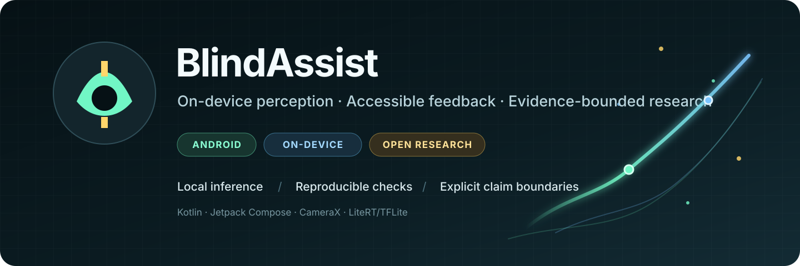
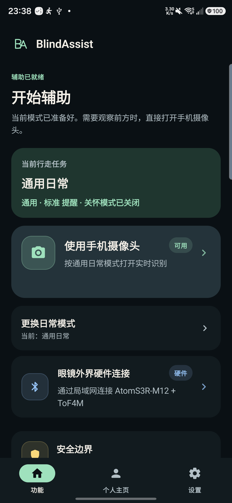
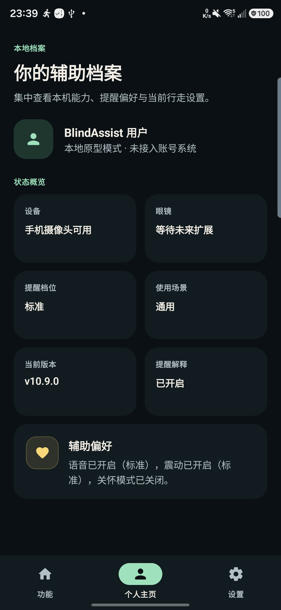
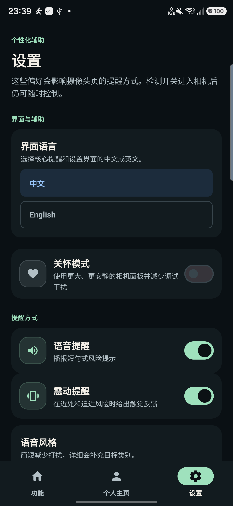
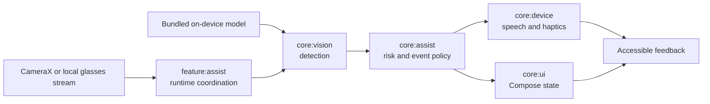
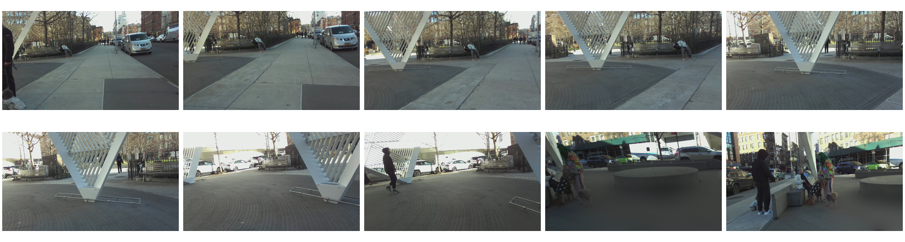
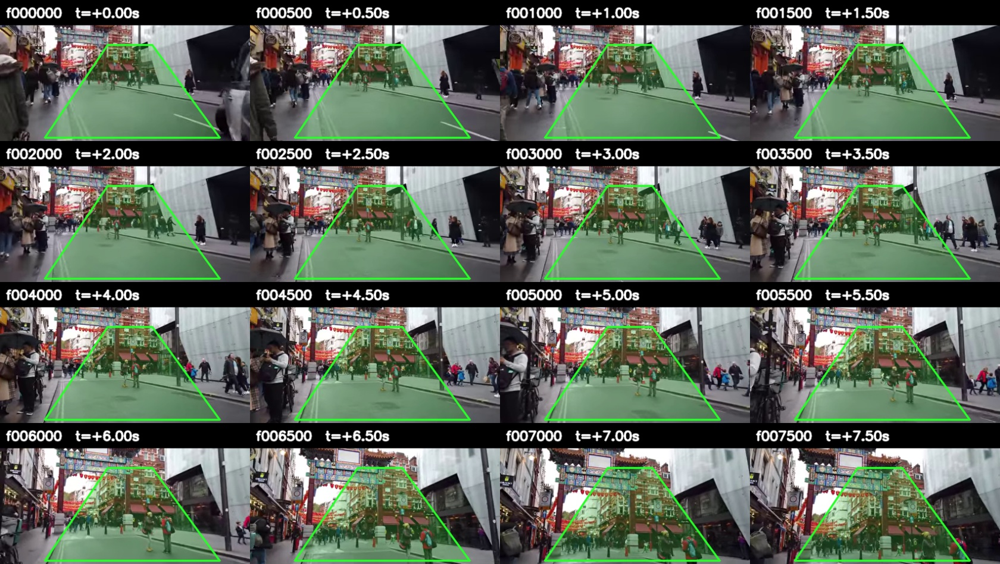

<div align="center">
  
  <br>
  <p>
    <a href="https://github.com/violetljj/blind-assist/actions/workflows/android.yml"></a>
    <a href="https://github.com/violetljj/blind-assist/releases/latest"></a>
    <a href="LICENSE"></a>
    
    <a href="https://github.com/violetljj/blind-assist/issues?q=is%3Aissue+is%3Aopen+label%3A%22help+wanted%22"></a>
  </p>
  <p><strong>An Android prototype for on-device camera inference, accessible feedback, reproducible evaluation, and honest research boundaries.</strong></p>
  <p><strong>端侧助盲感知 Android 原型：本地推理、可复现评测、明确证据边界。</strong></p>
  <p>
    <a href="docs/QUICKSTART_ZH.md"><strong>中文快速开始</strong></a> ·
    <a href="docs/QUICKSTART_EN.md"><strong>English Quick Start</strong></a> ·
    <a href="https://github.com/violetljj/blind-assist/releases/tag/v10.9.0"><strong>Download v10.9.0</strong></a> ·
    <a href="#architecture--架构">Architecture</a> ·
    <a href="#evidence-map--证据地图">Evidence</a> ·
    <a href="CONTRIBUTING.md">Contribute</a> ·
    <a href="https://github.com/violetljj/blind-assist/issues">Open tasks</a>
  </p>
</div>

> [!CAUTION]
> **Safety boundary / 安全边界：** BlindAssist is a research and accessibility prototype, not a certified mobility or safety device. It does not replace a white cane, guide dog, human judgment, mobility training, or professional advice. BlindAssist 是研究与无障碍原型，不替代盲杖、导盲犬、人工判断或专业出行训练。

## At a glance / 一眼看懂

<table>
  <tr>
    <td width="33%"><strong>🔒 On-device by default</strong><br><br>Camera inference stays on the Android device in the default flow.<br><br><sub>默认流程在 Android 设备本地完成摄像头推理。</sub></td>
    <td width="33%"><strong>♿ Accessible feedback</strong><br><br>Compose UI, speech, vibration, and TalkBack-oriented semantics share one deterministic state flow.<br><br><sub>界面、语音、震动与 TalkBack 语义共用确定性状态流。</sub></td>
    <td width="33%"><strong>🧪 Evidence before claims</strong><br><br>Checks preserve provenance, negative results, and <code>UNKNOWN</code> instead of turning prototypes into safety claims.<br><br><sub>保留来源、负结果和 <code>UNKNOWN</code>，不把原型包装成安全结论。</sub></td>
  </tr>
</table>

## Real prototype / 真实原型

<table>
  <tr>
    <td width="50%" align="center">
      
      <br><sub><strong>Feature home / 功能主页</strong><br>Current task, primary camera action, hardware entry, and safety boundary.</sub>
    </td>
    <td width="50%">
      <h3>What the public app contains</h3>
      <ul>
        <li>CameraX camera input and an optional local glasses-stream adapter.</li>
        <li>Bundled YOLO11n LiteRT/TFLite object detection.</li>
        <li>Deterministic direction, relative-risk, stabilization, and event policy.</li>
        <li>Speech, vibration, Compose UI, and accessibility semantics.</li>
        <li>Isolated benchmark and research apps that cannot silently replace the default path.</li>
      </ul>
      <p><strong>UI snapshot:</strong> current <code>master</code> debug build, captured on an SM-S9280 running Android 16.</p>
      <p><strong>Latest public release:</strong> <a href="https://github.com/violetljj/blind-assist/releases/tag/v10.9.0">BlindAssist v10.9.0</a> (<code>versionCode=37</code>)</p>
      <p><strong>Default model:</strong> <code>app/src/main/assets/yolo11n_fp16_320.tflite</code></p>
      <p><a href="docs/MODEL_CARD.md">Model identity and limitations</a> · <a href="docs/RELEASE_AND_VERIFICATION.md">Release verification</a></p>
    </td>
  </tr>
</table>

<table>
  <tr>
    <td width="50%" align="center">
      
      <br><sub><strong>Assist profile / 辅助档案</strong><br>Device capability, reminder profile, scenario, and preference summary.</sub>
    </td>
    <td width="50%" align="center">
      
      <br><sub><strong>Accessible settings / 辅助设置</strong><br>Language, Care Mode, speech, vibration, and reminder controls.</sub>
    </td>
  </tr>
</table>

These real-device screenshots document the recorded `master` UI surface and safety wording. They are not release artifacts and do not prove perception quality, user outcomes, accessibility certification, or mobility safety. 这些真机截图只记录当前 `master` 界面与安全措辞，不属于正式发布证据，也不证明感知质量、用户效果、无障碍认证或助行安全。

## Why it is public / 为什么开源

BlindAssist publishes more than an Android demo. It exposes the maintenance and evidence surfaces needed to inspect, reproduce, challenge, and improve the work:

- a runnable Kotlin / Jetpack Compose / CameraX mobile architecture;
- JVM, Android, repository-governance, and research-contract checks;
- model identity, upstream-license boundaries, and deterministic public-asset hashes;
- release manifests, checksums, APK identity, signing output, and 16 KB alignment verification;
- explicit separation between engineering, research, deployment, product, and safety evidence;
- contribution, governance, security, and public-roadmap workflows.

Forward-looking research follows the [research governance contract](docs/RESEARCH_GOVERNANCE.md): Development and production promotion are separate lanes, and production promotion requires explicit scope.

BlindAssist 不只公开演示代码，也公开构建、验证、模型来源、失败结果和维护流程，让贡献者能够真正复核和改进项目。完整说明见[开源公共价值](docs/OPEN_SOURCE_PUBLIC_VALUE.md)。

The project's public-interest intent aligns with UN SDG 10, Reduced Inequalities,
by making assistive Android engineering and its limitations inspectable. This is
an intent and contribution direction, not evidence of user or social outcomes.

## Architecture / 架构



| Module | Stable responsibility |
| --- | --- |
| `:app` | Android shell, permissions, packaged assets, build variants |
| `:feature:assist` | Runtime coordination and lifecycle |
| `:core:vision` | Detection and vision contracts |
| `:core:assist` | Pure risk, stabilization, and event policy |
| `:core:device` | Camera, speech, vibration, and device adapters |
| `:core:ui` | UI state and Compose rendering |

Detailed ownership and entry points are in the [code map](docs/CODE_MAP.md).

## Evidence map / 证据地图

| Surface | Publicly verifiable today | Boundary |
| --- | --- | --- |
| Default Android app | CI builds, tests, lint, APK/AAB assembly, release verification | Build success is not user effectiveness |
| Bundled model | Exact size/SHA-256, tensor inspection, model card, upstream-license notice | Identity is not accuracy or safety |
| Research routes | Versioned protocols, contracts, failures, `UNKNOWN`, and current authority | Research does not change the default app automatically |
| Device and benchmark apps | Isolated modules and bounded verification entry points | A benchmark is not deployment admission |
| Accessibility | Semantics-oriented implementation and a public audit roadmap | Not a certification or user study |

## 当前状态

<!-- research-status-owner: docs/research/README.md -->

- 当前产品版本：`v10.9.0`（`versionCode=37`）。
- 默认模型：`app/src/main/assets/yolo11n_fp16_320.tflite`。
- 正式 App 保持本地推理；研究、benchmark、导出或设备结果不会自动改变默认 App、模型、产品权限或安全结论。
- 动态研究状态、唯一 successor、禁止动作和证据权限只由[研究总入口](docs/research/README.md)及其 current 真源维护。
- 可并存安装的实验构建与正式 App 隔离，仅用于研究或诊断。

Experimental builds can coexist with the formal app, but they remain isolated research or diagnostic surfaces. Version changes are recorded in [CHANGELOG.md](CHANGELOG.md).

<details>
<summary><strong>See how visual research evidence is labeled / 查看视觉研究证据如何标注</strong></summary>

<br>

| Public-data sequence QA | Route-proxy replay |
| --- | --- |
|  |  |
| Public continuous sequence; offline research only. Not a target-user experiment. | The green corridor is an algorithm proxy, not a body-bound safe route. |

Synthetic, pseudo-labeled, or model-reviewed evidence is never promoted into device measurement, consent, objective ground truth, or safety evidence. Asset provenance and limitations are recorded in the [visual-asset ledger](docs/research/assets/group-meeting/README.md).

</details>

## Quick start / 快速开始

新贡献者从[中文三分钟快速开始](docs/QUICKSTART_ZH.md)进入；English readers can use the
[three-minute Quick Start](docs/QUICKSTART_EN.md).

The standard local entry point targets Windows 11 / PowerShell 7 with JDK 17 and Android SDK Platform 35. GitHub Actions continuously validates the Linux path; other environments are tracked in [contributor setup issue #7](https://github.com/violetljj/blind-assist/issues/7).

```powershell
git clone https://github.com/violetljj/blind-assist.git
cd blind-assist
pwsh -NoProfile -File scripts/run_android_gradle.ps1 -PreflightOnly
pwsh -NoProfile -File scripts/run_android_gradle.ps1 :app:testDebugUnitTest :app:lintDebug :app:assembleDebug
```

The debug APK is written to `app/build/outputs/apk/debug/app-debug.apk`.

Choose checks by the changed surface; these examples do not require an Android device:

```powershell
pwsh -NoProfile -File scripts/check_open_source_readiness.ps1
pwsh -NoProfile -File scripts/check_docs_index.ps1
python scripts/run_research_contract_tests.py
```

Do not run all examples by default. Documentation, open-source governance, and
research contracts each have their own focused check; release or shared-structure
work follows its owning gate.

## Contribute / 参与贡献

Contributions are welcome in accessibility, Android engineering, documentation, tests, reproducible evaluation, license/provenance review, and evidence-bounded research tooling.

For bounded starter tasks, use the
[`good first issue` queue](https://github.com/violetljj/blind-assist/issues?q=is%3Aissue%20state%3Aopen%20label%3A%22good%20first%20issue%22).
Questions, introductions, and early ideas belong in
[GitHub Discussions](https://github.com/violetljj/blind-assist/discussions).

| Good public workstream | Starting point |
| --- | --- |
| Accessibility and TalkBack | [Audit the default flow #9](https://github.com/violetljj/blind-assist/issues/9) |
| Cross-platform onboarding | [Verify Linux and macOS setup #7](https://github.com/violetljj/blind-assist/issues/7) |
| Model reproducibility | [Trace and reproduce the YOLO export #20](https://github.com/violetljj/blind-assist/issues/20) |
| Isolated DA2 experience | [Add a DA2 research-preview flavor #19](https://github.com/violetljj/blind-assist/issues/19) |
| Governed Android research | [Define the DA2 / A2-392 admission gate #21](https://github.com/violetljj/blind-assist/issues/21) |

Before opening a change, read [CONTRIBUTING.md](CONTRIBUTING.md), [GOVERNANCE.md](GOVERNANCE.md), and [CODE_OF_CONDUCT.md](CODE_OF_CONDUCT.md). Report security or privacy concerns privately through [SECURITY.md](SECURITY.md).

The project never asks contributors to commit raw camera footage, private data, credentials, restricted datasets, SDK payloads, device logs, or local evidence. Those materials stay outside Git under the documented [local-artifact boundary](docs/LOCAL_ARTIFACTS.md).

## Project links / 项目入口

- [Documentation index](docs/README.md)
- [中文三分钟快速开始](docs/QUICKSTART_ZH.md)
- [English three-minute Quick Start](docs/QUICKSTART_EN.md)
- [Community launch kit](docs/COMMUNITY_LAUNCH_KIT.md)
- [Code and build map](docs/CODE_MAP.md)
- [Default model card](docs/MODEL_CARD.md)
- [Codex maintainer automation](docs/CODEX_MAINTAINER_AUTOMATION.md)
- [Security threat model](docs/THREAT_MODEL.md)
- [Research governance](docs/RESEARCH_GOVERNANCE.md)
- [Release and verification](docs/RELEASE_AND_VERIFICATION.md)
- [Third-party notices](THIRD_PARTY_NOTICES.md)
- [Changelog](CHANGELOG.md)

## License / 许可证

Unless a file or directory states otherwise, original BlindAssist source code and documentation are licensed under the [GNU Affero General Public License v3.0 only](LICENSE) (`AGPL-3.0-only`). Third-party dependencies, models, data, labels, media, and hardware materials remain under their respective upstream terms; see [THIRD_PARTY_NOTICES.md](THIRD_PARTY_NOTICES.md).

除文件或目录另有说明外，BlindAssist 原创源代码与文档采用 `AGPL-3.0-only`。第三方依赖、模型、数据、标签、媒体和硬件材料仍受各自上游条款约束。
