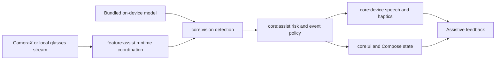

# BlindAssist

[](https://github.com/violetljj/blind-assist/actions/workflows/android.yml)
[](LICENSE)


**On-device assistive perception for Android, with reproducible evaluation and explicit evidence boundaries.**

BlindAssist 是一个使用 Kotlin、Jetpack Compose、CameraX 和 LiteRT/TFLite 构建的本地助盲感知原型。它通过手机摄像头识别前方目标，并用规则层生成方向、相对距离、语音和震动提醒。

> **Safety boundary / 安全边界：** BlindAssist is a research and accessibility prototype, not a certified safety device. It cannot replace a white cane, guide dog, human judgment, mobility training, or professional advice. BlindAssist 是研究与无障碍原型，不替代盲杖、导盲犬、人工判断或专业出行训练。

<p align="center">
  
</p>

<p align="center"><em>Real prototype screen / 真实原型界面（v10.9.0；非安全认证证明）</em></p>

## Why this project / 项目公共价值

BlindAssist 公开可运行的 Android 端侧感知实现、可复核的构建与评测入口，以及对失败和不可评估结果同样留痕的研究治理方法。项目希望降低以下工作的学习和审查门槛：

- privacy-preserving, on-device assistive perception；保护隐私的端侧辅助感知；
- accessible Android interaction, speech and haptic feedback；Android 无障碍交互、语音与震动反馈；
- reproducible model and device evaluation；可复现的模型与设备评测；
- evidence-bounded research that preserves `UNKNOWN` and negative results；保留 `UNKNOWN`、负结果和证据边界的研究流程。

完整说明见[开源公共价值](docs/OPEN_SOURCE_PUBLIC_VALUE.md)。

## What is included / 项目能力

- CameraX camera input and optional local glasses-stream adapter。
- On-device object detection with a bundled YOLO11n LiteRT/TFLite model。
- Deterministic risk analysis, stabilization, event tracking and feedback policy。
- Compose UI, TalkBack-oriented semantics, speech and vibration adapters。
- Reproducible JVM, Android, repository-governance and research-contract checks。
- Isolated benchmark, canary and experimental applications that do not silently replace the default app path。

## Architecture / 架构



模块职责和稳定入口见[代码地图](docs/CODE_MAP.md)。

## 当前状态

<!-- research-status-owner: docs/research/README.md -->

- 当前产品版本：`v10.9.0`（`versionCode=37`）。
- 默认模型：`app/src/main/assets/yolo11n_fp16_320.tflite`。
- 正式 App 保持本地推理；研究、benchmark、导出或设备结果不会自动改变默认 App、模型、产品权限或安全结论。
- 动态研究状态、唯一 successor、禁止动作和证据权限只由[研究总入口](docs/research/README.md)及其 current 真源维护。
- 可并存安装的实验构建与正式 App 隔离，仅用于研究或诊断。

版本变化见 [CHANGELOG.md](CHANGELOG.md)。

## Quick start / 快速开始

本地标准入口当前面向 Windows 11 / PowerShell 7，要求 JDK 17 与 Android SDK Platform 35。Linux 由 GitHub Actions 持续验证；其他开发环境见[新电脑与工具链说明](docs/NEW_COMPUTER_HANDOFF.md)。

```powershell
git clone https://github.com/violetljj/blind-assist.git
cd blind-assist
pwsh -NoProfile -File scripts/run_android_gradle.ps1 -PreflightOnly
pwsh -NoProfile -File scripts/run_android_gradle.ps1 :app:testDebugUnitTest :app:lintDebug :app:assembleDebug
```

输出 APK：`app/build/outputs/apk/debug/app-debug.apk`。发布与校验流程见[发布与验证](docs/RELEASE_AND_VERIFICATION.md)。

无需 Android 设备的仓库与研究合同检查：

```powershell
pwsh -NoProfile -File scripts/check_repo_hygiene.ps1 -IncludeStructure
pwsh -NoProfile -File scripts/check_docs_index.ps1
python scripts/run_research_contract_tests.py
```

## Research governance / 研究治理

研究治理标识为 `THESIS_FIRST_RESEARCH_GOVERNANCE_R4`。普通新研究默认进入 `THESIS_DEVELOPMENT`；只有显式的产品晋升工作才进入 `PRODUCTION_PROMOTION`。历史终态、失败和已消费证据不可通过后续包装改写。

- [研究治理总则](docs/RESEARCH_GOVERNANCE.md)
- [研究路线导航](docs/research/README.md)
- [双环 current 入口](docs/research/dual-loop/README.md)
- [第三方材料与模型边界](THIRD_PARTY_NOTICES.md)

Synthetic、pseudo-labeled 或 model-reviewed evidence 不是设备测量、用户结果、同意记录或客观 ground truth。`UNKNOWN` 不得被当作 negative，原型表现不得表述为部署或安全证明。

## Contributing / 参与贡献

欢迎提交 bug、无障碍改进、文档、测试、可复现评测和边界清晰的研究工具。开始前请阅读 [CONTRIBUTING.md](CONTRIBUTING.md) 与 [CODE_OF_CONDUCT.md](CODE_OF_CONDUCT.md)；安全或隐私问题请按 [SECURITY.md](SECURITY.md) 私下报告。

项目不会要求贡献者上传原始相机画面、私人数据、设备凭据、受限数据集或机器本地产物。适合参与的公开任务见 [Issues](https://github.com/violetljj/blind-assist/issues)。

## Documentation / 文档

- [文档索引](docs/README.md)
- [构建与代码导航](docs/CODE_MAP.md)
- [设备回归](docs/DEVICE_REGRESSION.md)
- [本地产物边界](docs/LOCAL_ARTIFACTS.md)
- [开放源码公共价值](docs/OPEN_SOURCE_PUBLIC_VALUE.md)

## License / 许可证

除文件或目录另有说明外，BlindAssist 贡献者原创的源代码与文档按 [GNU Affero General Public License v3.0 only](LICENSE)（`AGPL-3.0-only`）许可。第三方依赖、模型、数据、标签、媒体和硬件材料继续受各自来源条款约束，详见 [THIRD_PARTY_NOTICES.md](THIRD_PARTY_NOTICES.md)。
