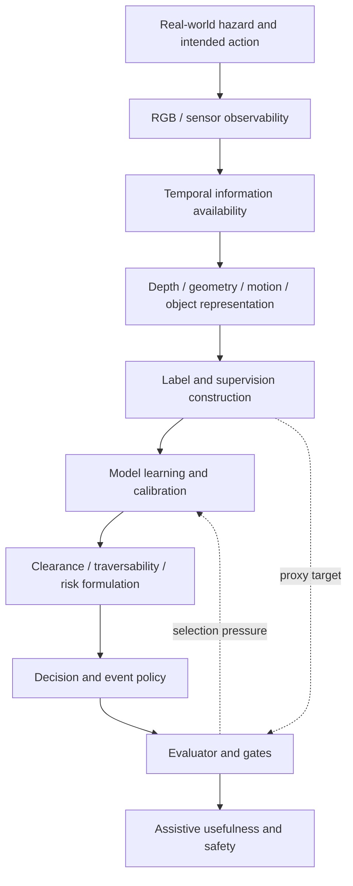
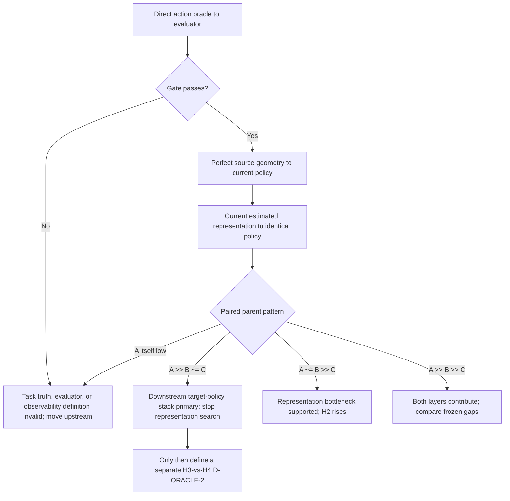

# BlindAssist Causal Failure Model

状态：`CURRENT_DIAGNOSTIC_MODEL / EVIDENCE_BOUNDED / NOT_A_PRODUCT_SAFETY_CLAIM`

本模型解释已有失败如何跨层累积；它不改写任何路线 terminal。总清算结论见
[Failure Synthesis](BLINDASSIST_FAILURE_SYNTHESIS.md)，下一诊断见
[Oracle Ladder](BLINDASSIST_ORACLE_LADDER.md)。

## 因果图



当前失败结构不是一条单点故障，而是三个连续断点：

```text
source truth != actionability truth
representation proxy improvement != decision improvement
decision/evaluator gate != demonstrated assistive usefulness
```

最后一条不是说 evaluator 已被证明错误，而是项目尚无真实视障用户、独立行走或安全证据；因此
现有 gate 最多是研究代理，不能自证产品 validity。

## A. Observability

### 已知

- bbox 不含局部路径占用、精细边界和可靠 clear information；oracle box在 3-event cohort 中虽然恢复
  `2/2` positives，却产生 53 false-alert frames并 `0/2` clear。见
  [information ceiling D0](research/dual-loop/INFORMATION_CEILING_THREE_ARM_D0_RESULT_2026-08-01.md)。
- 单目 metric depth/ground-height 不稳定：SATOM Real E0 在 arm metric 前就因 DepthART ground-height
  observability fail而 NOT_EVALUABLE。见 [SATOM current](research/satom/README.md)。
- pose/gravity确实增加了一些信息：Assistive Geometry analytic canary在 `3/6` parent恢复合理
  support-height geometry，但 `0/6` fold形成安全双阈值。见
  [Assistive Geometry current](research/assistive-geometry/README.md)。

### 未知

还没有同一 fresh parent cohort 的 single RGB / causal clip / clip+pose/depth upper bound。因此不能签署
`RGB_INFORMATION_INSUFFICIENT`。图像派生 oracle mask曾在极小 cohort成功，也说明“RGB一定没有信息”
过强；但 annotation可使用观察者语义和整帧理解，不等于当前模型可恢复。

## B. Temporal information

### 已知

- causal future-label mechanics能增加 `.4/.8 s` geometry-proxy support，说明时间中存在可用观察量；
  但它不是 actionability truth。见
  [future-label mechanics](research/hftf/HFTF_STAGE_C_CAUSAL_FUTURE_LABEL_MECHANICS_RESULT_D1_2026-08-01.md)。
- P3 temporal head改善 depth、clearance、false-clear和transition proxy，但 clearance-delta仅改善
  `1.5646%`，低于5%门，且1/3 parent回归。见
  [P3 result](research/hftf/P3_TEMPORAL_DEVELOPMENT_SCREEN_R0_RESULT_2026-08-06.md)。
- HFTF F0.1 cross-source temporal student的 current-risk F1中位数约 `.173267`，远低于 `.6`；
  RCLE自然session也未建立flow与pose主频同步。见
  [F0.1 heldout](research/hftf/HFTF_STAGE_C_SANPO_HELDOUT_EFFECT_RESULT_F0_1_2026-08-01.md)与
  [RCLE temporal diagnostic](research/rcle/RCLE_TEMPORAL_STRUCTURE_DIAGNOSTIC_R1_RESULT_2026-07-28.md)。

### 归因

`TEMPORAL_INFORMATION_EXISTS` 有局部支持；`TEMPORAL_IS_PRIMARY_BOTTLENECK` 未建立。没有先做 upper
bound时继续训练时序模型，会混淆“时间里没有任务信息”“target不稳定”“student学不会”。

## C. Representation

失败不是单一 generic depth层：

| Representation layer | Evidence | Current inference |
|---|---|---|
| Generic depth | DepthART R0显著改善clearance/false-clear但false-block veto | 有用但不足以保证task Pareto |
| Metric scale / plane | B1/A0系统性保守；SATOM ground height fail；Q-Plane负 | 当前跨parent不可靠 |
| Clearance / occupancy | A3、B1/A0、D2/D3显示false-clear/block结构冲突 | reducer/policy与upstream共同负责 |
| Obstacle evidence | learned obstacle undercoverage，support会fail-open | source-native obstacle supervision/semantics不足 |
| Traversability / actionability | perfect four-class mask仍不能区分should-alert/clear | target和policy未对齐 |
| Motion / temporal | controlled mechanics与自然event effect分裂 | 不是已证主瓶颈 |
| Ranking / active view | TARO consumed signal未迁移到fresh R38 | scorer transfer失败，非headroom全否定 |

证据入口：[DepthART R0](research/hftf/DEPTHART_ADMISSION_R0_RESULT_2026-08-07.md)、
[B1/A0](research/assistive-geometry/BLINDASSIST_ASSISTIVE_GEOMETRY_B1_A0_DEVELOPMENT_EVALUATION_RESULT_2026-08-09.md)、
[Q-Plane](research/assistive-geometry/BLINDASSIST_BA_CLEAR_QPLANE_O0A_REPRESENTATION_HEADROOM_RESULT_2026-08-14.md)、
[TARO current](research/taro/README.md)。

## D. Truth / labels

这是当前最强 bottleneck。

- source mask是语义/区域 truth，不是“现在应提醒”truth；perfect four-class IDs加当前soft adapter仍
  `12/14` false alerts、只clear `4/16`。见
  [RISKSEG R1 P0](research/dual-loop/RISKSEG_R1_P0_SOFT_DENSE_ADAPTER_AUDIT_RESULT_2026-08-01.md)。
- Failure Atlas没有instance correspondence、depth或pose，residual只能 `WEAKLY_LABELABLE`。见
  [Failure Atlas](research/dual-loop/DUAL_LOOP_SEGMENTATION_FAILURE_ATLAS_AND_RESIDUAL_LABELABILITY_R0_RESULT_2026-08-01.md)。
- R3.1的34个可计算 ground reports共有0个reference risk cells；semantic-ground membership不能自证
  step/drop actionability。见
  [R3.1](research/hftf/HFTF_STAGE_B_REFERENCE_ONLY_OPPORTUNITY_QUALIFICATION_RESULT_R3_1_2026-08-01.md)。
- SuperTeacher/F1 frontdoor证明label可以物化、provenance可闭合、reducer seam可运行；文件自己明确不证明
  factor learnability或navigation utility。见
  [F1 frontdoor](research/assistive-geometry/BLINDASSIST_ASSISTIVE_GEOMETRY_R2_F1_SOURCE_NATIVE_LABEL_MATERIALIZATION_AND_FRONTDOOR_RESULT_2026-08-11.json)与
  [landing](research/assistive-geometry/BLINDASSIST_ASSISTIVE_GEOMETRY_R2_SUPERTEACHER_TO_AG_LANDING_RESULT_2026-08-12.json)。

因此“模型学不会”中至少一部分更准确地说是“target不稳定、机会分母不足或与行动不对应”。

## E. Objective

### 已建立的错位模式

| Proxy improves | Task failure that remains/worsens | Evidence |
|---|---|---|
| Depth AbsRel / clearance | false-block、transition | [DA2 closure](research/hftf/DAV2_P1_P2_EXECUTION_CLOSURE_2026-08-05.md) |
| False-clear | over-occupied collapse | [A3](research/hftf/DAV2_TEMPORAL_MOBILE_STUDENT_A3_R0_RESULT_2026-08-05.md) |
| D2 head MAE/false-clear | false-block/coverage | [D2](research/hftf/DEPTHART_TASK_PRESERVING_D2_DEVELOPMENT_QUALITY_RESULT_2026-08-12.md) |
| Frame transition proxies | parent consistency / direct transition-head quality | [P3](research/hftf/P3_TEMPORAL_DEVELOPMENT_SCREEN_R0_RESULT_2026-08-06.md) |
| mIoU / boundary F1 | event recall/false events/clear | [RISKSEG R0](research/dual-loop/RISKSEG_R0_FINAL_RESULT_2026-08-01.md) |
| Frame feedback density | event correction | [retrospective §8.3](research/ALGORITHM_RESEARCH_RETROSPECTIVE_2026-08-01.md) |
| ranking macro on consumed cohorts | fresh parent strict wins | [TARO current](research/taro/README.md) |

正式结论：`PROXY_TARGET_ALIGNMENT_NOT_ESTABLISHED`。clearance MAE、false-clear或ranking不能单独
作为优化目标；必须以联合 event/action contract判断。

## F. Downstream decision

当前 policy 至少有四个结构风险：

1. 将“检测/区域存在”过快解释为“应提醒”，oracle box因此无法clear。
2. 将保守性主要投影为occupied/UNKNOWN，允许通过封路或abstention购买false-clear改善。
3. 用统一clearance/三态处理台阶、落差、动态接近、悬空和窄通道等不同危险。
4. transition主要检查状态一致，却未必表达事件开始、升级、重复提醒与清除的用户代价。

反证边界：90-frame mask oracle在当前source-specific policy下成功，所以不能说所有downstream policy都
必然错；该arm混合了形状、corridor过滤、候选压缩和不同source policy，未隔离policy本身。

## G. Evaluation

现有 evaluator比早期单指标严谨：同时检查false-clear、false-block、coverage、UNKNOWN、transition、
worst-parent，并保留missing denominator。但它仍是研究代理：

- A3早期 `geometry_state_exact_agreement` 曾以canonical为truth，而canonical自身false-clear为
  `24.25%`；后续已改为truth-referenced gate，但旧终态不能回写。见
  [A3 result](research/hftf/DAV2_TEMPORAL_MOBILE_STUDENT_A3_R0_RESULT_2026-08-05.md)。
- 当前没有真实盲人/低视力participant、独立行走或安全 outcome；不能证明门槛与真实utility一致。
- 小cohort和source-native geometry的prevalence与真实生态不等价。

因此 evaluator 是必要研究控制，不是产品目标的验证。若 direct action oracle都不能通过当前 evaluator，
优先审计 evaluator/product contract，而不是训练模型。

## 历史干预矩阵

符号：`●` 主要干预；`○` 次要/诊断；`—` 未真正干预。

| Experiment | Observability | Representation | Supervision | Objective | Policy | Evaluator |
|---|---:|---:|---:|---:|---:|---:|
| YOLO detector swaps | — | ● | — | — | ○ | ○ |
| MiDaS / DA2 / DepthART | — | ● | ○ | ○ | — | ○ |
| Information ceiling D0 | ○ | ● | ○ | — | ○ | ● |
| SANPO / RISKSEG | — | ● | ○ | ○ | ○ | ● |
| Truth-mask soft adapter | — | ○ | ● | ○ | ● | ● |
| RCLE | ○ | ● | — | ○ | — | ● |
| HFTF temporal students | ○ | ● | ● | ○ | — | ● |
| B1/A0 | — | ● | ○ | ○ | — | ● |
| R2 SuperTeacher | — | ○ | ● | — | — | ○ |
| D2/D3 heads | — | ● | ○ | ● | ● | ● |
| AG factor-wise / obstacle | ○ | ● | ○ | ○ | ● | ● |
| Q-Plane | — | ● | — | ○ | — | ● |
| TARO | ● | ● | ○ | ● | ○ | ● |
| SATOM Real E0 | ● | ○ | — | — | — | ○ |
| Human/product action oracle | — | — | — | — | — | — |

Representation是唯一被反复直接干预的列；human/product action oracle一列完全空缺。由此签署
`SEARCH_CONCENTRATION / WRONG_LEVEL_OPTIMIZATION`。

## 竞争性根因模型

### H1 — Input / observability ceiling

- Prior plausibility：中。
- 支持：metric scale、occlusion、motion、clear event不可由单帧稳定推断；pose可恢复部分geometry。
- 反证/异常：图像派生oracle mask有局部成功；纯RGB SVRF尚未运行。
- 能解释：SATOM preflight、部分AG/temporal失败。
- 不能解释：perfect mask进入policy仍失败。
- 下一诊断价值：高；成本中。

### H2 — Representation ceiling

- Prior plausibility：中高。
- 支持：DepthART/AG/Q-Plane/TARO fresh transfer链。
- 反证/异常：source-depth oracle、factor oracle、mask oracle显示上界。
- 能解释：跨parent scale/plane/obstacle/ranking失败。
- 不能独自解释：target mask的actionability失败。
- 下一诊断价值：很高；perfect-geometry substitution成本低。

### H3 — Target / supervision failure

- Prior plausibility：高。
- 支持：truth-mask soft adapter、label readiness、R3.1 opportunity、source/pseudo/geometry truth边界。
- 反证/异常：小mask-oracle cohort成功；source-native factor labels可稳定物化。
- 能解释：segmentation、teacher、reference、跨source学习失败。
- 不能独自解释：即使target正确，current policy是否有可行域。
- 下一诊断价值：最高；需要actionability adjudication，成本中。

### H4 — Downstream objective / policy failure

- Prior plausibility：高。
- 支持：box恢复但不clear；false-clear/block冲突；统一三态/scalar风险。
- 反证/异常：小mask-oracle cohort可过。
- 能解释：A3/B1/D2/D3/RISKSEG adapter。
- 不能独自解释：representation fresh transfer失败。
- 下一诊断价值：最高；perfect geometry policy frontier成本低。

## 决策树

当前唯一 P0 是已冻结但未执行的
[`D-ORACLE-1 matched causal ladder`](research/failure-synthesis/D_ORACLE_1_MATCHED_CAUSAL_LADDER_PROTOCOL_2026-08-17.md)。
下图只表达 D-ORACLE-1 能授权的归因；它不预先设计 H3/H4 分离实验，也不授权 temporal、policy grid
或 representation search。



## 条件化路线决定

- `A ≫ B ≈ C`：downstream target-policy stack 是主瓶颈；停止 encoder/depth/temporal 搜索。此结果尚不能
  单独区分 H3 与 H4，只允许另行冻结一个独立 D-ORACLE-2。
- `A ≈ B ≫ C`：H2 上升，重新允许 representation research；同时承认本次 H3/H4 排序被反证。
- `A ≫ B ≫ C`：两层都有损失，按预冻结的两个 gap 归因，不事后改阈值。
- `A` 本身低：上溯 action truth、evaluator 或 observability 定义，不把结果归罪于 B/C。
- B 的 parent-local permutation control 与 B 几乎相同：支持“current policy 未有效利用 geometry”的机制证据，
  但它不是第四个正式 arm，也不能单独完成 H3/H4 分离。
