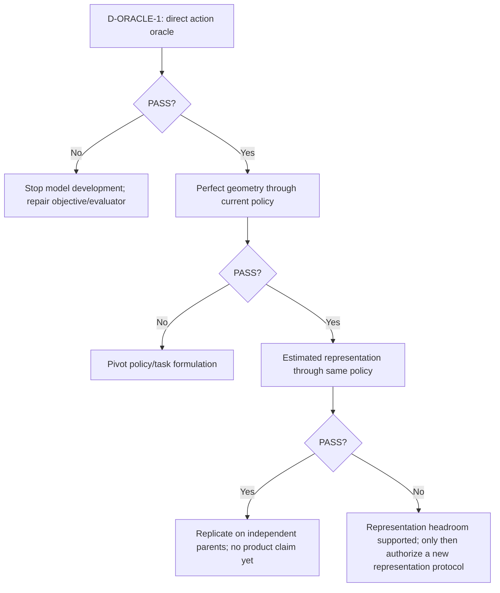

# BlindAssist Oracle Ladder

状态：`PARTIAL_EXISTING_EVIDENCE / CRITICAL_L0_L2_GAPS / NEXT_DIAGNOSTIC_IDENTIFIED`

目的不是比较第27和第28个模型，而是定位哪一级从 PASS 变成 FAIL。已有数据只读复用；缺口只允许
oracle、controlled ablation或perfect-information substitution。总判断见
[Failure Synthesis](BLINDASSIST_FAILURE_SYNTHESIS.md)。

## Ladder 定义

本项目的可执行梯级按“越靠上越接近真正决定”排列：

| Level | Perfect input / authority | Question | Existing evidence | Current answer |
|---|---|---|---|---|
| L0 | Human/product action oracle | 在每个parent event上，应该何时提醒、升级、清除或保持UNKNOWN？该输出能过研究evaluator吗？ | 没有真实视障用户/独立行走truth；部分event labels含AI review | `NOT_EVALUATED` |
| L1 | Adjudicated actionability/event labels | 不经过geometry/policy，直接把冻结action labels送入event scorer能否过门？ | 没有与当前完整gate绑定的独立adjudicated cohort | `NOT_EVALUATED` |
| L2 | Perfect traversability/obstacle/action mask | 完美区域truth经过当前adapter/policy能否过门？ | 90-frame cohort：mask `2/2` hit、0 FP、`2/2` clear；30-event soft adapter：14/16 hit、12/14 false、4/16 clear | `MIXED / POLICY_AND_TARGET_DEPENDENT` |
| L3 | Perfect source-native metric geometry | source depth/pose/obstacle输入当前reducer/policy能否过联合gate？ | Q-Plane source-depth arm为零误差，但未报告完整event/product ladder；factor substitution只局部定位support/obstacle | `NOT_YET_ANSWERED_END_TO_END` |
| L4 | Perfect motion/ego/temporal correspondence | 加入完美flow/pose/causal history是否让L3或actionability显著改善？ | future-label support PASS；RCLE Stage B因rotation/coverage NOT_EVALUABLE | `MECHANICS_SUPPORTED / TASK_EFFECT_UNRESOLVED` |
| L5 | Real estimated representation | 当前depth/geometry/temporal/ranking能否过？ | DA2、DepthART、AG、Q-Plane、TARO、RISKSEG多数有效FAIL或NOT_EVALUABLE | `FAIL_FOR_TESTED_FAMILIES` |
| L6 | Single-RGB current system | 当前默认YOLO/rules能否达到核心门？ | incumbent；information-ceiling cohort 0/2 positives；无产品/安全authority | `NOT_ESTABLISHED / CORE GATE NOT MET` |

证据：[information ceiling](research/dual-loop/INFORMATION_CEILING_THREE_ARM_D0_RESULT_2026-08-01.md)、
[RISKSEG R1 P0](research/dual-loop/RISKSEG_R1_P0_SOFT_DENSE_ADAPTER_AUDIT_RESULT_2026-08-01.md)、
[Q-Plane](research/assistive-geometry/BLINDASSIST_BA_CLEAR_QPLANE_O0A_REPRESENTATION_HEADROOM_RESULT_2026-08-14.md)、
[future mechanics](research/hftf/HFTF_STAGE_C_CAUSAL_FUTURE_LABEL_MECHANICS_RESULT_D1_2026-08-01.md)、
[algorithm current](research/ALGORITHM_RESEARCH_CURRENT.md)。

## 已有梯级不能被误读的地方

### L2 的两个结果不是矛盾

90-frame mask arm混合了source-native mask、corridor/连通域/边界过滤、候选压缩和source-specific policy，
且只有3个events。30-event soft-adapter audit使用另一cohort和另一adapter family。前者证明“某种mask+policy
组合在极小cohort有headroom”，后者证明“perfect four-class IDs + current soft family仍不足”。二者共同
要求拆开target、adapter和policy，而不是挑一个结果宣布segmentation成败。

### L3 尚未完成

Q-Plane的A5 source-depth oracle证明所测clearance cells可由source depth完美恢复，但没有把human/actionability
truth、完整event policy与产品gate串起来。Assistive Geometry的source-exact factor substitutions也只定位
support fail-open和obstacle undercoverage。故不能说“完美geometry一定PASS”，也不能说“policy一定FAIL”。

### L4 尚未证明temporal是主瓶颈

future frame能增加teacher support不等于causal student能做对event decision；RCLE controlled mechanics失败前门
或自然session不同步也不反证所有temporal information。必须做同一parent的观察上界对照。

## Pass → Fail 当前可定位范围

```text
L0 Human/product oracle             UNKNOWN
L1 Adjudicated actionability        UNKNOWN
L2 Perfect task mask                MIXED
L3 Perfect geometry                 UNKNOWN end-to-end
L4 Perfect temporal correspondence  UNKNOWN task effect
L5 Estimated representations        FAIL for tested families
L6 Current single-RGB system         CORE GATE NOT MET
```

唯一可信的断点结论是：**L5→L6均未证明可过；断点可能早在L1→L3，也可能位于L3→L5。**
因此继续优化L5无法区分根因。

## 唯一 P0 diagnostic

当前只冻结并推进 `D-ORACLE-1`。完整合同见
[matched causal ladder protocol](research/failure-synthesis/D_ORACLE_1_MATCHED_CAUSAL_LADDER_PROTOCOL_2026-08-17.md)。

三臂严格为：

1. `A_DIRECT_ACTION_ORACLE`；
2. `B_PERFECT_SOURCE_GEOMETRY_CURRENT_POLICY`；
3. `C_ESTIMATED_REPRESENTATION_CURRENT_POLICY`。

B/C 共用逐hash相同的policy、config、threshold、coverage、evaluator和parent denominator。gap只在
matched common parents/time support上按parent计算：

```text
G_downstream     = U(A) - U(B)
G_representation = U(B) - U(C)
G_total          = U(A) - U(C)
```

只有total gap足够大、两个component gap非负时才把normalized ratio解释为归因比例。native与matched
coverage、paired parent delta、median、worst-parent和bootstrap CI全部预冻结；hard gates不能被U覆盖。

`K_B_PARENT_LOCAL_DERANGEMENT` 只作低成本机制control，不是第四竞争臂。如果B与parent-local shuffled
geometry近似，只说明当前policy未证明有效利用geometry，不能解释为geometry target没有价值。

H3/H4分离不属于本协议。只有 `A materially > B` 后才允许另立小型D-ORACLE-2；其arms现在故意不定义。
single-RGB/causal-clip/sensor-reveal upper bound与perfect-geometry policy frontier均降为条件性backlog，不编号、
不冻结、不执行。

当前唯一 successor 是 `D_ORACLE_1_SOURCE_ACTION_TRUTH_POLICY_LOCK`，只允许锁定source roster、两个独立
truth roles、B/C common policy hashes、C existing representation identity和control map；不授权outcome access。

## 结果驱动的继续 / 转向 / 停止树



## Oracle使用边界

- oracle是诊断上界，不是learned-model、产品或安全证据；
- action oracle必须保留UNKNOWN，不允许强迫不确定场景成为negative；
- source-native depth/pose不进入estimated candidate臂；
- D-ORACLE-2、observability upper bound与policy frontier当前均不执行；
- fresh parent一旦打开outcome，不得再用于修改arm、gate或target definition。
