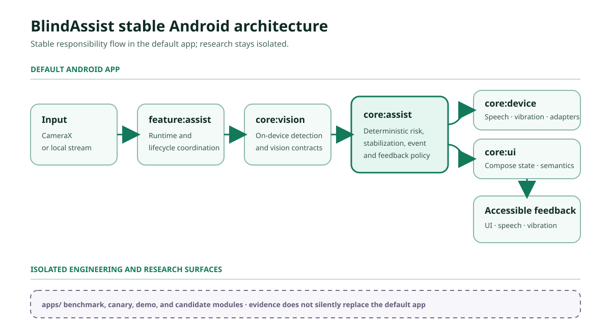
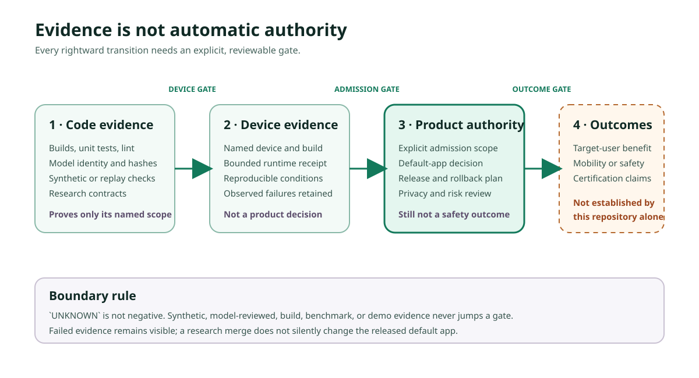

# BlindAssist community launch kit

Status: `current`

Last verified: 2026-08-13

This kit gives maintainers one honest technical story, reusable visuals, a real-
device demo contract, and channel-specific copy. Replace every bracketed
placeholder and complete the pre-publication checks before posting.

## Positioning

**One sentence:** BlindAssist is an open Android on-device assistive-perception
prototype that publishes reproducible checks, provenance, negative results, and
the limits of what its evidence can support.

**Contributor invitation:** We are looking for contributors in Android
accessibility, on-device ML, reproducible evaluation, Linux build validation, and
evidence-aware open-source maintenance—not coordinated stars.

**Public-value frame:** The project is aligned with UN SDG 10, Reduced
Inequalities, by making assistive Android engineering and its limitations open to
inspection and improvement. Alignment is a project intent, not proof of social or
user outcome.

## Reusable visuals

### Stable Android architecture



Download or link [the architecture SVG](assets/community-architecture.svg). It
shows stable module responsibility and keeps research or benchmark apps isolated
from the default app.

### Evidence-to-authority boundary



Download or link [the evidence boundary SVG](assets/evidence-authority-boundary.svg).
The arrows are gated transitions, not an automatic maturity pipeline.

## What the public project can and cannot claim

### It can demonstrate

- a buildable Kotlin, Jetpack Compose, CameraX, and LiteRT/TFLite Android codebase;
- on-device inference in the default camera flow;
- deterministic risk, stabilization, UI, speech, and vibration paths;
- public model identity, hashes, tests, CI, release verification, and research
  contracts;
- preserved failures, `UNKNOWN`, and explicit separation of research from product
  authority.

### It cannot currently claim

- certified navigation, obstacle avoidance, medical benefit, or mobility safety;
- replacement of a white cane, guide dog, orientation and mobility training, or
  human judgment;
- target-user effectiveness merely from a build, screenshot, benchmark, model
  metric, synthetic sample, or model-reviewed label;
- that experimental models or benchmark apps are part of the released default
  experience;
- broad Linux workstation support until clean-host reports close the documented
  portability gap.

## Three contribution calls

Keep the live URLs in posts rather than copying issue descriptions:

1. [Add regression fixtures for the community documentation entry pages](https://github.com/violetljj/blind-assist/issues/27).
2. [Extend the deterministic bilingual accessibility-string guard](https://github.com/violetljj/blind-assist/issues/28).
3. [Add round-trip tests for every daily usage preset](https://github.com/violetljj/blind-assist/issues/29).

The canonical queue is the
[`good first issue` search](https://github.com/violetljj/blind-assist/issues?q=is%3Aissue%20state%3Aopen%20label%3A%22good%20first%20issue%22).
Each issue must name exact files, acceptance criteria, commands, forbidden scope,
and estimated effort. If a post is older than the issue state, the issue wins.

## Real-device demo contract: 60–90 seconds

Do not publish a simulated, edited, or old recording as a current real-device
demo. Record a fresh session on a named Android device and released commit/tag.

### Capture checklist

- Use a scene that contains no faces, private documents, precise location, voices,
  or bystander data.
- Show the device model, Android version, app tag or commit, and whether the input
  is CameraX or an isolated local stream.
- Keep the system status bar visible unless it exposes private data.
- Record one continuous take; cuts may shorten loading only and must not hide a
  failure or replace the model output.
- Add burned-in captions. Keep natural app audio optional and avoid claiming that
  speech timing proves safety.
- End on the prototype limitation and contributor invitation.

### Shot list and voice-over

| Time | Screen | Voice-over / caption |
| --- | --- | --- |
| 0–8 s | Repository title, device, tag/commit | “BlindAssist is an open Android on-device assistive-perception prototype.” |
| 8–22 s | Launch app; show camera permission and safety wording | “The default flow runs camera inference locally and keeps research features isolated.” |
| 22–45 s | One consented, low-risk camera scene; show visible detection/risk state | “UI, speech, and vibration are driven by deterministic state and feedback policies.” |
| 45–60 s | Repository tests, model card, or evidence map | “The project publishes provenance, checks, negative results, and `UNKNOWN` instead of turning a demo into a safety claim.” |
| 60–78 s | `good first issue` queue | “We are looking for Android accessibility, on-device ML, and reproducible-evaluation contributors.” |
| 78–90 s | Limitation card | “This is not a certified mobility device and does not replace a cane, guide dog, training, or judgment.” |

### Required public metadata

Publish the video with device model, Android version, repository commit/tag, date,
input route, whether speech/vibration was enabled, edits made, and a link to the
limitations section. A video is interface and device-path evidence only; it is not
user-outcome or safety evidence.

Fill this card before recording and publish it next to the video:

```text
Device model:
Android version:
BlindAssist commit or tag:
Recording date (UTC):
Input route: CameraX / isolated local stream
Speech enabled: yes / no
Vibration enabled: yes / no
Video edits: none / loading-only cuts described here
Limitations: https://github.com/violetljj/blind-assist/blob/master/docs/COMMUNITY_LAUNCH_KIT.md#what-the-public-project-can-and-cannot-claim
```

## Pre-publication checklist

- The Quick Start commands pass on the environment claimed in the post.
- The demo metadata is complete and the file is accessible with captions.
- The remaining `[DEMO_URL]` placeholders are replaced with one public,
  captioned, metadata-complete real-device recording.
- The linked issues remain open and unassigned.
- No screenshot, log, path, device identifier, token, or media leaks private data.
- The post asks for review, reproduction, or contribution—not coordinated stars.
- The channel's current rules have been checked on the day of posting.

## Channel copy

### V2EX · 分享创造

**Title:** 我把一个端侧助盲感知 Android 原型开源了，也把失败结果和证据边界一起公开

**Body:**

> BlindAssist 是我在西安电子科技大学广州研究院读研期间持续开发的 Android 端侧辅助感知项目。它组合了 CameraX、本地 LiteRT/TFLite 推理、Jetpack Compose、语音和震动反馈。
>
> 我更想分享的不是“AI 助盲神器”，而是项目如何公开记录模型来源、可复现检查、失败结果和 `UNKNOWN`，并明确区分代码可运行、真机验证、产品权限与安全结论。
>
> 三分钟英文 Quick Start：https://github.com/violetljj/blind-assist/blob/master/docs/QUICKSTART_EN.md
> 真实设备演示：[DEMO_URL]
> 新手任务：https://github.com/violetljj/blind-assist/issues?q=is%3Aissue%20state%3Aopen%20label%3A%22good%20first%20issue%22
>
> 目前尤其希望得到 Android accessibility / TalkBack、on-device ML、Linux 构建和 reproducible evaluation 方面的代码审查与贡献。它不是安全认证设备，也不替代盲杖、导盲犬、训练或人工判断。欢迎指出构建复现问题和证据边界问题。

If the post is primarily promotional rather than a technical “show and tell,” use
V2EX's promotion area instead of disguising it as discussion.

### Reddit · r/androiddev monthly showcase

**Title:** BlindAssist — an open on-device Android assistive-perception prototype that publishes failures and evidence boundaries

**Body:**

> I am a graduate student working on BlindAssist, a Kotlin/Compose/CameraX Android prototype for on-device perception and accessible feedback.
>
> The unusual part is not a claim that the app makes mobility safe. The repository publishes model provenance, deterministic checks, negative research results, and the boundary between code evidence, device evidence, and product authority. Research and benchmark apps cannot silently replace the default app.
>
> 3-minute quick start: https://github.com/violetljj/blind-assist/blob/master/docs/QUICKSTART_EN.md
> 60–90 second real-device demo: [DEMO_URL]
> Good first issues: https://github.com/violetljj/blind-assist/issues?q=is%3Aissue%20state%3Aopen%20label%3A%22good%20first%20issue%22
>
> I would value feedback or contributors in TalkBack/Compose accessibility, on-device ML, Linux build reproducibility, and evaluation tooling. BlindAssist is a research prototype, not a certified mobility device.

Post this only in the current monthly showcase or another thread whose rules allow
self-promotion.

### Show HN

**Title:** Show HN: BlindAssist – an Android assistive-perception prototype that publishes negative results

**Text:**

> BlindAssist runs camera inference on-device and maps results into deterministic UI, speech, and vibration feedback. I built it as a graduate research project, but the main reason for sharing it is methodological: the repository preserves provenance, failed experiments, and `UNKNOWN`, and prevents research code from automatically gaining product or safety authority.
>
> You can build the default Android app, inspect the packaged model identity, and reproduce the public checks. The short real-device demo is here: [DEMO_URL]. The three-minute source quick start is here: https://github.com/violetljj/blind-assist/blob/master/docs/QUICKSTART_EN.md.
>
> I am looking for technical critique and contributors in Android accessibility, on-device ML, and reproducible evaluation. This is not a certified mobility device and it does not replace established mobility aids or training.

Do not submit to Show HN until the English Quick Start and real-device demo URLs
work without sign-in.

### 掘金 / 知乎 technical article

Recommended title: **从 CameraX 到 TFLite，再到“不能声称安全”：一个端侧助盲原型的证据边界**

Use five sections: default Android data flow; accessibility semantics and feedback;
model identity and reproducible build; one preserved failed experiment; code →
device → product authority. Include commands and diagrams from this repository.
Do not paste the README or present a model metric as a user outcome.

### Accessibility / Android awesome-list pull request

Use the list's own contribution format. A suitable description is:

> [BlindAssist](https://github.com/violetljj/blind-assist) — an AGPL-3.0 Android on-device assistive-perception prototype with Compose accessibility semantics, reproducible checks, model provenance, and explicit evidence/safety boundaries.

Submit only where the list accepts active open-source Android projects in this
scope. One normal pull request to one well-matched list is better than bulk
submissions.

### Ovio submission fallback email

Use this only when the public project-submission form is unavailable. Send it
from a working contact address to `hello@ovio.org`.

**Subject:** Project submission: BlindAssist Android accessibility research prototype

> Hello Ovio team,
>
> I maintain BlindAssist, an open-source Android research prototype for on-device assistive perception, accessible feedback, and reproducible evaluation:
> https://github.com/violetljj/blind-assist
>
> The repository has a contributor guide and bounded newcomer tasks with exact files, acceptance criteria, validation commands, forbidden scope, and effort estimates:
> https://github.com/violetljj/blind-assist/issues?q=is%3Aissue%20state%3Aopen%20label%3A%22good%20first%20issue%22
>
> I attempted to use the Ovio project-submission form, but its request failed before the site confirmed receipt. Would you consider adding BlindAssist to the contributor-friendly project portfolio, or advise on the current submission path?
>
> BlindAssist is a research prototype and does not claim certified mobility safety or replace established mobility aids, training, or human judgment.
>
> Regards,
> Junjie Lai (`violetljj`)

### Lab, research institute, or course group

> 我在维护开源项目 BlindAssist，现招募少量代码审查与复现贡献者，不组织统一点 star。适合的任务包括：检查 Compose/TalkBack 无障碍语义、补充确定性 Kotlin 单测、验证文档导航和复核端侧模型来源。每个任务都有精确文件、验收标准和命令，可独立署名提交 PR。项目是研究原型，不作安全或用户效果承诺。入口：https://github.com/violetljj/blind-assist/issues?q=is%3Aissue%20state%3Aopen%20label%3A%22good%20first%20issue%22

English version:

> I maintain BlindAssist, an open-source Android assistive-perception research prototype, and I am looking for a small number of code-review and reproduction contributors—not coordinated stars. Current tasks cover Compose/TalkBack accessibility checks, deterministic Kotlin tests, documentation navigation fixtures, and on-device model provenance. Each issue names exact files, acceptance criteria, validation commands, forbidden scope, and an effort estimate, so contributors can submit an independently attributable PR. The project does not claim certified mobility safety or user outcomes. Start here: https://github.com/violetljj/blind-assist/issues?q=is%3Aissue%20state%3Aopen%20label%3A%22good%20first%20issue%22

## English technical article draft

### From CameraX to on-device perception: why BlindAssist publishes what it cannot claim

BlindAssist is an open-source Android research prototype for on-device assistive
perception. The default application combines CameraX, a packaged LiteRT/TFLite
model, deterministic risk and stabilization logic, Jetpack Compose UI, speech,
and vibration feedback. That description says what the code path contains. It
does not say that the prototype makes independent mobility safe.

This distinction is the central engineering idea behind the project. A camera
frame reaching a model, a test passing, and an APK running on a phone are useful
forms of evidence, but they answer different questions. BlindAssist keeps those
questions separate so that a successful demo cannot silently become a claim
about user benefit or safety.

#### 1. A small, inspectable default path

The stable Android path is intentionally narrower than the research workspace.
The app module owns the shell and packaged assets; feature and core modules own
runtime coordination, pure assistive-risk logic, vision, device adapters, and UI
state. Experimental benchmark and research applications remain isolated. A
research result cannot replace the default model or feedback behavior merely
because it looks promising in a notebook or offline replay.

The public three-minute Quick Start lets a contributor clone the repository,
run the supported preflight, and build the default app without first learning
the research history. That is the first reproducibility target: another person
should be able to identify the supported entry point and report the exact step
that fails.

Quick Start: https://github.com/violetljj/blind-assist/blob/master/docs/QUICKSTART_EN.md

#### 2. Deterministic feedback does not mean deterministic safety

Model outputs are mapped through explicit state and feedback policies before
they reach the UI, speech, or vibration surfaces. This makes important behavior
testable: contributors can inspect preset round trips, accessibility strings,
state transitions, and the difference between an alert and continued
monitoring.

But deterministic code cannot remove uncertainty from the camera, scene,
model, or device. `UNKNOWN` is therefore not treated as a negative observation.
Likewise, “Monitoring” means that the current policy has not produced an alert;
it does not mean that the environment is safe.

#### 3. Negative results are part of the public interface

Open research is less useful when only successful experiments survive. The
BlindAssist repository preserves failed evaluations and the boundary of what
they invalidate. A candidate can improve one offline metric and still fail
temporal, state-consistency, latency, or same-device requirements. Such a result
may teach us something, but it does not receive default-app or product
authority.

This is also why model provenance matters. The project records the identity and
hash of packaged assets and keeps dataset or derived-model licensing questions
separate from whether upstream source code is open. Reproducibility includes
knowing what cannot yet be redistributed or promoted.

#### 4. Code evidence, device evidence, and product authority

BlindAssist uses three deliberately different questions:

1. **Code evidence:** Can the source, tests, contracts, and packaged asset
   identity be inspected and reproduced?
2. **Device evidence:** Did the named commit and APK exercise the intended path
   on a named Android device under a disclosed protocol?
3. **Product authority:** Is there sufficient evidence and governance to make a
   user-outcome, safety, or deployment claim?

These are gated transitions, not an automatic maturity ladder. A real-device
video can support a claim that a current interface path ran on that device. It
cannot establish effectiveness for blind users, certify obstacle avoidance, or
replace a cane, guide dog, orientation and mobility training, or human judgment.

#### 5. What contributors can own

The most useful early contributions are bounded and reviewable: verify the
Quick Start on a clean host, add deterministic unit tests, extend bilingual
accessibility checks, improve documentation navigation fixtures, or review
model provenance. Each newcomer issue includes exact files, acceptance
criteria, commands, forbidden scope, and an effort estimate.

Good first issues: https://github.com/violetljj/blind-assist/issues?q=is%3Aissue%20state%3Aopen%20label%3A%22good%20first%20issue%22

BlindAssist is shared as an inspectable engineering and research project, not
as an “AI mobility solution.” If you work on Android accessibility, on-device
ML, reproducible evaluation, or evidence-aware open-source maintenance, the
most valuable contribution is a reproducible finding or a focused PR—even when
the finding is that something does not work yet.

## Maintainer follow-through

After a contribution merges, thank the author in the relevant release notes,
invite them to one bounded follow-up issue, and review their next contribution
promptly. Access follows the objective ladder in [GOVERNANCE.md](../GOVERNANCE.md),
never a request for stars or informal group membership.
