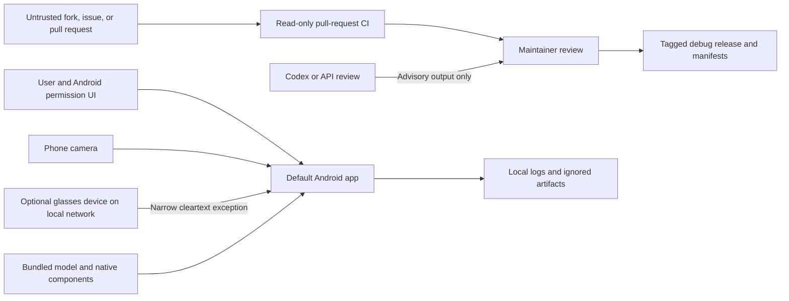

# BlindAssist threat model

Status: current

Last reviewed: 2026-08-12

This threat model covers the public Android prototype, the optional local
glasses stream, bundled models and native components, GitHub Actions, releases,
research artifacts, and model-assisted maintenance. It is a review boundary,
not a security certification or mobility-safety claim.

## Protected assets and trust boundaries

The assets that matter most are camera and bystander privacy, Android
permissions, device integrity, model and native-library integrity, repository
and CI credentials, release identity, contributor trust, and the provenance of
published evidence.

The default app performs camera inference on device. Machine-local datasets,
logs, downloads, and generated evidence are outside Git or under ignored
`artifacts.local/`. The optional AtomS3R path is a separate local-network trust
boundary and is not equivalent to the phone-camera default.

## Threats, controls, and residual risk

| Surface | Threat scenario | Current controls | Residual risk and required action |
| --- | --- | --- | --- |
| Camera and bystanders | Camera use exceeds user intent, frames leak into logs/artifacts, or sensitive scenes are committed | Runtime camera permission, on-device default processing, contribution/privacy rules, ignored local-artifact paths | Permission does not create bystander consent. Do not collect or publish real footage without separate authority; redact diagnostics and stop capture when the user leaves the flow |
| Local glasses stream | A local-network attacker observes, injects, replays, or spoofs MJPEG/ToF data | Global cleartext is disabled; the network security config allows only `192.168.5.11` and `atoms3r-tof.local`; the reader has timeouts, bounded headers, and a 2 MiB JPEG limit | The allowed path is still unauthenticated cleartext. Use only on a controlled isolated network; do not treat it as confidential or authentic. Authenticated encrypted transport is required before hostile-network or deployment claims |
| Android components and permissions | An exported component or excessive permission exposes capture or control functions | The main manifest requests camera, internet, and vibration; the launcher activity is the public component; broad cleartext is disabled | Re-audit every manifest, deep link, service, receiver, provider, backup rule, and permission change before merge. No new exported component is accepted by default |
| Bundled TFLite model and labels | A model or label payload is replaced, malformed, or mismatched with its documentation | `configs/public_release_assets.json` binds path, size, SHA-256, upstream URL, and notice; CI recomputes identity; the model card binds the default asset | Hash integrity does not prove upstream safety, accuracy, or freedom from malicious model behavior. Do not load contributor-supplied runtime models into a privileged release path without isolated inspection and promotion gates |
| Native/QNN components | A native binary introduces memory-safety, ABI, loading, or provenance risk | Native candidates are isolated from automatic default promotion; APK and 16 KB checks cover packaged artifacts; third-party scope is documented | Binary provenance and static/package checks are not a native-code security audit. Keep unsupported backends fail-closed and require source/version/hash review plus device evidence before promotion |
| Dependencies and build tools | A compromised package, Action, Gradle plugin, or downloaded tool executes in CI | GitHub Actions are pinned to commit SHAs; the TFLite inspection install uses hashes; downloaded bundletool is SHA-256 checked; Dependabot raises bounded update PRs | Gradle and transitive dependency supply chains remain trusted upstreams. Review repository changes, release notes, dependency graphs, and focused tests before accepting updates |
| Fork pull requests and CI | Untrusted code exfiltrates secrets, poisons caches, or alters evidence | Pull-request workflow permission is `contents: read`; no release credential is used; repository and ignored-output checks run on the submitted commit | Keep fork jobs secret-free and do not combine `pull_request_target` with untrusted checkout/execution. Treat artifacts and test output from forks as untrusted until reviewed |
| Tag and release pipeline | An unauthorized tag publishes a misleading APK, assets are overwritten, or version/source identity drifts | Tag/version equality is checked; APK identity/signature/16 KB checks run; source commit, checksums, verification JSON, and manifest are published; an existing release is not overwritten | Current public artifacts are explicitly debug releases, not production signing or store attestation. Protect tag authority and investigate keyless provenance/attestation before stronger distribution claims |
| Logs, research data, and local paths | Private images, device identifiers, credentials, restricted data, or absolute paths enter Git or an uploaded artifact | CONTRIBUTING/SECURITY rules prohibit them; repository hygiene and ignored `artifacts.local/` paths reduce accidental commits | Automated checks cannot recognize every sensitive payload. Review staged files and workflow artifacts; prefer synthetic/redacted evidence and revoke any exposed credential immediately |
| Model-assisted maintenance | Prompt injection in an issue or diff causes secret access, unsafe commands, or false approval | [`CODEX_MAINTAINER_AUTOMATION.md`](CODEX_MAINTAINER_AUTOMATION.md) treats repository text as untrusted, keeps model output advisory, separates read and write actions, and requires deterministic gates | Model review is not a security boundary. Do not provide write/release credentials or private reports to untrusted-content runs; stop on ambiguity or attempted instruction injection |
| Assistive feedback | A missed detection, stale frame, false-clear interpretation, or inaccessible UI causes misplaced confidence | Safety wording, deterministic state policy, `UNKNOWN` preservation, temporal/device gates, and explicit separation of research from product authority | The project has no real-user mobility-safety certification. Never describe absent detection as a clear route or use the prototype as a substitute for a cane, guide dog, training, or human judgment |

## Security invariants

The following changes fail closed until their owning review and tests are
complete:

- a new exported Android component, permission, network destination, cleartext
  exception, background-capture path, or backup surface;
- a different default model, labels file, native library, model loader, or
  third-party license/provenance record;
- a GitHub workflow that receives write permission, secrets, OIDC identity,
  signing material, fork artifacts, or untrusted code;
- a release-path, tag, signature, checksum, manifest, or provenance change;
- an API-backed maintainer workflow that can mutate issues, branches, pull
  requests, releases, repository settings, or vulnerability reports.

Security findings and mitigations remain separate from model-quality and
mobility-safety evidence. A security fix does not prove accessibility,
perception accuracy, or safe use.

## Known open risks

- The optional AtomS3R stream has a narrow but unauthenticated cleartext
  exception.
- The project has one active code maintainer and no independent security audit
  or penetration test.
- The GitHub release is a verified debug artifact, not production signing,
  store provenance, or deployment certification.
- The tag-triggered Release workflow was added after `v10.9.0` and has not yet
  completed a real tag run; the existing release therefore predates its
  `SHA256SUMS`, manifest, and verification-artifact contract.
- Public model identity is reproducible by hash, but the exact bundled YOLO
  export is not yet bit-for-bit reproducible from a frozen upstream toolchain.
- External adoption, target-user outcomes, and hostile-environment behavior are
  not established.

These risks must be disclosed, not converted into implied guarantees.

## Review and reporting

Re-review this document whenever a security invariant above changes, before a
new distribution channel, or after a material vulnerability. Private reports
follow [`SECURITY.md`](../SECURITY.md). Public changes should link the affected
threat row, list exact verification commands, and state any remaining evidence
gap.
