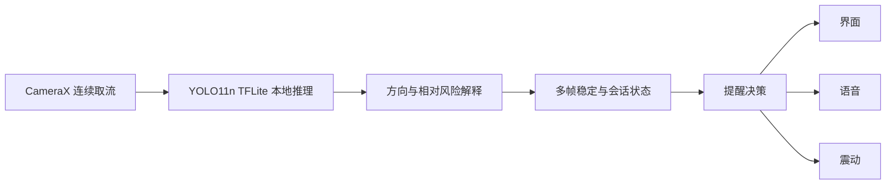
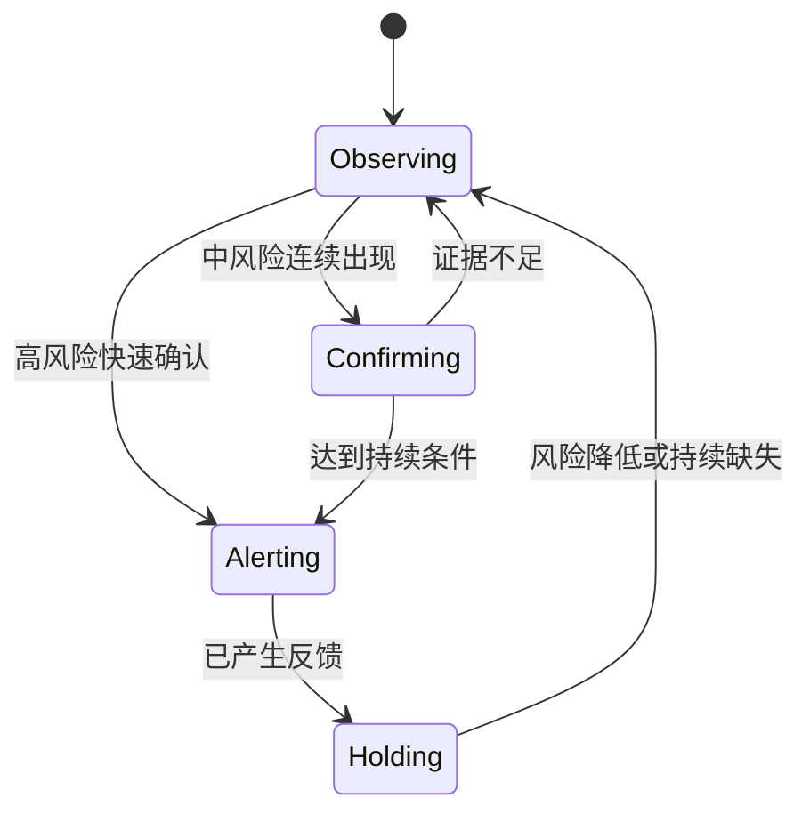

# BlindAssist 2026-07-29 首次组会汇报执行稿

状态：汇报准备稿

用途：用于制作 12—15 分钟 PPT、准备演示和统一现场表述。本文只安排第一次正式汇报，不替代 [研究生组会进展总账](GROUP_MEETING_PROGRESS.md) 或当前研究协议。

## 汇报结论

本次汇报只回答一个问题：BlindAssist 如何把手机摄像头中的逐帧目标检测结果，转化为具有方向、相对风险、时间稳定性和无障碍反馈的端侧辅助信息。

建议题目为：

> 从端侧视觉到可解释风险反馈：BlindAssist 项目规划与原型闭环

正文以项目阶段一至阶段三为主，阶段四仅用于解释模块分工和实时系统约束。固定评测集、模型 A/B、深度融合、项目审计、连续事件、路线研究和后续算法分支不进入正文。已有但未在本次展开的工作统一表述为“已经形成阶段材料，将按独立研究问题在后续汇报中展开”。

本次应形成的判断是：项目已经建立从连续视觉输入、本地推理、风险解释、多帧稳定到界面、语音和震动反馈的可运行原型闭环。现有结果证明系统链路和设计方法成立，不构成真实助行安全或目标用户有效性结论。

## 内容边界

| 内容层级 | 本次处理 | 现场口径 |
| --- | --- | --- |
| 端侧相机与模型推理 | 正文展开 | 已建立 CameraX 与 YOLO11n TFLite 的本地运行链路 |
| 风险转换与多帧稳定 | 正文重点 | 检测结果需要经过任务相关解释和时间状态约束 |
| 语音、震动与无障碍反馈 | 正文展开 | 算法输出与用户可理解反馈需要分别设计 |
| 多模块架构 | 只讲总体职责 | 用于说明实时链路复杂度，不展示完整可靠性专题 |
| 固定评测、模型 A/B、深度融合 | 规划页点到为止 | 已形成材料，后续按实验问题汇报 |
| SANPO、USTRF、RCLE、跨相机、RGB-D/pose | 不进入正文 | 不主动提及；被追问时只说明已进入连续风险研究预研 |
| 真实用户效果和助行安全 | 明确不作结论 | 尚无目标用户研究，原型不能替代盲杖、导盲犬或人工判断 |

## PPT 页面与讲稿

### 第 1 页：标题

页面只保留项目名称、汇报题目、姓名和日期。开场控制在 30 秒，不介绍版本号、提交数量或最新研究分支。

建议讲稿：

> 我汇报的项目是 BlindAssist。它是一个运行在 Android 手机上的端侧视觉辅助原型，目标不是简单识别画面中的物体，而是研究如何把检测结果转化为用户能够理解的方向、相对风险和反馈信息。因为这是项目建立以来第一次系统汇报，今天主要介绍项目规划，以及已经形成完整运行闭环的第一阶段工作。

### 第 2 页：问题背景

页面用“目标检测输出”和“用户真正需要的信息”形成对照。左侧可以放检测框示意，右侧写方向、相对风险、变化趋势和提醒时机。

建议讲稿：

> 普通目标检测回答的是“画面里有什么”，但这个答案不能直接用于助盲提醒。系统还需要判断目标位于左侧、右侧还是前方，距离风险属于哪个相对等级，目标是否持续接近，以及当前结果是否稳定到足以打断用户。这里存在两类错误：漏报可能使风险未被提示，误报和重复播报也会降低用户对系统的信任。因此，项目关注的不是单个模型指标，而是从视觉证据到反馈决策的完整链路。

本页控制在 1 分 30 秒，不讲具体模型对比结果。

### 第 3 页：项目总体规划

页面用四阶段路线图表示项目安排。

| 阶段 | 研究内容 | 汇报状态 |
| --- | --- | --- |
| 原型闭环 | 端侧感知、风险解释、多帧稳定、无障碍反馈 | 本次重点 |
| 可信验证 | 运行时可靠性、固定评测、模型和策略对照 | 后续专题 |
| 连续风险研究 | 从逐帧命中转向连续事件、运动和空间关系 | 后续专题 |
| 扩展验证 | 跨场景统计、设备证据和受控用户研究 | 中长期规划 |

建议讲稿：

> 项目按原型闭环、可信验证、连续风险研究和扩展验证四个层次推进。本次只展开原型闭环，说明系统怎样从相机输入走到用户反馈。可靠性、固定评测和连续风险方向已经形成部分材料，但这些问题的方法、数据和结论边界不同，后续会分别汇报。

本页控制在 1 分钟。不要在路线图中写 SANPO、USTRF 或 RCLE。

### 第 4 页：端到端系统框架

页面使用下图：

建议讲稿：

> 系统由连续取流、本地推理、风险解释、时间状态和多模态反馈组成。CameraX 提供相机帧，TFLite 模型在手机端完成检测，风险层根据目标位置、框底部、面积、类别和置信度形成相对风险。多帧状态用于过滤抖动、处理短时漏检并抑制重复提醒，输出再交给界面、语音和震动。整个基础链路在端侧运行，不需要把相机画面上传到云端。

本页控制在 1 分 30 秒。模块名称可以在图角落标注，但不展开 Hilt、故障注入、session token 或审计修复。

### 第 5 页：从检测结果到风险解释

页面展示两个对照场景：远处侧方目标与近处中心目标。两者即使属于同一类别、具有相近检测置信度，对用户行动的意义仍不同。

建议讲稿：

> 检测置信度只表示模型对类别判断的把握，不能直接等同于危险程度。BlindAssist 将目标在画面中的方向、框底部位置、面积、类别和置信度共同用于风险解释。系统输出 FAR、MID、NEAR、CRITICAL 等相对等级，不把框面积换算成未经标定的米制距离。这样的处理保留了输出的可解释性，也避免向用户提供超出当前传感器能力的距离承诺。

页面底部放一句结论：

> 检测结果需要经过与行动任务相关的风险语义转换。

本页控制在 1 分 30 秒，不展示后续风险场、深度或路线公式。

### 第 6 页：多帧稳定与会话状态

页面用简化状态图说明逐帧结果如何形成稳定提醒：

建议讲稿：

> 连续视频中，单帧结果可能因为遮挡、运动模糊或模型波动而短暂变化。如果每次变化都触发反馈，系统会产生抖动和重复播报。当前策略允许高风险证据快速确认，中风险需要连续出现，短时漏检可以在有限时间内保持；风险方向和等级没有变化时，不重复更新读屏摘要。新会话开始后会重置旧状态，避免前一次使用过程影响当前判断。

页面底部放一句结论：

> 单帧命中不足以直接决定用户提醒，时间一致性是感知链路的一部分。

本页控制在 2 分钟。不要提前讲完整事件生命周期、因果窗口或后续事件指标。

### 第 7 页：反馈与无障碍

页面使用 [App 首页真机截图](assets/group-meeting/app-home-2026-07-22.png)，旁边标注方向与距离等级、语音、震动、TalkBack、大字体、权限解释和提醒模式。图片只用于展示界面形态，不能标成感知效果证据。

建议讲稿：

> 风险结果只有被用户及时发现并正确理解，才具有反馈意义。原型提供界面、语音和震动三种输出，支持安静、标准和敏感等提醒策略，并处理 TalkBack、大字体、中英文界面和相机权限说明。系统区分“当前帧没有目标”和“稳定器仍保持上一风险”，避免界面状态与内部判断相互矛盾。现阶段完成的是无障碍工程设计和运行流程，还没有目标用户研究，因此不能据此判断真实可用性。

本页控制在 1 分 30 秒。

### 第 8 页：原型演示与证据边界

演示建议使用 20—30 秒预录视频，现场运行作为备用。录屏按“进入辅助识别—相机开始工作—目标出现—风险信息变化—产生反馈—切换提醒模式”的顺序组织。

演示结束后的建议讲稿：

> 这段演示证明相机输入、本地推理、风险解释、状态稳定和反馈输出已经接通。它不能证明系统识别了所有障碍，也不能证明真实道路助行安全。项目将 App 演示、逻辑测试、真机流程和后续实验分别记录，避免用某一层证据替代另一层结论。

如果现场环境不稳定，直接播放录屏，不临时调整模型、阈值或提醒策略。

### 第 9 页：阶段结论与后续问题

页面上半部分写本次结论：

> BlindAssist 已经完成从连续视觉输入到可解释反馈的端侧原型闭环。项目难点不只在模型推理，还包括风险语义、时间状态、会话边界和无障碍反馈之间的一致性。

页面下半部分只列后续研究问题，不展示已有结果：

| 后续问题 | 后续汇报方向 |
| --- | --- |
| 怎样客观比较不同检测模型是否更适合助行任务 | 固定评测与同设备 A/B |
| 深度和运动信息能否改善风险判断而不增加误报和延迟 | 候选证据融合与停止门 |
| 怎样评价接近、通过、离开和重复提醒 | 连续事件指标 |
| 怎样区分前进方向内的风险和侧方干扰 | 空间关系与对照实验 |
| 怎样判断结果能否跨场景重复 | 固定协议与统计验证 |

建议结束语：

> 第一阶段解决的是“视觉结果怎样形成用户能够理解的提醒”。后续工作将分别回答提醒是否准确、是否稳定，以及在连续和跨场景条件下能否形成可重复的算法收益。每个问题都会使用独立的数据、对照和停止条件进行汇报。

本页控制在 1 分 30 秒。

## 时间安排

| 内容 | 时间 |
| --- | ---: |
| 标题、背景与研究问题 | 2 分钟 |
| 项目规划与系统框架 | 2 分 30 秒 |
| 风险解释与多帧稳定 | 3 分 30 秒 |
| 无障碍与原型演示 | 3 分钟 |
| 阶段结论与后续问题 | 1 分 30 秒 |
| 机动时间 | 1 分钟 |
| 合计 | 13 分 30 秒 |

如果现场限制为 10 分钟，删除第 3 页的口头展开，将第 7 页压缩为 40 秒，并把第 8 页演示控制在 20 秒。

## 可能追问与回答

### “项目的创新点是什么？”

> 当前研究重点不是简单替换更大的检测模型，而是研究逐帧检测结果如何经过风险语义和时间状态，形成可解释、不过度重复并能在证据不足时保持克制的反馈。第一阶段先建立可信的端侧闭环，后续再用固定数据和对照实验验证连续风险表示是否具有稳定收益。

### “现在是不是只做到这个阶段？”

> 不是。可靠性、固定评测和连续风险方向已经形成阶段材料。今天是项目建立以来第一次系统汇报，所以先讲证据闭环完整的原型部分；后续会按数据、方法、对照和结论边界分别汇报，避免把不同证据层级混在一次汇报中。

### “为什么选择 YOLO11n？”

> 本阶段需要先建立能够在移动端稳定运行的感知入口。YOLO11n 具备现成的 TFLite 部署条件，能够支持端到端链路研究。它是当前基线，不代表已经证明为最优模型；候选模型比较属于后续固定评测专题。

### “为什么不用真实距离？”

> 当前基础链路没有经过可靠标定的米制深度，因此系统只输出相对距离等级。用检测框面积直接换算米数会产生超出证据能力的精度承诺，现阶段保留相对风险更符合系统边界。

### “有没有真实盲人用户实验？”

> 当前没有目标用户研究。已有工作证明原型链路、交互实现和部分真机流程，不支持真实助行安全或用户有效性结论。目标用户实验需要单独的伦理、场地、任务设计和风险控制。

### “工作量主要体现在哪里？”

> 工作量主要体现在连续相机输入、本地推理、风险转换、多帧状态、会话管理和多模态无障碍反馈之间的接口与一致性，而不是单独训练或调用一个模型。每一层都需要处理正常路径、证据不足和状态变化，并保证最终界面与反馈不产生错误安全暗示。

## 汇报前检查

- PPT 正文保持 9 页，备份页不超过 3 页。
- 准备 20—30 秒录屏，并确认离线可以播放。
- 架构图和状态图使用大字号，避免展示代码截图。
- App 截图标注为“界面与运行流程证据”，不标注为算法效果。
- 不在正文出现 SANPO、USTRF、RCLE、JRDB、LILocBench 或六臂消融。
- 不展示代码行数、提交次数或主观人月换算。
- 不使用“保证安全”“准确避障”“可以独立出行”等表述。
- 预演一次 10 分钟版本和一次 13 分钟版本。
- 将完整项目材料保留在备课文档中，不把长期总账直接投屏。

## 备课证据入口

本次汇报的原型、风险解释、会话追踪和无障碍内容以 [2026 年 5 月开发记录](../history/development-log/2026-05.md) 为主要证据。系统总体框架和阶段边界见 [研究生组会进展总账](GROUP_MEETING_PROGRESS.md)，产品定位与当前正式 App 边界见 [项目 README](../../README.md)。这些材料用于核对讲稿，不建议整页复制到 PPT。
