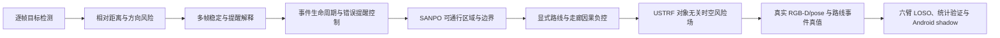
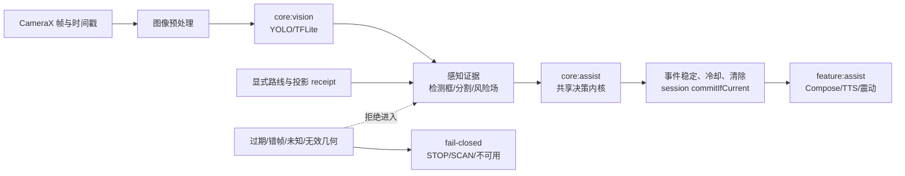
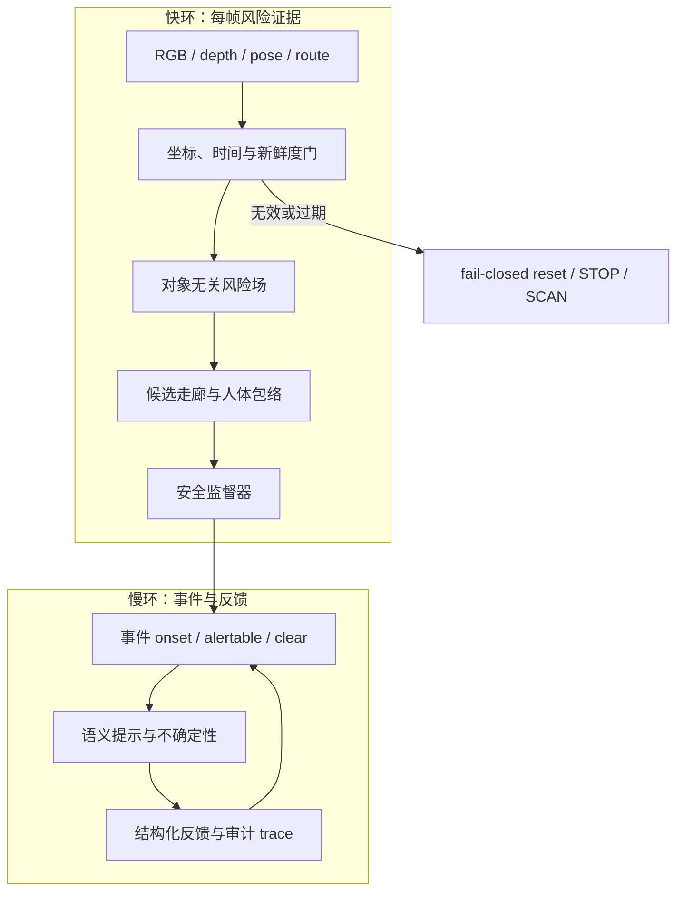
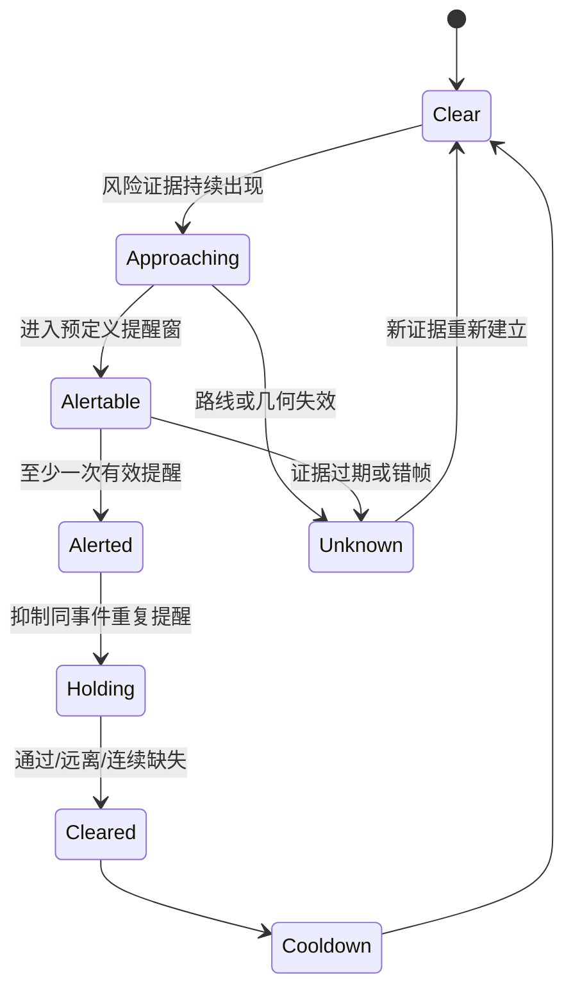
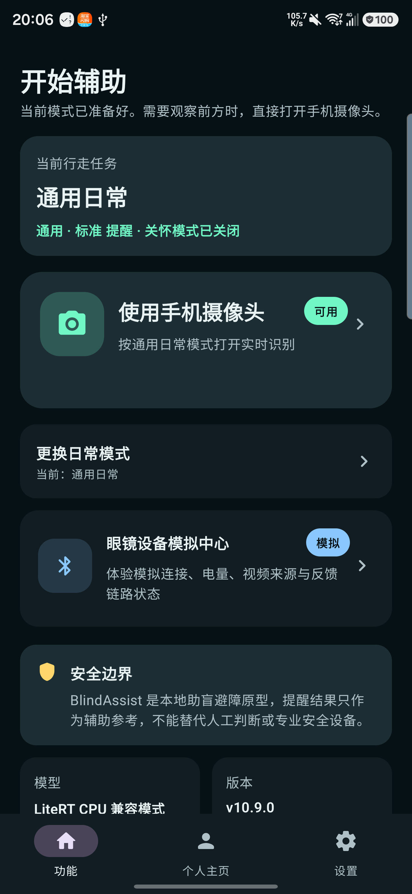
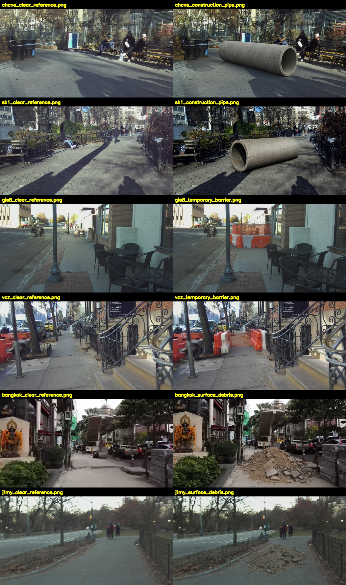
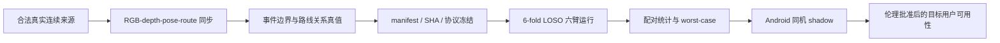
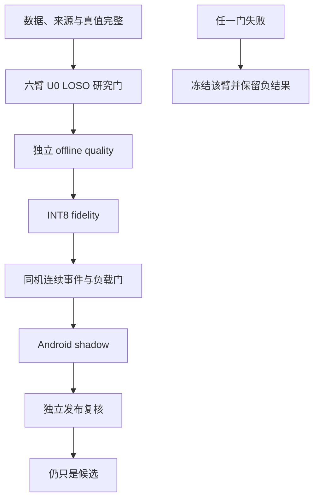

# BlindAssist 研究生组会进展总账

状态：长期维护记录

建立日期：2026-07-22

覆盖范围：2026-05-17 至今

当前研究主线：神经—几何双环阶段−1顺序准入；下文路线条件化研究作为历史演化与
负结果保留

## 文档定位与使用方法

本文用于保存 BlindAssist 自项目建立以来可用于研究生组会汇报的工作、证据、负结果和下一步协议。它回答三个问题：已经做了什么；这些工作能支持什么强度的结论；怎样把后续工作收敛为一条可以被数据证伪的硕士研究主线。

本文不是产品说明书，也不替代当前协议。SANPO 的当前授权以 [SANPO_CURRENT_STATUS.md](../SANPO_CURRENT_STATUS.md) 为准，USTRF-SC 的实现与证据边界以 [USTRF_SC_IMPLEMENTATION_STATUS.md](ustrf-sc/USTRF_SC_IMPLEMENTATION_STATUS.md) 为准。日期化报告只说明当时实验结论；当数字发生变化时，组会记录应链接新的证据，不在多个文档复制一个会漂移的“当前状态”。

全文采用三层证据标记。`已验证`表示存在代码、测试、设备收据或可复算报告；`受限研究证据`表示结果来自合成数据、公开数据原生真值、模型复核、oracle、proxy 或 benchmark-only 路径；`计划/缺口`表示尚未完成，不能在汇报中改写成结果。App 截图只证明界面和运行流程，不能证明助行安全；模型生成或模型复核材料不能称为人工真值；某项 benchmark 通过也不自动授权生产替换。

## 首次正式汇报的公开边界

本总账保存项目建立以来的完整材料，不等于第一次汇报需要覆盖的内容。首次正式汇报建议使用“从端侧视觉到可解释风险反馈：BlindAssist 项目规划与原型闭环”作为题目，正文以阶段一至阶段三为主。阶段四只用于交代模块职责、实时链路和后续可靠性问题，不展开专项修复、完整测试矩阵或审计结论；阶段五及其后的数据、算法和实验结果留作后续专题汇报。逐页安排、建议讲稿和现场问答见 [2026-07-29 首次组会汇报执行稿](GROUP_MEETING_FIRST_REPORT_2026-07-29.md)。

这一区间已经能够形成完整的问题链。系统需要在移动端持续取得相机帧，完成本地模型推理，再将目标框转换为方向和相对风险。单帧结果不能直接驱动反馈，因此还要处理高风险快速确认、中风险连续确认、短时漏检保持、会话重置和重复提醒抑制。风险状态最终通过界面、语音和震动传递给用户，并与 TalkBack、大字体、权限失败及中英文语义保持一致。首次汇报的工作量应由这条闭环中的相互约束体现，而不是通过罗列阶段数量、提交次数或代码行数体现。

| 复杂度层面 | 首次汇报可讲内容 | 能够支持的结论 |
| --- | --- | --- |
| 端侧感知 | CameraX 连续取流、YOLO11n TFLite 本地推理、坐标映射 | 已建立真实运行的视觉输入与推理链路 |
| 风险解释 | 目标位置、框底部、面积、类别和置信度共同形成相对风险 | 检测结果需要经过任务相关的风险语义转换 |
| 时间一致性 | 多帧确认、短时保持、会话重置、重复反馈抑制 | 单帧命中不足以直接决定用户提醒 |
| 反馈与无障碍 | 方向与距离等级、语音、震动、TalkBack、大字体和权限语义 | 算法输出与用户可理解反馈需要分别设计和验证 |
| 证据边界 | App 演示、逻辑测试和真机流程分别陈述，不把未检测表述为安全 | 原型闭环成立，但尚不构成真实助行安全证明 |

现场展示可以由一段短演示、一张端到端框架图、一张风险状态转换图和一个会话追踪示例构成。固定评测集、检测器 A/B、深度融合负结果、项目审计、连续事件、路线条件化和后续研究分支只出现在项目规划或备份页中。本次不把这些内容说成尚未开展，而表述为“已经形成材料，将按独立研究问题在后续汇报中展开”，以免当前进度说明与实际项目状态冲突。

## 内部全量结论

项目已经从一个手机端本地目标检测原型，演进为包含移动端感知、风险解释、连续事件生命周期、可通行区域、显式路线、对象无关风险场、跨相机验证、RGB-D/pose 回放和设备门禁的研究系统。现有材料可以组织为 12—16 次具有独立问题、方法、证据、结论和下一步的组会汇报；如果只保留论文主线，适合压缩为 8—10 次高质量汇报。

截至 2026-07-22 当前 HEAD `448f0d4`，Git 历史从 2026-05-17 开始，共 142 次提交，分布于 21 个活跃提交日和 7 个活跃周。仓库当前跟踪 1250 个文件，其中 Kotlin 266 个、Python 540 个、Markdown 116 个。历史文本变更规模约为十余万行，但该数字包含重复改写、实验脚本、配置生成和验证设施，只用于说明实现与实验基础设施的规模，不能直接换算为论文贡献或人工工时。

上述仓库规模不能代替研究贡献判断。现有材料已经形成可运行原型、端侧风险与反馈链路、测试和评测设施，以及多条受控实验记录；论文层面的结论仍取决于真实事件分母、固定协议、对照实验和可复算统计。首次汇报不使用提交次数、文件数或“折合多少个月工作量”作为主要证据，而通过系统约束、设计取舍、失败处理和验证链路说明工作复杂度。

## 2026-07-22 阶段性统一研究问题

当时的项目材料曾收敛为下面一个问题：

> 在跨相机、跨场景的连续真实路线事件中，路线条件化、对象无关的稠密时空风险场 USTRF-SC，能否相较类别依赖的检测框风险基线，提高路线内关键危险事件的识别与因果闭环能力，同时不增加假提醒、重复提醒、清除延迟和端侧负载，并在感知、位姿或几何证据失效时保持 fail-closed？

这条问题能够解释截至当时的主要工作。早期 App 解决“检测结果怎样转成用户可理解的提醒”；EvalSet 和同设备 A/B 解决“模型是否真的改善助行相关指标”；SANPO 将研究对象从 COCO 类别扩展到自由空间、边界和连续事件；显式路线实验检验风险能否相对于候选走廊进行归因；USTRF-SC 将检测框、稠密几何、动态接近、不确定性和事件生命周期放进同一证据链。该路线后来已经按照预设停止门收口，本节只作为研究问题演化记录，不代表当前执行主线。2026-07-30 起，论文系统路线入口改为 [双环阶段−1准入](dual-loop/README.md)；RCLE 已暂停，其历史终态继续由 [RCLE README](rcle/README.md) 保存。

论文结论应限定为算法与系统闭环有效性。在完成伦理审批和目标用户研究以前，不能写成“证明了真实盲人助行安全有效”。

## 系统框架

### Android 产品链路

正式 App 保持本地、离线、辅助性原型定位。CameraX 提供帧，视觉模块运行 TFLite 检测，风险层结合位置、面积、底部位置、方向和连续趋势，运行时协调层管理 session、事件和反馈，Compose、语音与震动负责输出。研究候选不能绕过共享安全内核直接生成“安全”或方向指令。

### USTRF-SC 双环框架

USTRF-SC 不再把“识别到某个 COCO 类别”等同于危险，而是构造与路线相交的对象无关风险证据。快环处理同帧几何、占用、动态接近和不确定性，慢环处理事件、语义、持久事实与反馈。任何 route、frame、pose、depth 或 coordinate receipt 不完整时，系统应拒绝推断并进入保守状态。

### 连续事件而非逐帧命中

助行提醒的分析单位是事件，不是相邻视频帧。一个事件只需在可提醒窗口内成功触达一次；同一事件的重复播报是负担；障碍通过或离开路线后必须及时清除；连续帧不能作为独立样本扩大统计显著性。

## 当前 App 界面

下图来自 2026-07-22 连接的 Samsung SM-S9280 上已安装正式 App，应用 ID 为 `com.linnan.blindassist`。截图展示“通用日常”任务、手机摄像头入口、眼镜模拟中心和安全边界。它证明当前产品形态和安全措辞，不代表相机感知质量或真实用户安全效果。

## 项目阶段总账

### 阶段一：手机端实时助盲原型建立（2026-05-17）

这一阶段回答“检测框怎样转成有行动含义的提醒”。项目接入 CameraX 连续取流和 YOLO11n TFLite 本地推理，以检测框底部位置、面积、中心偏置、类别和置信度构造相对风险，输出方向、距离等级、语音和震动。距离只使用 FAR、MID、NEAR、CRITICAL 等相对等级，没有将框面积伪装成米制距离。

风险稳定器给高风险单帧快速确认，中风险需要连续证据，并允许短暂漏检在有限时间内保持。阶段结果不是“算法已经安全”，而是完成了从视觉输入、风险判断到用户反馈的第一条可运行链路。开发记录中的距离风险与稳定器测试为逻辑层证据，真实环境覆盖仍不足。

组会可展示：CameraX—TFLite—风险规则—反馈的端到端流程；相对距离设计；为什么不能把单帧置信度直接播报为危险。证据入口为 [2026-05 开发日志](../history/development-log/2026-05.md) 中 5 月 17 日的性能、距离提醒和稳定化记录。

### 阶段二：提醒策略、可信显示与会话追踪（2026-05-17—18）

系统增加安静、标准、敏感三档策略，并以 `SessionTrace` 保存近期帧、反馈原因和性能摘要。界面开始区分“当前帧没有目标”和“稳定器仍保持上一风险”，避免算法内部状态与用户看到的文字相互矛盾。风险、方向或距离没有变化时，读屏摘要不重复更新，从设计上降低播报疲劳。

这一阶段形成了一个可以复盘的 Assist session：输入帧、模型输出、风险转换、稳定结果和最终反馈不再只是散落日志。它为后续事件级指标和 `commitIfCurrent()` 生命周期门提供了结构基础。

### 阶段三：无障碍与真实使用流程（2026-05-18—19）

App 补充 TalkBack、大字体、中英文切换、新手引导、相机权限解释、Care Mode、日常模式和一键入口，并通过 Compose 真机仪器测试与安装回归反复修正。研究意义在于把“算法是否命中”与“用户是否能发现、理解和操作”分开评价。

这一阶段支持的结论是：助盲系统评价必须同时覆盖提醒可理解性、动态播报、权限失败、错误信任和重复反馈。它不能证明目标用户可用性，因为尚无盲人或低视力参与者实验。

### 阶段四：多模块架构与运行时可靠性（2026-05-22—26）

项目从单模块迁移为 `app`、`feature:assist`、`core:assist`、`core:vision`、`core:device` 和 `core:ui` 等职责分离的结构。Runtime 状态机、Hilt 依赖、CameraX 生命周期、反馈触达、帧输入、故障注入和回归脚本逐步建立，重点处理旧帧、快速关闭/重开、相机中断和后台线程提交等实时系统问题。

该阶段可以作为“移动端实时视觉系统的可靠性与可测试性”独立汇报。工作量主要体现在接口收敛、生命周期状态、错误路径和测试矩阵，而不是新模型指标。

### 阶段五：固定评测集与检测器同设备 A/B（2026-05-27）

研究问题从“哪个模型更新”转成“哪个模型在相同设备和助行指标上更合适”。项目建立 detector benchmark lab 和 150 张 BlindAssist 专用静态评测集，包含 1144 个 COCO 框；CENTER、LEFT、RIGHT 分布为 93、29、28，应提醒与不提醒为 99、51，HIGH、MEDIUM、LOW、NONE 为 60、39、26、25。

YOLO11n 的 AP50 为 0.285、recall 为 0.299，总延迟 P50/P95 为 54/56 ms；YOLO26n 的 AP50 为 0.279、recall 为 0.294，总延迟为 49/51 ms。候选更快，但 AP 和召回略降，因此没有替换默认模型。这个负结果确立了后续原则：速度收益不能自动抵消关键漏报、错误提醒或事件质量退化。

静态评测集能够固定模型比较口径，但不能验证接近、通过、清除和重复提醒。其职责与限制见 [BLINDASSIST_EVALSET.md](../BLINDASSIST_EVALSET.md) 和 [DETECTOR_BENCHMARK.md](../DETECTOR_BENCHMARK.md)。

### 阶段六：深度、运动与保守融合（2026-06-11—12）

这一阶段检验“检测框面积能否被深度和运动证据可靠增强”。项目验证 Depth Anything V2 Small 和移动端 MiDaS 候选，建立 `DistanceEvidence`、`TemporalRiskTracker` 和 `ConservativeRiskFusionPolicy`。深度或运动最多提升一个风险等级；证据冲突、低置信或不可用时回退几何基线。

同设备实验中，baseline 的距离准确率为 0.73、alert FP 为 0.037、critical miss 为 9、P50/P95 为 54/56 ms；depth fusion 的距离准确率为 0.69、alert FP 为 0.185、critical miss 为 7、P50/P95 为 276/292 ms。关键漏报从 9 降至 7，但误报约增加五倍，距离准确率下降，P95 延迟增加到约五倍，因此候选被否决。

该结果展示了适合组会汇报的完整负实验：假设合理，局部指标改善，但系统级代价超过收益。证据见 [2026-06 开发日志](../history/development-log/2026-06.md)。

### 阶段七：综合审计与安全语义修复（2026-07-10）

项目审计确认 CameraX、TFLite、风险规则、稳定器、界面、TTS、震动、偏好和构建链路均有真实实现，同时发现“未检测到”被表达为“安全观察中”、旧帧跨 session 提交、benchmark 与功能 instrumentation 混杂、Gradle 隐式依赖和仓库卫生假通过等问题。

修复引入 `RiskEvidenceState`，区分没有证据、低风险和已识别风险；session token 与 `commitIfCurrent()` 阻止过期结果提交；设备 benchmark 被移入独立模块；真机回归不再只判断进程存在，而是检查前台、模型 ready、相机帧和无 Crash/ANR。审计时 189 项 JVM 测试、分模块 Lint 和 APK 构建分别通过，随后完成 SM-S9280 上的 Compose、Detector A/B、Depth-fusion 和 90 秒相机回归。

这一阶段标志着项目从功能原型进入可审计的安全语义和验证阶段。完整边界见 [PROJECT_AUDIT_2026-07-10.md](../PROJECT_AUDIT_2026-07-10.md)。

### 阶段八：SANPO 连续序列、可通行区域与事件闭环（2026-07-11）

静态 COCO 目标无法表达路沿、台阶、自由空间和同一障碍事件。项目建立 SANPO 连续序列流程，首批真实序列为 30 帧、3 秒、2208×1242，保留唯一帧哈希、分割来源和复核记录。YOLO11n 与 YOLO26n 在关键 person GT 上均出现漏检，approach recall 均为 0，进一步说明 COCO detector AP 不能替代助行事件指标。

可通行区域 oracle 离线覆盖主区域 26/30，但首版真机错误提醒率从 3.3% 升至 90%，主要原因是把路线侧方 curb 当作中心危险。v2 将 curb 降为边界证据，限制无深度分割的风险等级，并建立中心侵入逻辑。`RiskEventTracker` 随后让同一事件只提醒一次，并在连续远离或缺失后清除；90 帧回归中的重复提醒和平行路沿提醒降到 0。

下图为公开 SANPO 连续画面的时间线，用于说明相邻帧高度相关以及事件会经历接近、遮挡和离开。它是公开数据离线研究，不是目标用户实验。

阶段结论是研究分析单位必须从 frame 转向 event。协议见 [SANPO_SEQUENCE_EVALSET.md](../SANPO_SEQUENCE_EVALSET.md) 与 [SANPO_TRAVERSABILITY_BASELINE.md](../SANPO_TRAVERSABILITY_BASELINE.md)。

### 阶段九：SANPO 数据治理、GPU 训练与单因素消融（2026-07-12—13）

训练入口被限制为唯一 dataset root，blind holdout 固定为 `benchmark_only`，训练器、阈值选择和早停不能访问。数据记录许可/来源、RGB 与 mask、逐资产 SHA、session 身份和 split；缺失证据时 fail closed。独立 canonical 包含 14 个互斥 session，train 为 8 session/400 帧，dev 为 4 session/200 帧，blind 为 2 session/120 帧，RGB 与 raw mask 共 1440 个哈希闭合。

模型路线为 MobileNetV3 + LR-ASPP，参数量 670588。RTX 5060 mixed FP16、batch 64 的吞吐约 358 images/s。Torch—TensorFlow 数值等价门达到最大绝对误差约 `6.34e-5`，argmax 一致率为 1.0。实验比较输入分辨率、宽度系数、decoder、采样和 seed；最佳 384 候选的 mIoU 为 0.4344、boundary IoU 为 0.4506，但 macro-session mIoU 为 0.3283，低于 0.40 门，worst-scene 为 0.2680，低于 0.30 门。其他两个预注册 seed 的 mIoU 只有 0.1804 和 0.2498。

P0 因子审计进一步显示，固定 sampler 时 model seed 跨度为 0.2685，固定 model seed 时 sampler seed 跨度为 0.0112，模型初始化影响约为采样器的 24.1 倍。结果否定了“挑最好 seed 即可晋级”的做法。候选未导出新 INT8、未进入设备晋级、未替换 App。

### 阶段十：公开银标、反事实与路线意图转折（2026-07-15—19）

项目获取第一人称公开视频并构建 matched counterfactual、生命周期和表示诊断。1.319 GB 的 uB-VisioGeoloc 序列抽取 804 帧，隐私预处理产生 585 个模糊区域；数据仍保留隐私和来源限制，未被升级为用户真值。DINO probe 的 mIoU 为 0.4235，boundary IoU 只有 0.1312；train/dev 边界覆盖差约 19.8 倍，使直接 boundary loss 消融无法归因。多轮生命周期实验虽然出现局部提升，worst seed 和跨来源覆盖仍未达门。

三个 IMU probe 的 AUROC 为 0.4770、0.4746、0.3465，否决“手机 IMU 可以直接代表用户路线意图”。显式 future-route teacher 在 16 事件、11 来源上取得 intervention recall 1.0、context recall 0.8333、balanced accuracy 0.9167。该结果只属于受限 teacher 上限，却把研究方向从继续堆视觉 head 转向显式路线条件化。

下图展示六组清晰/障碍反事实。图中的障碍由合成流程加入，作用是控制障碍是否侵入路径这一变量，不是真实传感器观测。

### 阶段十一：显式路线几何与 Corridor-Causal 工程可行性（2026-07-19—20）

系统完成世界路线到相机坐标投影、外部 route payload 时效与置信度校验、Camera2 内参/畸变/镜头位姿、CameraX sensor-to-buffer 矩阵，以及旋转向量和相机时间戳配对。SM-S9280 的 Camera 0 观测约为 `fx=2766.12 px`、`fy=2771.18 px`；30 帧 CameraX 均为 640×480、旋转 90°；旋转向量最近采样差中位 4.81 ms、最大 9.67 ms。gravity-axis 重投影最小角误差为 0.42°，但有效对齐长度 8.782% 低于 10% 门，因此停止继续外推。

Corridor-Causal Student 原型包含 62689 参数的全 INT8 TCN，组件 P95 为 0.3155 ms，CameraX + YOLO + TCN 总 P95 约 69 ms，说明端侧实现具有工程可行性。96 episode/48 matched pair 的事件真值当时为空，所以没有训练或事件效果结论。

### 阶段十二：USTRF-SC 对象无关时空风险场（2026-07-20—21）

USTRF-SC 将“危险”重新定义为路线内空间占用、几何异常、动态接近和不确定性的组合，而不是某个类别是否出现。项目新增 pure-Kotlin `core:ustrf`、隔离的 `ustrf-shadow-benchmark`、风险场 TTL/warp/reset、人体 capsule 走廊、安全监督器、共享 `AssistDecisionKernel`、baseline YOLO geometry、bbox × explicit route 两条真实 Android adapter，以及 dense risk-evidence seam。

V13 研究汇总共 15 个 gate，通过 14 个，唯一失败为 device metric geometry admission，状态只能是 `CONDITIONAL_RESEARCH_GO`。REveL 的 770 个框中有 488 个可做 motion 对齐，approaching、quasi-static、receding recall 分别约为 0.931、0.903、0.906。route-specific synthetic balanced accuracy 为 0.91555，错路线下降到 0.72492 和 0.79515，说明路线具有可观察贡献；但多 seed mean BA 为 0.87737，低于 0.90，worst no-alert recall 为 0.79710，低于 0.80，稳定门仍失败。

真机 shared-kernel 历史 benchmark 为 90 帧，P95 57.674 ms，event recall 1.0、critical miss 0、repeat delivery 0、false alerts/min 0，并抑制 49 次重复尝试。这里的反馈 adapter 是 deterministic planner acceptance，不是物理反馈送达，也没有冻结的真实事件真值，因此只能证明共享内核和 trace 链路，不证明助行安全。

### 阶段十三：跨相机归因、移动端连续事件与小目标负结果（2026-07-21—22）

R1/R1.1 将路线改成 hash-bound 当前帧凸多边形，以目标框底部接触点输出 inside/outside/uncertain。诊断发现原 COCO taxonomy 不覆盖 traffic cone、delineator、bollard，旧检测器对该问题属于 unsupported taxonomy。R1.2 预注册后改用 YOLOE 三类 prompt，在六个新 held-out 来源上取得正例 3/3、负例假告警 0/3、目标匹配 5/6，Android 与离线结果一致。

连续事件暴露了性能与效果的分离。R1.2a 在 600 秒内运行 648 次推理，P50/P95 为 762/978 ms，正例为 4/6，性能门和事件门都失败；R1.2b 使用 GPU delegate，在 600 秒内完成 4795 次检测，推理 P50/P95 为 40/54 ms，温升 4°C，设备性能门通过，但事件仍为 4/6，London 有 22 帧完全未关联。

R1.2d 的 stride-4/P2 小目标候选在三 seed 下使 small recall 平均提高 2.20 个百分点，但事件仍为 4/6，同时 FP 增加 0.236/图，因此停止继续训练。该实验直接支持当前主线：small-object recall 提高不等于路线内关键事件收益。

下图是 London 公开视频的连续路线代理。绿色区域是算法构造的当前帧走廊，不是身体绑定真实路线；它适合展示为什么逐帧“看到了目标”仍可能在事件关联上失败。

### 阶段十四：多来源传感器回放、独立实验 App 与真实证据停止门（2026-07-22）

ETH3D、ICL-NUIM、TartanAir 各规范化 120 帧，source alignment 均为 1.0，depth reprojection P95 分别为 4.13、9.15、288.83 mm。三来源 geometry transport 通过，但两次隔离模型审核均拒绝 route/event admission，因为这些序列不具备身体绑定前向路线和可观察的助盲事件生命周期。

SM-S9280 的 ARCore frame-bound canary 在 150 行中获得 139 个唯一 Camera2 timestamp 与 image pair，但 raw depth、tracking、valid pair 和稳定 anchor 均为 0，触发 `FREEZE_FRAME_BOUND_METRIC_GEOMETRY`。这项负结果阻止了用不存在的设备深度或瞬时 pose 构造米制安全结论。

LILocBench 两条动态来源完成适配。`dynamics_0` 为 2397 帧，RGB-depth 对齐率 0.999583，pose 覆盖 1.0；`lt_changes_dynamics_0` 为 8377 帧，对齐率 0.999881，pose 覆盖 0.999164。当前冻结来源进度为 2/3，候选事件尚未完成正式评测。独立 `com.linnan.blindassist.ustrf.experimental` App 可以与正式版并存，仅用于体验二维 route proxy 与对象无关风险 seam，米制深度、稳定 pose、ground 和真实事件仍缺失。

## 关键公式与指标口径

### 概念风险分解

早期 bbox 风险可用下面的概念式解释，实际实现参数应以代码和配置为准：

$$
R_t = w_c C_t + w_a A_t + w_b B_t + w_r G_t + w_k K_t + w_d D_t + w_m M_t
$$

其中 $C_t$ 为置信度，$A_t$ 为框面积，$B_t$ 为框底部位置，$G_t$ 为路线或中心走廊关系，$K_t$ 为类别先验，$D_t$ 为深度证据，$M_t$ 为运动趋势。该式用于说明证据组成，不表示系统拥有真实物理距离。

### 动态接近与 TTC

当距离变化率为负时，可定义接近时间：

$$
TTC_i = \frac{d_i}{\max(-\dot d_i,\epsilon)}, \qquad \dot d_i < 0
$$

TTC 风险可以用平滑函数映射：

$$
R_{ttc,i}=\sigma\left(\frac{T_{safe}-TTC_i}{\tau_t}\right)
$$

当前公开来源的 source-native range-rate 或 TTC-proxy 只能用于分层诊断，不能写成用户身体距离或 physical assistive TTC。

### 路线条件化风险场

$$
R_{route}(t)=\max_{x\in\mathcal C_t}\left[P_{hazard}(x,t)\,P_{occupancy}(x,t)\,(1-U(x,t))\right]
$$

$\mathcal C_t$ 是时刻 $t$ 的候选路线走廊，$U(x,t)$ 是不确定性。当路线无效、风险场过期、坐标不一致或几何 receipt 不完整时，输出应为 unknown 并 fail closed，而不是把 unknown 解释为安全。

### 事件级主指标

$$
Recall_{event}=\frac{N_{\text{在 alertable 窗口内至少成功提醒一次的事件}}}{N_{\text{应提醒事件}}}
$$

$$
CriticalMissRate=\frac{N_{\text{漏掉的关键事件}}}{N_{\text{关键事件}}}
$$

$$
FalseAlertsPerMinute=\frac{N_{\text{负事件窗口内错误提醒}}}{T_{\text{负事件分钟}}}
$$

$$
BA=\frac{1}{2}\left(\frac{TP}{TP+FN}+\frac{TN}{TN+FP}\right)
$$

mIoU、AP50、small-object recall 和逐帧 recall 保留为机制诊断。正式主结论使用事件召回、关键漏报、错误提醒、重复提醒、清除延迟、non-abstain coverage 以及 worst session/scene/pair。

## 统一研究假设

### H1：稠密风险表示优于 bbox 路线基线

在相同显式路线、输入数据和共享安全内核下，预注册主效应为：

$$
\Delta BA_{dense-bbox}=BA(dense+route)-BA(bbox+route)\ge 0.10
$$

如果增益只出现在最好 seed、单一来源或 global average，H1 不成立。

### H2：路线条件化具有因果贡献

$$
BA(dense+true\ route)-BA(dense+uniform\ route)\ge0.10
$$

$$
BA(dense+true\ route)-BA(dense+shuffled\ route)\ge0.10
$$

真实路线必须同时优于全图均匀路线和 session 内错配路线，才能排除普通显著性、数据泄漏或路线无关解释。

### H3：因果生命周期改善提醒闭环

加入 causal lifecycle 后，event recall 不下降，重复提醒和 event regeneration 不增加，post-event clearance 不下降。若减少错误提醒只是因为大量 abstain，则不算支持 H3。

### H4：未知和低矮障碍获得跨 session 改善

未知/低矮障碍相对最佳 bbox 臂的事件召回至少提高 0.10，并且至少在两个独立 session 方向一致。单个合成障碍或单个来源不能支持该假设。

### H5：故障状态保持 fail-closed

在 stale observation、pose lost、geometry unavailable、route invalid 和中央走廊 unknown 等故障注入下，错误方向指令必须为 0，相同 replay 的输出必须完全一致，abstain 不得计作正确预测，每折 non-abstain coverage 不低于 0.95。

## 固定六臂消融

| 实验臂 | 风险表示 | 路线 | 生命周期 | 回答的问题 |
| --- | --- | --- | --- | --- |
| `baseline_yolo_geometry` | YOLO bbox | 无 | frame-local | 当前类别依赖基线 |
| `detector_bbox_explicit_route` | YOLO bbox | 真实显式路线 | frame-local | bbox 加路线是否已经足够 |
| `teacher_dense_explicit_route` | dense field | 真实显式路线 | frame-local | 稠密表示是否优于 bbox |
| `teacher_dense_explicit_route_causal` | dense field | 真实显式路线 | causal | 生命周期是否改善闭环 |
| `teacher_dense_uniform_route_control` | dense field | 全图均匀路线 | frame-local | 排除普通显著性解释 |
| `teacher_dense_shuffled_route_control` | dense field | session 内错配路线 | frame-local | 排除路线无关和身份泄漏 |

六臂名称与基础合同已经在 `configs/ustrf_sc_u0_teacher_upper_bound_v1.json` 中冻结。正式运行仍缺真实事件分母和完整的 dense/control adapter；当前只能写“evaluator 与协议已建立”，不能写“六臂实验已完成”。

## 真实数据补齐方案

正式 U0 数据固定为 6 个相互独立 session、5 类场景、每类一个 positive 和一个 matched negative，共 120 episodes/60 matched pairs。五类场景为 route obstacle、low obstacle/drop、head-height hazard、approaching dynamic object、dense boundary/route-side distractor。正负配对应尽量保持设备、地点、路线、光照、相机参数和时长一致，只改变障碍是否进入路线。

每个事件至少冻结 `onset_frame`、`alertable_frame`、`passed_or_cleared_frame`、`end_frame`、`critical`、路线有效性和障碍—路线空间关系。数据采用 6-fold leave-one-session-out；禁止帧级随机切分，matched pair 不得拆开，route trace 不得跨 fold 复用，holdout 不参与训练、阈值、校准、早停或主动采样。

当前存在四个真实缺口。正式 120 episode/60 pair 尚未闭合；设备米制几何 admission 仍为 false；多个 RGB-D+pose 来源缺身体绑定前向路线和助盲事件真值；没有盲人/低视力用户的路线完成率、干预次数、认知负担或错误信任证据。前两项是算法实验的直接阻塞，目标用户研究属于后续独立伦理边界，不能通过模型生成或自动化 receipt 替代。

## 固定协议与防止事后调参

正式运行前一次性冻结并记录 SHA：数据 manifest、模型权重、输入尺寸、六臂配置、route/projection receipt、共享决策内核、detector confidence/NMS/tracker/TTL、采样间隔、事件生命周期参数、软件版本、设备 build fingerprint 和统计脚本。查看正式结果后不得修改 confidence、NMS、走廊宽度、清除帧数或阈值来回救失败臂。

研究变量按以下顺序推进，每轮只改变一个可归因因素：数据量与来源覆盖；风险表示 bbox/dense；路线 true/uniform/shuffled；生命周期 frame-local/causal；量化 FP32/INT8；设备后端 CPU/GPU。Detector 架构、输入尺寸和 tiling 不再与主六臂混在同一轮，否则无法判断收益来自风险表示还是目标召回变化。

## 统计分析计划

主分析单位为 event 或 matched pair，聚类单位为 session。连续帧不得作为独立样本；多个 seed 是算法随机性重复，不增加真实样本数。

同一事件上两臂的 hit/miss 使用 exact McNemar test，并报告 paired risk difference。balanced accuracy 和其他配对聚合指标使用配对置换检验，同时报告均值差、中位数差和按 session 聚类 bootstrap 的 95% 置信区间，bootstrap 建议 10000 次。

错误提醒属于带暴露时间的计数，采用 Poisson 或 negative-binomial mixed model，以 `log(duration_minutes)` 为 offset，session 为随机效应，报告 incidence-rate ratio 与 95% 置信区间。清除延迟可能存在右删失，采用 Kaplan—Meier 或 restricted mean clearance time；事件结束前未清除的样本不能强行记为 0 ms。

主比较只保留三组：dense true-route 对 bbox true-route；dense true-route 对 uniform route；dense true-route 对 shuffled route，并采用 Holm 校正。causal lifecycle 作为预注册的非劣效与机制检验。其他 detector、分辨率、场景或类别分析标为次要/探索性。只有 6 个 session 时应以效应量和置信区间为主；区间过宽就增加独立 session，而不是增加同一 session 的相邻帧。

## 停止门与晋级门

任一情况出现时停止对应研究臂：正式 120 episode/60 pair 或任一 fold 的关键事件分母不完整；route、frame、pose、depth、truth 或 prediction identity 不能哈希绑定；non-abstain coverage 低于 0.95；任一 fold event recall 低于 0.90；critical miss rate 高于 0.05；false alerts/min 高于 0.50；repeated-alert rate 高于 0.10；post-event clearance 低于 0.90；clearance P95 高于 500 ms；dense 路线臂相对 bbox/uniform/shuffled 未达到预注册增益；收益只存在于最好 seed 或单一来源；结果依赖 future frame、blind 泄漏或事后阈值；unknown 扩张造成表面假提醒下降；故障注入出现任何错误方向指令。

设备米制几何单独要求至少 100 个不同 timestamp 的 RGB-depth pair，source-aligned fraction 不低于 0.95，pose 必须为 `INTER_FRAME_STABLE`。缺 depth 或 tracking 的帧不能进入有效分母。达不到时冻结该设备的 metric geometry，不放宽门槛或用模型估计冒充测量。

即使 U0 通过，也只授权后续 student 或 shadow 研究。训练资格、App feedback 和生产替换是三个独立边界；默认模型继续保持 `yolo11n_fp16_320.tflite`，除非完整晋级链另行通过。

## 组会汇报编排

下表用于安排材料的公开顺序，不代表历史研究路线仍具有当前执行权限。第一次汇报只合并阶段一至阶段三，阶段四及其后的内容各自保留为独立问题。涉及已经停止或调整的研究路线时，应报告当时的问题、证据和停止原因，不把历史“下一步”改写成当前计划。

| 次数 | 汇报题目 | 核心证据 | 应形成的结论 |
| --- | --- | --- | --- |
| 1 | 从端侧视觉到可解释风险反馈 | 阶段一至三：五月原型、风险转换、多帧稳定、SessionTrace、无障碍与真机流程 | 已完成从视觉输入到用户反馈的原型闭环；复杂度来自感知、时间状态和交互语义的共同约束 |
| 2 | 实时视觉系统可靠性 | 多模块、Hilt、CameraX、故障注入 | 生命周期错误可能成为安全错误 |
| 3 | EvalSet 与检测器 A/B | 150 图、YOLO11n/26n、延迟 | 更快模型不一定更适合助行 |
| 4 | 深度融合为何被否决 | MiDaS A/B、误报和延迟 | 局部漏报改善不足以晋级 |
| 5 | 项目审计与安全语义 | RiskEvidenceState、session token | “未检测到”不能表达成“安全” |
| 6 | SANPO 连续序列与 oracle | 30/90 帧、curb 误报、事件闭环 | 分析单位应从帧转为事件 |
| 7 | SANPO 数据与训练协议 | 14 session、blind、hash、等价门 | 数据治理是可复现实验的一部分 |
| 8 | 多 seed 与 P0/P1/P2 消融 | seed 范围、worst scene、负结果 | 最佳 seed 不代表稳定能力 |
| 9 | 公开银标、反事实与路线意图 | DINO/IMU 负结果、显式 route teacher | 路线因素需要独立归因，不能由代理证据直接外推 |
| 10 | USTRF-SC 风险场与安全内核 | risk field、capsule、fail-closed、V13 | 对象无关路线风险是一条已接受停止门检验的历史研究路线 |
| 11 | 跨相机连续事件门 | R1.2a/b、性能与事件分离 | 延迟通过不等于事件效果通过 |
| 12 | 小目标检测受控负结果 | R1.2d 三 seed | small recall 提升不等于事件收益 |
| 13 | RGB-D/pose replay 与设备停止门 | R2/R3、ARCore、LILocBench | transport 通过不等于真值准入 |
| 14 | 消融协议、统计计划与路线收口 | H1—H5、LOSO、停止门及后续收口证据 | 固定协议既用于验证假设，也用于及时结束证据不支持的路线 |

## 后续每次组会的追加模板

### YYYY-MM-DD：汇报标题

研究问题：本轮只写一个可回答的问题。

与主线关系：说明本轮改变的是数据、表示、路线、生命周期、量化还是设备后端。

预注册假设与停止门：在运行前写清主比较、最小效应、失败条件和禁止事后调整项。

数据与切分：记录来源、许可/公开性、session、scene、episode、matched pair、train/dev/blind/LOSO、manifest SHA。

方法与变量：列出 baseline、candidate、唯一变化、模型/配置/代码 SHA、seed、设备和时间预算。

结果：同时报告 mean、标准差、95% CI、worst seed/session/scene、事件级主指标、设备指标和失败样本；禁止只贴最佳数值。

证据强度：标记为真实事件、公开 source-native、模型参考、合成、oracle、proxy、设备 trace 或接口/单元测试。

结论与边界：明确支持/不支持哪条假设，哪些结论不能推出，是否触发 stop gate。

下一轮唯一变量：只保留一个能缩小不确定性的动作；如果当前路线已被数据否定，记录停止而不是继续扫参数。

图表与证据路径：链接报告、逐事件 ledger、QA 页面、图片、配置和验证命令。

## 2026-07-22 当时的下一步

当时的优先级为：完成第三个独立且满足协议的 RGB-D+pose 来源；补齐真实路线正负 matched event；冻结 120 episode/60 pair 与 LOSO inventory；实现四条剩余 dense/control adapter；运行六臂主比较和预注册统计；只有研究门通过后才进入 INT8 和同机连续事件 shadow。该计划随后已由路线收口结论取代，不再构成当前执行权限。

当时已经明确不把新增 detector、提高分辨率、继续 tiling、单个 best seed 或扩大同一视频帧数作为主线进展。R1.2d 提供的反证是 small-object recall 提高而事件结果不变且假检增加。该判断仍可用于说明研究方法：有效进展应体现为独立来源、充分分母、受控变量、可复算统计和停止规则，而不是单一局部指标改善。

## 证据导航

| 主题 | 入口 |
| --- | --- |
| 五月原型、界面、架构和 EvalSet | [2026-05 开发日志](../history/development-log/2026-05.md) |
| 深度、运动和保守融合 | [2026-06 开发日志](../history/development-log/2026-06.md) |
| 综合安全审计 | [PROJECT_AUDIT_2026-07-10.md](../PROJECT_AUDIT_2026-07-10.md) |
| Detector 与静态 EvalSet | [DETECTOR_BENCHMARK.md](../DETECTOR_BENCHMARK.md)、[BLINDASSIST_EVALSET.md](../BLINDASSIST_EVALSET.md) |
| SANPO 当前状态 | [SANPO_CURRENT_STATUS.md](../SANPO_CURRENT_STATUS.md) |
| SANPO 数据与训练 | [SANPO_TRAINING_PROTOCOL.md](../SANPO_TRAINING_PROTOCOL.md) |
| 候选晋级门 | [SANPO_CANDIDATE_PROMOTION_GATES.md](../SANPO_CANDIDATE_PROMOTION_GATES.md) |
| 连续序列和 oracle | [SANPO_SEQUENCE_EVALSET.md](../SANPO_SEQUENCE_EVALSET.md)、[SANPO_TRAVERSABILITY_BASELINE.md](../SANPO_TRAVERSABILITY_BASELINE.md) |
| 前沿论文与项目升级 | [BLINDASSIST_FRONTIER_PAPER_UPGRADE_REPORT_2026-07.md](frontier-upgrade-2026-07/BLINDASSIST_FRONTIER_PAPER_UPGRADE_REPORT_2026-07.md) |
| USTRF 研究指标 | [USTRF_SC_RESEARCH_METRICS_2026-07-20.md](ustrf-sc/USTRF_SC_RESEARCH_METRICS_2026-07-20.md) |
| USTRF 实施状态 | [USTRF_SC_IMPLEMENTATION_STATUS.md](ustrf-sc/USTRF_SC_IMPLEMENTATION_STATUS.md) |
| 跨相机小目标负结果 | [USTRF_CROSSCAM_SMALL_TARGET_R12D_RESULT_2026-07-22.md](ustrf-sc/USTRF_CROSSCAM_SMALL_TARGET_R12D_RESULT_2026-07-22.md) |
| 多来源 sensor replay | [USTRF_SENSOR_REPLAY_R3_RESULT_2026-07-22.md](ustrf-sc/USTRF_SENSOR_REPLAY_R3_RESULT_2026-07-22.md) |
| 正式下一步顺序 | [USTRF_POST_R12D_NEXT_WORK_PLAN_2026-07-22.md](ustrf-sc/USTRF_POST_R12D_NEXT_WORK_PLAN_2026-07-22.md) |
