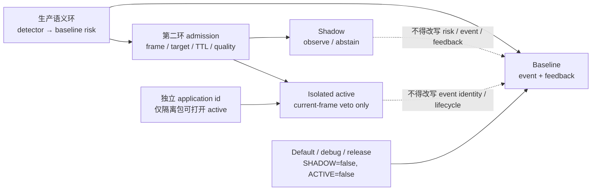
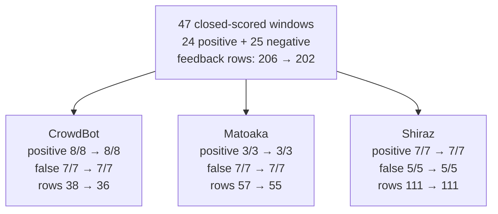
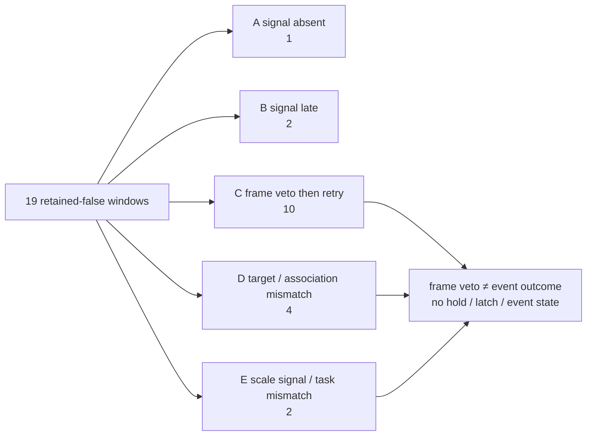

# 双环阶段收口 R0：教师可读总结

状态：`STAGE_CLOSED_FOR_CURRENT_EVENT_EFFECT / DEVELOPMENT_ONLY / DEFAULT_OFF`

日期：2026-07-31（Asia/Hong_Kong）

本报告只整理已经完成的 Development、工程集成和事件级回放证据，不运行新实验，
不改变阈值、默认模型、事件规则或产品行为。当前 dual-loop README 仍是阶段的
唯一当前真相；本报告是给教师和评审者的收口索引，不替代各项原始结果。

## 先回答四个问题

| 问题 | 当前可回答的内容 |
| --- | --- |
| 做成了什么？ | 做成了一个因果框尺度三态机制、真实 Android shadow 接缝和独立 active 构建；在冻结回放中完成了逐帧 parity、隔离和事件级失败分解。 |
| 没有证明什么？ | 没有证明误提醒事件下降、默认生产收益、真人助行、产品可用性、跨设备性能、能效或安全效果。 |
| 为什么停止？ | 事件级负窗没有被消除；当前 veto 只作用于一帧 feedback opportunity，不能改变 event identity/lifecycle，后续 retry 会使同一窗口仍为 false；相近二维 radial-flow 候选也未通过 readiness。 |
| 留下了什么？ | 默认关闭的机制与隔离包、baseline/shadow/active parity 夹具、receipt、逐窗口结果、五类 retained-false 分解和明确的 successor 停止边界。 |

## 一、机制层：能工作，但高精度低覆盖

### 1. 框尺度三态源

因果三态源只读取 production semantic loop 当前选中的 detection，并在同一 track
上使用过去七帧 `log(bbox height)` 的同号趋势，输出
`CONFIRM_APPROACH / CONTRADICT_APPROACH / ABSTAIN`。它不读取 future frame、RGB、
pose、IMU、depth，也不承担 ego/target 运动责任归因。

在独立 JRDB annotation tracks 上，非弃权判断为 `1,017`，正确 `1,008/1,017`
（`99.12%`）；opportunity coverage 仅 `2.391%`。这支持“一个简单的、保守的
三态机制在独立标注轨迹上可复现”，不支持 detector/live-track 精度或 active 效果。
完整结果见[三态源 R0 结果](DUAL_LOOP_CAUSAL_TRACK_TRISTATE_R0_RESULT_2026-07-30.md)。

因此这里的关键关系不是“精度高，所以已经有效”，而是：机制在少数高质量机会中表现
稳定，但覆盖率低；进入 Android 后仍以 shadow、弃权和默认关闭为边界。

### 2. 相近二维候选的负结果

冻结的 LITE R2 将 bbox 面积增长与 ROI sparse radial flow 放在同一自然事件分母上：

| arm | correct | wrong-signed | readiness |
| --- | ---: | ---: | --- |
| bbox log-area growth | `204/469` | `153/469` | fail |
| ROI sparse radial flow | `188/469` | `161/469` | fail |

radial flow 相对 bbox 的 correct-event gain 为 `-16`，两个 arm 都没有达到预声明的
readiness floor。该结果是有效的 Development 负结果：它没有授权调参救援、Confirmation、
Android 性能主张或生产部署。见[LITE R2 execution result](DUAL_LOOP_TARGET_TRACK_CAUSAL_RADIAL_GEOMETRY_LITE_R2_EXECUTION_RESULT_2026-07-30.md)。

### 图 1：baseline / shadow / isolated active / default-off 架构



图 1 的阅读重点是“第二环接入了，但没有取得默认行为的所有权”。shadow admission
会检查 frame、target、TTL、quality 和来源边界；active 构建最多否决当前 feedback
机会，不能把一个 frame-level decision 伪装成 event-level correction。

## 二、工程层：shadow、隔离 active、默认关闭和 parity

工程闭环已经落地，但工程闭环不等于效果闭环：

- **shadow**：`AssistDecisionKernel` 仍是唯一 event/feedback seam；baseline risk
  先计算，shadow evidence 不能替换 risk、event、feedback、trace 或 gateway
  调用。非法 frame、过期证据、target mismatch、来源弃权和低质量输入都显式
  fail-closed。见[shadow wiring R0](DUAL_LOOP_SHADOW_WIRING_R0_IMPLEMENTATION_RESULT_2026-07-30.md)。
- **isolated active**：`dualLoopActive` 使用独立 application id；只有该隔离构建
  可以执行当前帧 `CONTRADICT` veto，普通 debug、release 和 `dualLoopShadow`
  仍不干预。见[active correction R1](DUAL_LOOP_ACTIVE_CORRECTION_R1_RESULT_2026-07-30.md)。
- **默认关闭**：默认构建的 `DUAL_LOOP_SHADOW=false`、`DUAL_LOOP_ACTIVE=false`；
  当前阶段没有把机制接入正式提醒或产品授权。
- **host / device parity**：CrowdBot active replay 的 host evaluator 与 device
  Kotlin 实现逐帧对齐 `4,422/4,422`，detector hash、baseline feedback、candidate
  feedback 和 scene decision mismatch 均为 `0`。这证明测试路径的一致性，不证明
  live detector、持续运行或用户收益。
- **真机边界**：隔离 shadow 包在 `SM-S9280 / SM8650` 上完成冷启动和相机帧接入；
  短观测中没有目标，故输出 `EVIDENCE_ABSENT`。QNN 因安装环境缺少
  `libcdsprpc.so` 回退 CPU XNNPACK；该 smoke 不构成 NPU 或正式性能证据。

## 三、事件效果层：保住了 baseline，但没有消除 false window

三来源事件失败分解的 ledger 共 `49` 个窗口：`24` 个正例、`25` 个负窗；其中
`47` 个窗口 closed-scored，两个 CrowdBot 正例沿用协议标记为
`TEMPORAL_SCORING_NOT_EVALUABLE`。来源级结果如下：

| source | positive hit | false window | feedback rows |
| --- | ---: | ---: | ---: |
| CrowdBot | `8/8 → 8/8` | `7/7 → 7/7` | `38 → 36` |
| Matoaka | `3/3 → 3/3` | `7/7 → 7/7` | `57 → 55` |
| Shiraz | `7/7 → 7/7` | `5/5 → 5/5` | `111 → 111` |
| **aggregate** | **`18/18` retained** | **`19/19` retained** | **`206 → 202`** |

把 `25` 个负窗按 baseline outcome 展开，就是 `19` 个 baseline-false 和 `6` 个
baseline-clear：

- `18/18` 个 baseline-hit 正例保留；
- `19` 个 baseline-false 负窗中 `corrected=0/19`；
- `6` 个 baseline-clear 负窗保持 clear，`induced_false=0/6`；
- `47` 个 closed-scored 窗口内 feedback rows 由 `206 → 202`，这是行密度变化，
  不是事件窗口数量下降。

### 图 2：三来源事件级结果



这组结果可以回答“做了候选后是否减少了 baseline false event window”：答案是没有。
可以回答的较弱问题是“是否在不丢失既有正例的情况下减少了部分 feedback rows”：
答案是 `206 → 202`，但它不能替代 event-level outcome。

## 四、为什么停止：frame veto 与 event outcome 的粒度错配

active R1 的实际权限是当前 feedback opportunity 的 frame-level veto。它没有 hold、
latch 或 event state，不写入 `RiskEventTracker` 的 event identity/lifecycle。因此
一帧被 veto 后，只要同一 truth window 后面仍有 candidate feedback opportunity，
该窗口仍然是 false。post-terminal decomposition 的 retained-false 分类为：

| failure class | count | 教师可读解释 |
| --- | ---: | --- |
| `A_SIGNAL_ABSENT` | `1` | 评分窗内没有 contradiction evidence。 |
| `B_SIGNAL_LATE` | `2` | 信号晚于 baseline 首次 feedback。 |
| `C_FRAME_VETO_THEN_RETRY` | `10` | 当前帧被 veto，但同一窗口随后重试并再次 feedback。 |
| `D_TARGET_OR_ASSOCIATION_MISMATCH` | `4` | target association reset 破坏了事件级继承。 |
| `E_SCALE_SIGNAL_TASK_MISMATCH` | `2` | 有信号，但不落在可 veto opportunity 或不匹配 scene-scale task。 |
| **合计 retained-false** | **`19`** | **没有任何 baseline-false window 被完整消除。** |

### 图 3：五类 retained-false 失败分解



因此当前正式停止判断是：

```text
POLICY_GRANULARITY_MISMATCH_SUPPORTED
CLOSE_SCENE_SCALE_ACTIVE_ROUTE
r2_implemented = false
```

有限 upper-bound audit 在 CrowdBot 和 Matoaka 各找到一个需要新增 runtime state 的
hold witness，但 Shiraz 没有 witness；它们只说明某些 Development trace 存在政策粒度
空间，不是新的 R1 效果结果，也不授权 R2。

## 五、留下什么、下一步不自动做什么

留下的可复用资产是：

1. 因果七帧三态机制与其独立 annotation-track Confirmation 证据；
2. frame/target/TTL/quality 绑定的 shadow admission 和显式 abstain/fail-closed；
3. 独立 application id 的 active 构建、baseline/device/host parity 夹具和 receipts；
4. 三来源逐窗口 CSV/JSON/Markdown、upper-bound audit 和 A–E 失败分类；
5. LITE R2 的冻结负结果、不可重跑边界和“不得用后验调参救援”的停止规则。

不自动做的事情是：实现 scene-scale active R2、调整 hold/latch/阈值、改变默认模型、
启动 scheduler、宣称异构平台性能，或把当前 Development 证据升级为 Confirmation、
产品、安全或真人助行证据。任何后继路线都必须另立问题、冻结输入和门槛，先通过
独立可比性与方差预检。

## 原始证据索引

- [dual-loop 当前 README](README.md)
- [因果框尺度三态 R0](DUAL_LOOP_CAUSAL_TRACK_TRISTATE_R0_RESULT_2026-07-30.md)
- [shadow wiring R0](DUAL_LOOP_SHADOW_WIRING_R0_IMPLEMENTATION_RESULT_2026-07-30.md)
- [隔离 active R1](DUAL_LOOP_ACTIVE_CORRECTION_R1_RESULT_2026-07-30.md)
- [R1 unseen rank-2 effect](DUAL_LOOP_R1_UNSEEN_NATURAL_EVENT_R0_RANK2_EFFECT_RESULT_2026-07-31.md)
- [R1 事件失败分解](DUAL_LOOP_R1_EVENT_FAILURE_DECOMPOSITION_R0_RESULT_2026-07-31.md)
- [LITE R2 execution result](DUAL_LOOP_TARGET_TRACK_CAUSAL_RADIAL_GEOMETRY_LITE_R2_EXECUTION_RESULT_2026-07-30.md)
