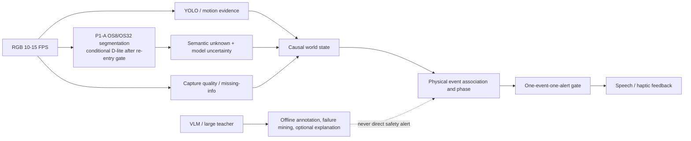

# 从轻量分割到事件级安全感知

## BlindAssist 前沿论文精读与跨越式升级报告（2026-07）

## 1. 执行摘要

本轮下载并精读了 14 篇论文，共 162 页，覆盖轻量边界分割、sim-to-real、半监督去噪、表示稳定性、不确定性校准、视频一致性、路径预测以及真实视障用户数据。论文全文保存在 Git 忽略的 `.downloads/papers/2026-07-frontier-upgrade/`，来源、页数和 SHA256 见 [论文全文清单](refs/paper-inventory.md)，逐篇证据卡见 [边界架构笔记](notes/segmentation.md)、[鲁棒性与不确定性笔记](notes/robustness.md) 和 [时序与人因笔记](notes/temporal-human.md)。

最重要的结论是：BlindAssist 下一次真正的跨越，不会来自“把 MobileNetV3 换成更大的模型”，而会来自以下五层同时闭合：

1. **数据可观测层**：保留 HUMAN/MACHINE 标注质量，防止来源真值被误写成人工真值。
2. **边界感知层**：用高分辨率 detail、独立几何边界和选择性融合解决 step/curb，而不是继续给稀有类加权。
3. **选择性预测层**：把语义 `unknown`、模型不确定性和额外 abstain 分开，建立 risk-coverage 和独立校准集。
4. **因果事件层**：维护物理事件身份、遮挡保持、通过/远离和清除；同一事件只交付一次提醒。
5. **真实用户层**：以 BLV 第一视角、缺失信息、拍摄质量、错误依赖和任务成功为最终证据，而不是只看通用图像或戴眼罩模拟。

P1 已经给出一个重要反例：sigmoid/no-pooled-BN 提高了最佳值，但 model-seed range 反而从 `0.2685` 扩大到 `0.2951`；OS4/OS16 端点全部因 boundary 下限坍塌被拒绝。推荐的技术主线因此调整为：

> **保留 P1-A OS8/OS32 正确结构 → P2 确定性 quota sampler → D0 标注质量与 T0 事件指标闭环 → U0 risk-coverage 审计 → 必要时做 2×2 交互/初始化稳定性审计 → 再选择 HRFP 或 UPC → session-level calibration → causal event state → 真实 BLV shadow-mode。**

Mobile-PID-lite 仍有论文机制价值，但已经从近期主线降为条件候选：只有 P2/交互审计重新满足稳定性进入门后，才允许在保留 OS8/OS32 的前提下单独测试 D-lite/Light-Bag；不得重开已否决的 OS4/OS16 组合。

这不是把所有论文模块叠在一起。每一步只有在最差 seed、最差 session、`step_curb`、unknown、事件级错误提醒和端侧 P95 同时不退化时，才允许进入下一步。

## 2. 当前事实：门禁已闭合，但模型稳定性没有闭合

当前最新训练数据是 real-only `sanpo-v4-real-canonical-r3-20260713`：400 train、200 dev、120 blind，共 14 个互斥 source session。最终 10 项检查全绿，training gate SHA256 为 `4c68e43494012f0499d8f9f01a5160a80276682fcd2e78a6ac5ca4cf98a1d5e1`，assembly report SHA256 为 `f7f7b11e4ca0f733dd4c5ccfb9f01ccf30548014c406edd72f308bb1fd6967b5`。来源、许可、哈希和 split 已闭合；因此“来源 inventory 未闭合”不再是最新阻塞。旧 `evidence-v4` 的 `32968...` 只保留为历史对照，不能支撑最新 600+120 结论。

模型侧的证据更严峻：固定 sampler、改变 model seed 时，head-only selection score 为 `0.1739–0.4424`，范围 `0.2685`；固定 model seed、改变 sampler 时范围只有 `0.0112`，两者相差约 `24.1×`。五组最弱场景均为 `step_curb`。这说明现有 session-balanced/rare-class 采样逻辑仍值得保留，但下一步应将其改造成 deterministic quota；它并不是当前大方差的主因，继续扫学习率、输入分辨率或 decoder 宽度很难形成可靠突破。

P1 已完成四组、每组五个 head-only 短跑。P1-A `sigmoid/no pooled-BN + OS8/OS32` 的最佳 mIoU/boundary 为 `0.4642/0.5235`，跨后端等价为 green，但 model-seed range 为 `0.2951`，高于 P0 的 `0.2685`。OS4/OS32 的两个 seed boundary IoU 坍塌至 `0.0271/0.0130`；OS4/OS16、OS8/OS16 的最佳 selection 仅 `0.0968/0.1549`。因此只保留 sigmoid/no-pooled-BN 的结构正确性修正，默认继续使用 OS8/OS32；P1 没有关闭初始化及关联 Torch 随机状态方差，所有候选仍未晋级。完整证据见 [P1 LR-ASPP 对齐审计](../../SANPO_P1_LRASPP_ALIGNMENT_2026-07-13.md)。

P2 quota sampler 被列为下一主线，不是因为 P0 证明 sampler 是方差主因，而是为了把 session/scene/rare-class 暴露从概率采样变成确定性配额，关闭另一个可控变量。P2 必须重新报告 model-seed range；如果 range 仍高，就转入 2×2 交互和初始化/归一化诊断，不能把 P2 的覆盖改善伪称为稳定性修复。

此外，一次性本地派生审计以 `reviewed-source-manifest.image_sha256` 回连 assembly recipe 所列 14 个 draft manifest 的 `source.sha256/source_annotation_quality`，720/720 帧匹配：train 为 38 HUMAN/362 MACHINE，dev 为 39 HUMAN/161 MACHINE，blind 为 30 HUMAN/90 MACHINE。训练/开发集中 MACHINE 占 `523/600=87.2%`。该回连不适用于旧 evidence-v4，也尚未成为正式 schema、sidecar 或 gate；canonical 没有保存 `source_annotation_quality`，trainer 因而无法直接消费该事实或保证半监督 donor 只来自人工标签。

最后，现有 benchmark 的 `repeatedAlertCount` 统计 `EVENT_ALREADY_ALERTED`，实际含义是“被事件层成功抑制的重复尝试”，不是用户收到的重复提醒。若直接把它接到 `repeated_alert_rate`，会把上游严重抖动误解为用户重复被打扰，或反过来把真实交付重复遗漏掉。该指标必须先拆分。

事件侧当前最强证据仍是 **90 帧 SANPO oracle v2 规则实验**，不是训练模型或 blind 模型结果：危险提醒召回为 `88.9%`，错误提醒率为 `25.9%`，因登阶后重复和边界误升级而未晋级。它只支持“事件身份、通过/清除和错误提醒是关键瓶颈”，不能用来宣称当前分割候选已有同等事件表现。

## 3. 文献告诉我们的不是同一件事

### 3.1 PIDNet 与 Mobile-Seed：边界必须参与融合，但边界监督可能反伤主任务

[PIDNet](https://openaccess.thecvf.com/content/CVPR2023/papers/Xu_PIDNet_A_Real-Time_Semantic_Segmentation_Network_Inspired_by_PID_Controllers_CVPR_2023_paper.pdf) 的核心价值不是 PID 类比本身，而是把 detail、context、boundary 分成不同职责，再由 boundary 决定局部更相信 detail 还是 context。论文消融显示，边界分支和 boundary-aware loss 对其架构有增益；同时，完整 PIDNet-S 仍是约 7.6M 参数、47.6 GFLOPs 的 GPU 方案，不能直接替换当前移动图。

[Mobile-Seed](https://arxiv.org/pdf/2311.12651) 提供了更重要的反例：增加边界流但不加边界监督时，语义指标先提高；直接加 boundary loss 后，主语义指标反而下降；加入双任务一致性才恢复并进一步提升。它说明“有边界标签就加 BCE”并不安全。本文当前按预印本证据降级使用，其 GPU FPS 也不能外推到 Android。

BlindAssist 还必须区分两个概念：`boundary_step_curb` 是风险语义类，而论文中的 boundary 是相邻语义类别变化的几何边界。推荐新增独立 `geometric_boundary` 辅助头，主输出仍保留四类 taxonomy。几何边界只负责选择性融合和诊断，不能直接生成障碍提醒。

因此，最小可迁移结构仍可定义为 **Mobile-PID-lite**，但 P1 已否决直接切换 OS4/OS16，当前不得立即实施。只有 P2 和后续方差审计满足结构重入门后，才按以下受限版本测试：

- MobileNetV3Small 保持不变；
- 固定已经保留的 OS8 detail / OS32 semantic，不重开端点搜索；
- 新增 16 通道左右、使用 GroupNorm 的多尺度 D-lite；
- D-lite 输出 `geometric_boundary_logit`；
- 使用 Light-Bag 风格的逐像素 gate 融合 detail/context；
- 先不加几何边界辅助损失，证明结构本身有用后再以小权重加入；
- 只有出现“几何边界变好、主语义变差”的明确冲突，才增加一致性项。

如果 P2 后 model-seed range 仍不能下降，Mobile-PID-lite 继续停放，先做 2×2 model×sampler 交互与初始化/归一化诊断；不能用“PIDNet 论文有效”绕过本地失败证据。

### 3.2 MRFP、UPC、SWSEG：三个模块解决三种不同失败，不能一次叠加

[MRFP](https://openaccess.thecvf.com/content/CVPR2024/papers/Udupa_MRFP_Learning_Generalizable_Semantic_Segmentation_from_Sim-2-Real_with_Multi-Resolution_Feature_CVPR_2024_paper.pdf) 在训练期扰动高频细纹理和低频风格，论文在 GTA→多个真实域上取得显著平均增益，且推理不保留扰动模块。它适合 synthetic/procedural→real 或跨 session 泛化，但不针对当前 head 初始化问题。过强高频扰动还可能把真正需要的细路沿当成域特征抹掉。因此只能在稳定 head 后先试 HRFP-only，并给扰动单独记录 `perturbation_seed`。

[UPC](https://openaccess.thecvf.com/content/ICCV2023/papers/Fang_Locating_Noise_is_Halfway_Denoising_for_Semi-Supervised_Segmentation_ICCV_2023_paper.pdf) 证明伪标签噪声往往成片出现并集中在边界附近，patch-wise uncertainty 定位后再用可靠 labeled patch 替换，优于随机 erase/CutMix。但当前 MACHINE 帧并不是无标签数据；它们有来源机器 mask。最接近论文语义的迁移是：HUMAN=train 作为可靠 donor，MACHINE=train 作为 weak target，由仅使用 train 构建的 teacher 产生 pseudo-label。当前只有 38 张 HUMAN train 帧，donor 多样性很低，硬矩形 CutMix 还可能制造伪边界，所以第一版必须是 UPC-lite、单一中等替换率，并审计 donor 垄断和伪边界。

[SWSEG](https://openaccess.thecvf.com/content/CVPR2025/papers/Lu_Improving_Semi-Supervised_Semantic_Segmentation_with_Sliced-Wasserstein_Feature_Alignment_and_Uniformity_CVPR_2025_paper.pdf) 把 weak/strong consistency 扩展到 encoder 表示，通过 Gaussian-SWD 优化 alignment/uniformity。它可能帮助表示覆盖，但论文没有报告跨初始化 seed 方差、unknown 或事件门。错误伪标签一旦进入 weak/strong 流，SWD 也可能让错误表示更稳定。因此 SWSEG 是 P4 正则，而不是 P1 修复；必须在 head 稳定且 UPC 角色清晰后，按 `Lswd → Lreg → projection MLP` 单因素加入。

三者正确顺序是：**结构稳定 → MRFP 或 UPC 二选一 → 证明单模块有效 → 再决定是否引入 SWSEG**。第一轮禁止 `MRFP+UPC+SWSEG` 全开，因为届时特征分布、伪标签、loss landscape 和随机源同时变化，任何提升或退化都无法归因。

### 3.3 ValUES 与 Kandinsky：先回答“不确定性有没有用”，再谈校准

[ValUES](https://proceedings.iclr.cc/paper_files/paper/2024/file/1548d98b62d3a4382a31ba77d89186cd-Paper-Conference.pdf) 最有价值的结论是：不确定性不是一个 entropy heatmap，而是 `C1 prediction model + C2 uncertainty measure + C3 aggregation + downstream task`。论文显示 aggregation 选择可以主导 OoD/failure detection 结果；AU/EU 在 toy 数据上可分，在真实数据上未必能干净分开；ensemble 跨任务最稳，TTA 常是较轻替代。

BlindAssist 应先冻结现有三 seed 输出，离线比较 MSR、predictive entropy 和 ensemble MI，并分别使用固定中心走廊 patch、scene-aware patch、threshold mean 聚合。主产物不是“最佳 entropy 阈值”，而是 pixel/session/event 三层 risk-coverage curve：随着拒判增加，covered accuracy 是否上升、boundary recall 是否保留、critical miss 是否下降。如果拒判越多风险反而不降，不确定性就没有生产价值。

[Kandinsky Conformal Prediction](https://openaccess.thecvf.com/content/CVPR2024/papers/Brunekreef_Kandinsky_Conformal_Prediction_Efficient_Calibration_of_Image_Segmentation_Algorithms_CVPR_2024_paper.pdf) 利用空间相似 pixel classifier 共享 non-conformity score，在低 calibration data 下比逐像素校准更数据高效。对胸前相机，底部中心近场、底部左右、远场/地平线和上部背景确实有空间先验。但连续 50 帧不能当 50 个独立 calibration 样本；固定空间 cluster 也会被俯仰和安装角度破坏。

正确做法是新增独立 session calibration split。现有 4 个 dev session 每个 scene 只有 1 个，不能再切走。最低工程方案是四个 scene 各新增至少一个 official-train session，只做经验校准；若要声称 session-level 95% conformal coverage，则需要更多独立 session。任何在 dev/blind 上反复调 α、cluster 或 abstain 规则的做法都会使覆盖结论失效。

同时必须保留三种不同状态：

- `semantic_unknown`：数据 taxonomy 的真实第 4 类；
- `model_uncertainty`：entropy/MI/conformal set size；
- `extra_abstain`：冻结规则拒绝原本的 known prediction。

它们不能全部改写成 obstacle，也不能全部算成同一个 unknown 指标。

### 3.4 DTERN、BOFP 与 Escalator Problem：时序目标不是平滑，而是有效事件

[DTERN](https://openaccess.thecvf.com/content/ICCV2025/papers/Xu_Dual-Temporal_Exemplar_Representation_Network_for_Video_Semantic_Segmentation_ICCV_2025_paper.pdf) 指出旧 Video Consistency 可以被“全零且始终不变”的输出欺骗，并提出 VEC 同时约束时序一致性与语义有效性。其 VEC 与人工 temporal consistency 的相关性明显高于旧 VC，但完整模型参数和吞吐成本较高。BlindAssist 第一阶段应移植 VEC8/VEC16 和轻量 history-only prototype，而不是完整 DTERN。

[BOFP](https://openaccess.thecvf.com/content/WACV2024/papers/Baghbaderani_Temporally-Consistent_Video_Semantic_Segmentation_With_Bidirectional_Occlusion-Guided_Feature_Propagation_WACV_2024_paper.pdf) 说明传播特征在遮挡/反遮挡区域会失真，需要专门的 attention 决定何时相信当前帧。完整双向方法依赖未来帧，只能作为离线上界。线上候选只能使用前向 motion/warped IoU，并把短时遮挡转成 `OCCLUDED_HOLD`：保留事件身份、降低语义信心、禁止创建新提醒。

[The Escalator Problem](https://openaccess.thecvf.com/content/ICCV2025W/CV4A11y/papers/Zhang_The_Escalator_Problem_Identifying_Implicit_Motion_Blindness_in_AI_for_ICCVW_2025_paper.pdf) 是 position paper，不提供算法增益，但准确指出稀疏抽帧会丢失扶梯方向、旋转门、自动门和横向交通参与者等低信号连续运动。BlindAssist 应建立外观相同、运动方向相反的 hard pair benchmark，禁止模型只凭单帧外观猜测。

最终时序层必须回答四个问题：这是哪个物理事件、现在处于哪个阶段、是否已经真正提醒、什么时候可以清除。mask 更平滑但事件 recall、清除时延和重复交付不改善，只能判定为失败。

### 3.5 Watch Your STEPP：轨迹监督可以教“熟悉的可走区域”，但异常不等于危险

[Watch Your STEPP](https://arxiv.org/pdf/2501.17594) 把人类行走轨迹投影到图像，用 DINOv2 区域特征和重建误差区分熟悉可走地形与陌生/潜在危险地形，并在 ANYmal 机器人上进行室内外实验。它值得借鉴的是“从走过的轨迹自动产生 traversability 正样本”和“以异常分数补充闭集语义”，而不是把机器人系统直接搬到手机。论文运行约 2.5 Hz，并依赖深度、SLAM、NUC/Jetson；阈值还在同一批标注区域上调优。对 BlindAssist，它只适合作为离线 teacher 或轻量 anomaly head 的蒸馏来源。高异常首先应转成 `unknown_motion_or_surface`，不能自动转成 obstacle，更不能单独触发提醒。

### 3.6 AI Guide Dog、VisAssist 与 CLIP-BLV：真实用户分布不能用模拟或通用数据代替

[AI Guide Dog](https://ojs.aaai.org/index.php/AAAI-SS/article/view/35591) 把未来 1 秒路径表述为 FRONT/LEFT/RIGHT，使用 57 小时、392,580 个样本，并在 iPhone 13 上以 FP16、2 Hz 运行。但 8 名参与者主要是研究生/实习生，戴黑眼镜模拟，最佳 LEFT/RIGHT recall 约 0.56–0.58。它适合作为低频 intent prior，不足以作为真实 BLV 有效性或近场安全告警证据。

[VisAssist](https://ojs.aaai.org/index.php/AAAI/article/view/42410) 包含 13,413 段真实视障志愿者视频，揭示通用模型在 depth、direction、反射、远距离、信息缺失和低质量画面上的系统性问题。其开放模型在 RTX 3090 上仍是秒级延迟，且任务是 VideoQA，不是实时导航。最值得迁移的是独立 `capture_quality` 状态：`ANSWER_VISIBLE / RECOVERABLE_QUALITY / INFORMATION_MISSING`。后两种状态不得生成“前方安全”或精确距离，只能给克制的相机调整提示。

[CLIP-BLV disparity](https://openaccess.thecvf.com/content/CVPR2024/papers/Massiceti_Explaining_CLIPs_Performance_Disparities_on_Data_from_BlindLow_Vision_Users_CVPR_2024_paper.pdf) 在 ORBIT/VizWiz 等真实 BLV 数据上发现，25 个 CLIP 变体平均比 web 图像低 15 个百分点；残障特定物体、模糊、遮挡、光照和触觉描述均会造成差距。5-shot 在 clean 数据上可显著缩小 gap，在 clutter 中仍保留约 14–15 点差距。所有 foundation teacher、VLM 解释器和未来个性化都必须按 worst-user、quality、device、scene 单独审计，不能只报告平均值。

## 4. 建议的新系统架构

### 4.1 感知层输出合同

- 四类 semantic logits：walkable、boundary_step_curb、obstacle、unknown_nonwalkable；
- 独立 geometric boundary logit；
- capture quality：visible、recoverable degraded、information missing；
- 模型不确定性：MSR/PE，离线可加 ensemble MI；
- motion evidence：warped IoU、center/bottom trend、flow consistency；
- 每个输出都必须保留 model/config/data SHA256 和时间戳。

### 4.2 世界状态和事件身份

事件关联不再只使用 label 和 center-x，而使用：

`category family + warped mask/box IoU + center/bottom displacement + corridor overlap + approach trend + short-gap age`。

当 `boundary_step_curb ↔ obstacle ↔ unknown` 标签翻转但几何轨迹连续时，保持同一事件 ID，只更新证据分布。短时丢失进入 `OCCLUDED_HOLD`，已提醒状态继续锁定；只有超过预注册 gap 且满足 clear 条件才释放。通过/远离必须由连续 receding、走廊退出或深度远离共同确认，不能仅因三帧 mask 丢失就清除。

### 4.3 反馈合同

- 高置信危险：允许一次风险提醒；
- semantic/model unknown：不得宣称安全，可给“路径不确定”的低频提示；
- capture missing/degraded：走独立相机调整提示，不与障碍告警混用；
- VLM：只解释已经由安全链确定的状态，或在非紧急问答中工作；
- 已提醒事件的后续帧只更新 UI/内部状态，不再交付第二条同类语音。

## 5. 分阶段实验路线

| 阶段 | 状态 / 唯一主要改变量 | 必须产物 | 进入下一阶段的条件 | 停止条件 |
|---|---|---|---|---|
| P1 | **已完成**：sigmoid/no-pooled-BN 与 OS4/OS16 | 四组×五短跑；P1 审计 | 只保留 OS8/OS32 + sigmoid 修正 | range 扩大、OS4/OS16 boundary 坍塌，已停止 |
| D0 | 待执行：canonical 透传 HUMAN/MACHINE | split/session/scene/class 分项报告；正式 sidecar/gate | 来源总门仍绿，trainer 可见质量字段 | 任一来源/split/hash 门退化 |
| T0 | 待执行：修正事件指标语义 | delivered repeats、suppressed attempts、clearance latency、regeneration | 指标可由同一逐帧日志确定性重算 | 仍混淆尝试与真实交付 |
| P2 | 当前主线：确定性 quota sampler | 固定 quota、覆盖报告、原五组 OFAT | worst-scene/seed 改善且 range 不扩大 | 只改善覆盖统计、主门不动 |
| I0 | 条件执行：2×2 交互/初始化稳定性 | model×sampler 交互与梯度/归一化诊断 | 定位剩余高方差来源 | 证据仍不足时禁止加新结构 |
| E2 | 条件候选：OS8/OS32 上 D-lite + Light-Bag | B0/B1/B2，冲突时才 B3 | 需先通过结构重入门；随后 offline quality 九项全绿 | geometric boundary 好、风险类/事件变差 |
| R1 | HRFP-only | perturbation seed 与 3 seed 报告 | worst-session/seed 上升，薄边界不降 | 方差扩大或 step_curb 被抹平 |
| R2 | UPC-lite | HUMAN donor 审计、pseudo coverage、伪边界检查 | HUMAN-dev 与 MACHINE-dev 均不退化 | donor 垄断、高置信错误、伪边界 |
| R3 | SWSEG 单因素 | alignment/uniformity + 主门 | worst-seed 主指标改善 | 只改善 uniformity，不改善质量门 |
| U0 | ValUES-style 离线审计 | C1/C2/C3、risk-coverage | 拒判随 coverage 单调降低风险 | aggregation 仅单 session 有效 |
| U1 | 独立 session calibration | coverage、set size、extra abstain | unknown/event 门和 coverage 同时通过 | 用 dev/blind 调 α 或关键事件过度拒判 |
| T1 | history-only prototype + VEC | VEC8/16、event split/regeneration | 事件指标改善且 boundary 不被平均 | 只变平滑，事件门不动 |
| T2 | BOFP 双向离线上界 | 无传播/前向/双向比较 | 上界能显著降低错误再生 | 双向上界都无收益 |
| T3 | causal forward occlusion hold | 同机 P95 和完整事件门 | 接近离线上界且无晚提醒 | critical miss/late alert/P95 增加 |
| H1 | capture quality/missing-info | 合成退化 + 真实 BLV audit | missing recall、错误安全声明、恢复率改善 | 无法区分 missing 与 recoverable |
| H2 | BLV shadow-mode | worst-user、任务成功、错误依赖 | 目标用户与安全专家批准下一阶段 | 高信任但错误依赖、事件安全不达标 |

### 5.1 P1 结论与结构重入门

现有正式 offline quality 阈值保持不变：global mIoU ≥0.45、macro-session ≥0.40、worst-session ≥0.25、worst-scene ≥0.30、boundary precision/recall/IoU ≥0.35/0.50/0.25、unknown precision/recall ≥0.50/0.60。

P1 已经证明“最佳值上升”不能构成结构晋级。下一次允许测试 D-lite/Light-Bag 前，应先通过 P2；若 P2 后 range 仍高，再完成 I0。建议的结构重入门是：固定 sampler 的 model-seed selection range 相对 P0 `0.2685` 至少下降 30%，最差 model seed selection 不低于 P1-A 的 `0.1970`，且 `step_curb` worst-scene、boundary recall、unknown recall 均不得下降。该 30% 是工程预注册起点，不是论文通用阈值；如果未通过，Mobile-PID 继续停放。

### 5.2 INT8 与设备门不变，但补充指标

现有 INT8 fidelity 要求继续保持：argmax agreement ≥0.995、逐类 prediction IoU ≥0.97、逐类 GT IoU drop ≤0.02、mean IoU drop ≤0.01。

设备门继续要求 event recall ≥0.90、critical miss rate ≤0.05、false alerts/min ≤0.50、post-event clearance ≥0.90、P95 ≤100 ms。`repeated_alert_rate ≤0.10` 必须明确改为实际交付重复率；另外新增 `suppressed_duplicate_attempts_per_event`、`clearance_latency_ms`、`event_regeneration_rate` 和 `late_alert_rate` 作为诊断及后续硬门候选。

## 6. 最可能形成“大跨越”的组合

如果只允许选择一条最有把握的组合路线，应是：

> **近期可执行核心：P2 确定性 quota sampler + D0 标签质量可观测 + T0 事件指标修正 + ValUES risk-coverage。长期组合：通过结构重入门后的 Mobile-PID-lite 或 HRFP/UPC（二选一）+ session calibration + causal event identity/clearance。**

其突破点不是某个 benchmark 数字，而是同时改变五个失败模式：

| 当前失败 | 目标机制 | 真正成功的证据 |
|---|---|---|
| step/curb 与 seed 稳定性不足 | P2 quota；条件满足后才在 OS8/OS32 加 D-lite/Light-Bag | 最差 seed 和 worst-scene 同时提升，range 不扩大 |
| MACHINE 标签边界噪声不可见 | quality 透传 + UPC-lite | HUMAN-dev 不降，MACHINE-dev 改善，伪边界不增 |
| 域外/陌生表面错误自信 | HRFP + risk-coverage + conformal abstain | 拒判后 risk 单调下降且 critical recall 保持 |
| mask 丢失后事件重建并重复提醒 | causal association + occluded hold + clearance | delivered repeat、regeneration、clearance 全改善 |
| 通用模型在 BLV 画面上错误自信 | capture quality + BLV audit | missing-info recall、错误安全声明率和 worst-user 改善 |

任何只提高 global mIoU、VEC、uniformity、coverage 或 GPU FPS 的结果，都不能单独称为“大跨越”。

## 7. 明确不建议做的事情

1. 不立即换 Mask2Former、大型 Transformer/Mamba 或完整 PIDNet。当前瓶颈是结构职责、标签质量、校准和事件生命周期，不是容量不足。
2. 不一次叠加 MRFP、UPC、SWSEG、Kandinsky。它们改变不同层次，必须单因素归因。
3. 不把 `boundary_step_curb` 直接作为 geometric boundary GT，也不让几何边界直接触发提醒。
4. 不把连续帧或像素当作独立 conformal calibration 样本，不在 blind 上调 α、阈值或 cluster。
5. 不把 entropy 直接命名为 epistemic/aleatoric，不把所有不确定性都改写成 obstacle。
6. 不把双向 BOFP 放入在线告警；未来帧只能作为离线 teacher/上界。
7. 不让 VLM、CLIP 或 2 Hz 路径模型直接触发近场安全告警。
8. 不把戴黑眼镜模拟实验等同真实 BLV 用户证据，也不以“用户觉得不错”替代错误依赖和任务安全指标。

## 8. 建议的近期执行顺序

未来一轮执行以下四条，其中 D0/T0/U0 可并行，P2 是模型侧唯一主线：

1. **P2**：实现确定性 quota sampler，并以 P1-A OS8/OS32 + sigmoid/no-pooled-BN 原样复跑五组 OFAT。
2. **D0**：把 `source_annotation_quality` 写入 canonical、报告、sidecar 和 gate；把一次性回连转成可重算合同。
3. **T0**：把实际交付重复与被抑制尝试拆开，增加 clearance latency 和 event regeneration。
4. **U0**：不改模型，对冻结的多 seed 输出执行 ValUES 风格 MSR/PE/MI、aggregation 和 risk-coverage 审计。

若 P2 后 range 仍高，下一步是 I0 交互/初始化稳定性诊断，不是 Mobile-PID；只有结构重入门通过，才允许在 OS8/OS32 上测试 D-lite。只有 HUMAN/MACHINE 质量字段进入正式合同，才启动 UPC/SWSEG；只有 risk-coverage 有跨 session 的单调价值，才新增 calibration split 和 Kandinsky-style abstain。

## 9. 证据边界与剩余风险

本报告证明的是“哪些机制值得按什么顺序验证”，不是证明新模型已经提高，更不是生产晋级结论。当前仍缺：

- P2 quota sampler 的五组 seed 重跑，以及必要的 2×2 交互/初始化稳定性审计；
- HUMAN/MACHINE 正式 schema 与分项质量报告；
- 独立 session calibration；
- 更大连续 blind 风险集和隐式运动 hard pairs；
- 实际 delivered repeat/clearance/regeneration 指标；
- 真实 BLV 连续行走 shadow-mode 与目标用户共创。

在这些证据完成前，所有候选继续保持 `benchmark-only` 和 `do_not_replace_default_model`。

## 10. 参考文献与精读索引

完整书目信息、官方链接、本地文件哈希见 [paper-inventory.json](refs/paper-inventory.json) 与 [paper-inventory.md](refs/paper-inventory.md)。论点到来源的映射见 [evidence-map.md](refs/evidence-map.md)。

主要论文：PIDNet（CVPR 2023）、Mobile-Seed（arXiv 2023）、MRFP（CVPR 2024）、UPC（ICCV 2023）、SWSEG（CVPR 2025）、ValUES（ICLR 2024）、Kandinsky Conformal Prediction（CVPR 2024）、Watch Your STEPP（ICRA 2025）、DTERN（ICCV 2025）、BOFP（WACV 2024）、AI Guide Dog（AAAI Spring Symposium 2025）、The Escalator Problem（ICCV Workshop 2025）、VisAssist（AAAI 2026）、Explaining CLIP's Performance Disparities on Data from Blind/Low Vision Users（CVPR 2024）。
