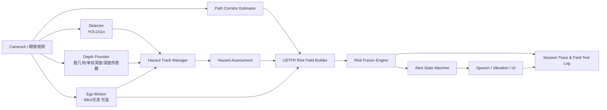
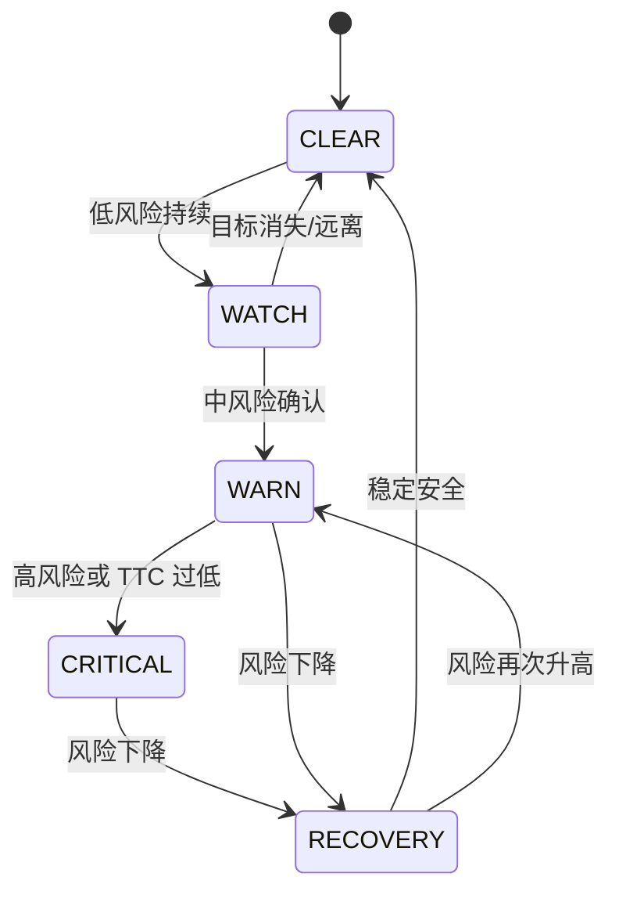

> **文档用途**  
> 本文档是 BlindAssist 后续核心算法研发的主指引，面向 Codex、项目开发者、课程答辩和后续论文工作。它同时承担算法规格、工程架构、实现路线、测试验收和当前状态交接五种职责。  
> **当前结论**：截至本次检查，`violetljj/blind-assist` 的主干版本为 `v5.9.0`，已形成质量较好的 **L2/5 级 USTFR-Lite 基线**；USTFR 核心算法完成度约 **35%–40%**，外围工程闭环完成度约 **65%–70%**。下一阶段应停止以 UI 增量为主，优先补齐可通行走廊、目标跟踪、TTC 和风险场融合。

---

# 目录

- [1. 执行摘要](#1-执行摘要)
- [2. 名称、定位与安全边界](#2-名称定位与安全边界)
- [3. 总体系统架构](#3-总体系统架构)
- [4. USTFR 数学定义](#4-ustfr-数学定义)
- [5. 风险状态机与提醒策略](#5-风险状态机与提醒策略)
- [6. 推荐工程模块与接口](#6-推荐工程模块与接口)
- [7. 每帧算法流程](#7-每帧算法流程)
- [8. 当前仓库映射与详细评级](#8-当前仓库映射与详细评级)
- [9. 分阶段实现路线](#9-分阶段实现路线)
- [10. 测试与评价体系](#10-测试与评价体系)
- [11. 场景数据与消融实验](#11-场景数据与消融实验)
- [12. 代码改造建议](#12-代码改造建议)
- [13. 优化建议与优先级](#13-优化建议与优先级)
- [14. 两周最小冲刺计划](#14-两周最小冲刺计划)
- [15. Codex 执行规范](#15-codex-执行规范)
- [16. 风险与失败模式](#16-风险与失败模式)
- [17. 论文与答辩建议](#17-论文与答辩建议)
- [18. 最终交接结论](#18-最终交接结论)
- [附录 A：公式与变量速查](#附录-a公式与变量速查)
- [附录 B：当前仓库到新模块的迁移表](#附录-b当前仓库到新模块的迁移表)
- [附录 C：版本里程碑建议](#附录-c版本里程碑建议)
- [附录 D：来源与事实边界](#附录-d来源与事实边界)

# 1. 执行摘要

## 1.1 USTFR 的一句话定义

**USTFR（Unified Spatio-Temporal Traversability Field，统一时空可通行风险场）**不是一个新的目标检测网络，而是部署在检测、深度、运动估计之后的轻量决策层：它把障碍物语义、空间位置、相对距离、目标运动、用户自身运动、可通行区域和模型不确定性统一映射为一个随时间更新的风险场，并输出“是否提醒、提醒什么、向哪里避让、提醒强度多大”。

传统方案通常采用：

```text
YOLO 检出目标 → 判断框是否在中心 → 播报“前方有人”
```

USTFR 的目标是升级为：

```text
多源观测 → 可通行空间建模 → 目标轨迹与 TTC → 多区域风险场 → 行动代价比较 → 稳定且节制的语音/震动反馈
```

## 1.2 为什么需要 USTFR

单纯物体检测无法回答助盲系统最关键的问题：

1. 检测到的物体是否真的占用了用户行进路线？
2. 一个远处高置信度目标和一个近处低置信度目标，谁更危险？
3. 静止在路边的人和横穿用户路径的人，风险是否相同？
4. 两个障碍物之间是否存在足够宽的可通行间隙？
5. 目标短暂漏检时是否应该立即取消提醒？
6. 系统不确定时，是静默、普通提醒还是保守升级？
7. 在密集场景中，如何避免连续播报造成“提醒疲劳”？

USTFR 的价值在于把这些问题从零散规则整理成一个可解释、可扩展、可测试的统一框架。

## 1.3 当前仓库评级

| 维度 | 当前水平 | 评级 | 说明 |
|---|---:|---:|---|
| 手机端检测链路 | CameraX + TFLite YOLO11n | 8/10 | 已能真机持续运行，模型输入 320×320 |
| 单帧静态风险评分 | 框底部、面积、中心偏置、类别权重 | 6.5/10 | 已构成 USTFR 的空间风险观测基线 |
| 时间稳定 | 连续帧确认、短时保持、风险升级 | 5.5/10 | 属于去抖与滞回，不等于目标跟踪 |
| 场景策略 | 五种手动场景 + 三种提醒档位 | 5/10 | 参数化较好，但仍为人工规则 |
| 反馈控制 | 语音、震动、冷却、疲劳抑制 | 7/10 | 工程完成度较高 |
| 可通行走廊 | 未实现 | 0/10 | 当前最大缺口之一 |
| 目标跟踪与速度 | 未实现 | 0/10 | 没有 Track ID、轨迹和接近速度 |
| TTC/碰撞预测 | 未实现 | 0/10 | 尚不能区分静止、接近和横穿目标 |
| 深度/尺度融合 | 未实现 | 0/10 | 仍使用检测框几何代理相对距离 |
| 风险场融合 | 零散分数 + 选最高风险目标 | 1.5/10 | 还不是多区域连续风险场 |
| 数据闭环与自适应 | 仅会话摘要 | 1/10 | 尚未用结果反向校准参数 |
| **综合核心算法** | **L2/5，USTFR-Lite** | **约 35%–40%** | 可作为完整 USTFR 的可靠 baseline |

## 1.4 Codex 的首要任务

Codex 后续开发顺序必须是：

1. 冻结并测试当前 v5.9.0 基线。
2. 建立 USTFR 数据模型和 debug-only 离线回放入口。
3. 实现 `PathCorridorEstimator`。
4. 实现 `HazardTrackManager` 和 `TtcEstimator`。
5. 实现 `RiskFieldBuilder` 与 `RiskFusionEngine`。
6. 最后才做提醒文案、UI 展示和额外场景预设。

禁止再次以“大量新增界面、开关或展示卡片”代替算法进展。

# 2. 名称、定位与安全边界

## 2.1 名称

建议在代码和论文中统一使用：

- 中文：**统一时空可通行风险场**
- 英文：**Unified Spatio-Temporal Traversability Field**
- 缩写：**USTFR**

若希望名称更短，可在论文标题中使用 **TTRF（Temporal Traversability Risk Field）**，但仓库内部不应同时存在多套含义。本文统一沿用 USTFR。

## 2.2 产品定位

USTFR 是一个**辅助提醒算法**，不是安全认证导航系统。它不能替代：

- 盲杖；
- 导盲犬；
- 定向行走训练；
- 人工判断；
- 专业导航或道路安全设施。

所有产品文案、代码注释、测试报告和答辩材料必须保留该边界。

## 2.3 目标与非目标

### 目标

- 在手机或低算力边缘设备上实时运行；
- 以 10–20 FPS 的感知频率提供低延迟风险更新；
- 使用可解释的风险分量支持调试和消融实验；
- 在单目视觉退化模式下仍能工作；
- 可逐步接入深度、IMU、眼镜摄像头和手杖传感器；
- 输出稳定、节制、行动导向的反馈。

### 非目标

- 不直接做完整地图级导航；
- 不用大语言模型承担毫秒级避障；
- 不承诺厘米级距离；
- 不在第一阶段引入复杂端到端强化学习；
- 不为了架构而一次性引入多模块、Hilt、Room、云后端等非必要组件。

# 3. 总体系统架构

## 3.1 分层架构



USTFR 位于“感知结果”和“用户反馈”之间。它不取代 YOLO，而是统一解释 YOLO、深度和运动信号。

## 3.2 推荐数据流

```text
Frame
  ├─ ObjectDetector.detect()
  ├─ DepthProvider.estimate()
  ├─ EgoMotionEstimator.update()
  └─ PathCorridorEstimator.estimate()
          ↓
HazardTrackManager.update()
          ↓
HazardAssessment[]
          ↓
RiskFieldBuilder.build()
          ↓
RiskFusionEngine.fuse()
          ↓
AlertStateMachine.update()
          ↓
FeedbackController.notify()
          ↓
SessionTrace.record()
```

## 3.3 降级层级

USTFR 必须支持分级降级，而不是缺少深度模型就完全失效。

| 运行层级 | 输入 | 能力 | 当前状态 |
|---|---|---|---|
| Tier 0 | YOLO 框几何 | 左/中/右 + FAR/MID/NEAR/CRITICAL | 已实现 |
| Tier 1 | YOLO + 跟踪 | 接近趋势、横穿趋势、稳定目标身份 | 待实现 |
| Tier 2 | YOLO + 单目深度 + 跟踪 | 粗距离、TTC、风险场 | 待实现 |
| Tier 3 | 深度传感器 + IMU | 更可靠的距离和自运动补偿 | 未来硬件 |
| Tier 4 | 手机/眼镜/手杖多传感器 | 高低障碍、坑洼、近场冗余 | 后续扩展 |

# 4. USTFR 数学定义

## 4.1 坐标与符号

在时间帧 $t$，检测器输出目标集合：

$$
\mathcal{D}_t = \{d_{t,i}\}_{i=1}^{N_t}
$$

每个检测目标定义为：

$$
d_{t,i} = (c_i, q_i, b_i)
$$

其中：

- $c_i$：语义类别；
- $q_i \in [0,1]$：检测置信度；
- $b_i=(x_i,y_i,w_i,h_i)$：归一化边界框；
- 坐标均除以图像宽高，限制在 $[0,1]$。

推荐将风险场定义在轻量极坐标网格：

$$
g=(\theta_k,\rho_m,z_n) \in \Omega
$$

- $\theta$：左右方向角或离散方向区间；
- $\rho$：相对距离层；
- $z$：高度层，例如地面、腰部、头部；
- 手机上的 MVP 可先采用 $K\times M=9\times4$ 的二维场，不启用高度层。

推荐 MVP 配置：

```text
方向：极左、左、左中、中左、正中、中右、右中、右、极右（9 bins）
距离：FAR、MID、NEAR、CRITICAL（4 bins）
风险场：9 × 4 = 36 个单元
```

## 4.2 目标空间投影

目标 $i$ 的水平角近似：

$$
\theta_i = \arctan\left(\frac{x_i-0.5}{f_x}\right)
$$

其中 $f_x$ 为归一化焦距。若暂时没有相机标定，可使用线性近似：

$$
\theta_i \approx \theta_{\max}(2x_i-1)
$$

目标接地位置优先使用边界框底部中心：

$$
p_i^{foot} = \left(x_i, y_i+\frac{h_i}{2}\right)
$$

原因是助行风险主要取决于目标与地面的接触点是否进入行进走廊，而不是框中心是否靠近图像中心。

## 4.3 当前框几何距离代理

在没有深度的 Tier 0 模式下，可保留当前仓库逻辑，使用框底部和面积构造相对接近度：

$$
b_i^{bottom}=y_i+\frac{h_i}{2}
$$

$$
a_i=w_ih_i
$$

$$
P_i^{geom}=\sigma\left(\beta_0+\beta_1b_i^{bottom}+\beta_2a_i+\beta_3C_i\right)
$$

其中中心偏置：

$$
C_i=1-2|x_i-0.5|
$$

当前 `RiskAnalyzer` 的线性启发式可视为该式的未归一化版本：

$$
S_i^{current}=1.6b_i^{bottom}+5a_i+0.7C_i+W_{prox}+0.4q_i
$$

该公式可以作为 baseline，但不应作为最终距离估计。

## 4.4 可通行走廊

定义当前可通行区域掩码：

$$
M_t^{free}(u,v)\in[0,1]
$$

定义用户短期行进走廊：

$$
C_t(u,v)\in[0,1]
$$

其中 $C_t$ 可由以下方式逐步实现：

1. **MVP**：固定梯形走廊；
2. **进阶**：根据地面/可行驶区域分割修正走廊边界；
3. **完整**：结合光流、IMU 和用户转向动态预测未来 $1$–$2$ 秒走廊。

目标对行进走廊的占用度：

$$
R_{path,i}=\frac{\sum_{u,v}M_i(u,v)C_t(u,v)}{\sum_{u,v}M_i(u,v)+\epsilon}
$$

MVP 中可以不用完整像素掩码，改用目标底边与梯形走廊的重叠：

$$
R_{path,i}^{lite}=\operatorname{IoU}\left(B_i^{foot},C_t^{foot}\right)
$$

或者用高斯函数：

$$
R_{path,i}^{lite}=\exp\left[-\frac{(x_i-x_C(y_i))^2}{2\sigma_C(y_i)^2}\right]
$$

这一步是 USTFR 与“检测框中心规则”最重要的区别。

## 4.5 深度风险

当可获得距离 $d_i$ 时，定义场景相关安全距离：

$$
d_{safe}=d_0+k_vv_{user}+k_rR_{reaction}
$$

其中：

- $d_0$：静止基础安全距离；
- $v_{user}$：用户估计速度；
- $R_{reaction}$：反应时间系数。

深度风险可定义为：

$$
R_{depth,i}=\sigma\left(\frac{d_{safe}-d_i}{\tau_d}\right)
$$

若只有相对深度 $\tilde d_i$，可按每帧分位数归一化：

$$
R_{depth,i}=1-\operatorname{norm}(\tilde d_i)
$$

距离值必须携带来源和质量：

```kotlin
sealed interface DepthSource {
    data object BoxGeometry : DepthSource
    data object MonocularModel : DepthSource
    data object HardwareSensor : DepthSource
}
```

## 4.6 目标跟踪状态

为每个目标维护状态：

$$
x_{t,i}=[x,y,w,h,d,\dot x,\dot y,\dot d]^T
$$

完整实现可使用卡尔曼滤波。手机 MVP 推荐先用轻量 $\alpha$–$\beta$ 滤波：

$$
\hat p_t^- = \hat p_{t-1}+\hat v_{t-1}\Delta t
$$

$$
r_t=z_t-\hat p_t^-
$$

$$
\hat p_t=\hat p_t^-+\alpha r_t
$$

$$
\hat v_t=\hat v_{t-1}+\frac{\beta}{\Delta t}r_t
$$

数据关联优先级：

1. 同类别 + IoU；
2. 中心距离；
3. 框尺度变化；
4. 轨迹门控；
5. 后续可换 ByteTrack 或 SORT-Lite。

## 4.7 TTC（Time to Collision）

若目标距离正在减小，定义 TTC：

$$
TTC_i=\frac{d_i}{\max(-\dot d_i,\epsilon)}
$$

若 $\dot d_i\ge0$，则：

$$
TTC_i=+\infty
$$

TTC 风险：

$$
R_{ttc,i}=\sigma\left(\frac{T_{safe}-TTC_i}{\tau_t}\right)
$$

没有绝对深度时，可使用框扩张率近似：

$$
\gamma_i=\frac{1}{a_i}\frac{\Delta a_i}{\Delta t}
$$

$$
TTC_i^{scale}\approx\frac{1}{\max(\gamma_i,\epsilon)}
$$

该值只适用于近似刚体、相机方向稳定的情况，必须降低置信度，并在文档中明确是代理量。

## 4.8 横穿风险

目标即使不快速接近，也可能横穿用户路径。预测未来位置：

$$
\hat p_i(t+\Delta)=p_i(t)+v_i\Delta
$$

在预测时域 $H$ 内，若目标轨迹与用户走廊相交，则：

$$
R_{cross,i}=\max_{0\le\Delta\le H} C_t\left(\hat p_i(t+\Delta)\right)
$$

可进一步加入时间权重：

$$
R_{cross,i}=\max_{\Delta}\left[C_t(\hat p_i(t+\Delta))e^{-\Delta/\tau_h}\right]
$$

## 4.9 语义风险

定义类别先验：

$$
R_{sem,i}=W_{class}(c_i)\cdot W_{height}(z_i)\cdot W_{scene}(s_t)
$$

示例而非最终固定值：

| 类别 | 基础权重 | 解释 |
|---|---:|---|
| car/bus/truck/motorcycle | 1.25 | 高动能动态危险 |
| bicycle/person | 1.10 | 运动不确定性较高 |
| chair/bench/table edge | 1.00 | 常见碰撞障碍 |
| traffic light/stop sign | 0.70 | 信息重要但不一定占路 |
| dog/temporary object | 0.95 | 轨迹不稳定 |

类别权重不得单独决定风险，必须与走廊占用、距离和运动结合。

## 4.10 不确定性

定义质量分数：

$$
Q_i=q_i\cdot q_{track,i}\cdot q_{depth,i}\cdot q_{ego}
$$

不确定性：

$$
U_i=1-Q_i
$$

不确定性不能简单等价为“风险更高”或“风险更低”。推荐使用带条件的保守项：

$$
R_{unc,i}=U_i\cdot R_{path,i}\cdot \max(R_{depth,i},R_{ttc,i})
$$

只有当目标处于行进路线且空间上接近时，低质量观测才推动保守提醒；远处低置信目标不应因此频繁报警。

## 4.11 单目标综合风险

目标 $i$ 的基础风险：

$$
H_i=\sigma\Big(
 b+
 w_pR_{path,i}+
 w_dR_{depth,i}+
 w_tR_{ttc,i}+
 w_cR_{cross,i}+
 w_sR_{sem,i}+
 w_uR_{unc,i}
\Big)
$$

推荐初始权重关系：

```text
w_path ≈ w_ttc > w_depth > w_cross > w_sem > w_unc
```

这是安全直觉，不是最终实验结论。权重必须通过场景数据标定和消融实验确定。

## 4.12 风险场投影

目标对网格单元 $g$ 的影响核：

$$
K_i(g)=K_\theta(\theta_g-\theta_i)K_\rho(\rho_g-\rho_i)K_z(z_g-z_i)
$$

单目标场贡献：

$$
F_{t,i}(g)=H_iK_i(g)
$$

多目标不建议直接求和，以免大量低风险目标导致饱和。推荐 noisy-OR：

$$
\hat F_t(g)=1-\prod_{i=1}^{N_t}\left(1-F_{t,i}(g)\right)
$$

其含义是：多个独立风险证据共同提高该区域危险概率，但结果仍限制在 $[0,1]$。

## 4.13 时间更新与自运动补偿

若可获得相机/用户自运动，对上一帧风险场进行变换：

$$
F_{t-1}^{warp}=\mathcal{W}\left(F_{t-1},\Delta T_t\right)
$$

时间融合：

$$
F_t=\alpha_t\hat F_t+(1-\alpha_t)F_{t-1}^{warp}
$$

其中：

$$
\alpha_t=\operatorname{clip}(\alpha_0+k_q\bar Q_t-k_mM_t,\alpha_{min},\alpha_{max})
$$

- 观测质量高时，更相信当前帧；
- 相机运动剧烈时，降低对旧场的依赖；
- 无 IMU 的 MVP 可以先不 warp，只做短时间指数平滑。

## 4.14 场景和用户参数调制

不同场景不应复制一套独立算法，而应对统一权重进行调制：

$$
w_j^{(s,u)}=w_j\cdot m_j^{scene}(s)\cdot m_j^{user}(u)
$$

例如：

- 走廊：提高正前方 $R_{path}$ 和持续风险权重；
- 密集区域：提高轨迹稳定要求，降低普通语音频率；
- 户外：提高车辆语义和 TTC 权重；
- 室内：提高近距离障碍和桌椅权重；
- 用户速度快：提高安全距离和提前量。

## 4.15 行动方向评分

将方向候选定义为：

$$
\mathcal{A}=\{left,center,right\}
$$

每个方向的代价：

$$
J(a)=
\lambda_{mean}\operatorname{Mean}(F_t|a)+
\lambda_{max}\operatorname{Max}(F_t|a)+
\lambda_{unc}U(a)+
\lambda_{turn}C_{turn}(a)+
\lambda_{dev}C_{dev}(a)
$$

选择：

$$
a^*=\arg\min_{a\in\mathcal{A}}J(a)
$$

但只有满足以下条件才允许给方向性建议：

1. 最佳方向与次佳方向差值超过阈值；
2. 最佳方向风险低于安全阈值；
3. 走廊估计置信度足够高；
4. 没有未覆盖的高危区域；
5. 提示使用“建议留意/可尝试向某侧调整”，不能使用保证安全的绝对措辞。

## 4.16 风险等级

建议保留四级输出，但由连续场值映射：

$$
L_t=
\begin{cases}
NONE,& r_t<T_1\\
LOW,& T_1\le r_t<T_2\\
MEDIUM,& T_2\le r_t<T_3\\
HIGH,& r_t\ge T_3
\end{cases}
$$

其中：

$$
r_t=\max_gF_t(g)
$$

阈值必须使用进入/退出两组值形成滞回：

$$
T_k^{enter}>T_k^{exit}
$$

避免风险值在边界附近抖动。

# 5. 风险状态机与提醒策略

## 5.1 推荐状态机



状态定义：

| 状态 | 含义 | 默认反馈 |
|---|---|---|
| CLEAR | 没有值得提醒的风险 | 静默 |
| WATCH | 有目标但证据不足或距离较远 | UI/debug，不播报 |
| WARN | 已确认近处或路径占用风险 | 短语音 + 普通震动 |
| CRITICAL | TTC 很低、正前方迫近或高危冲突 | 立即短语音 + 强震动 |
| RECOVERY | 风险刚下降，防止立刻重复 | 保持/冷却，通常静默 |

## 5.2 状态转换条件

示例：

```text
CLEAR → WATCH: risk > T_low_enter 连续 2 帧
WATCH → WARN: risk > T_warn_enter 且 trackStable
WARN → CRITICAL: risk > T_critical_enter 或 TTC < 1.5 s
CRITICAL → RECOVERY: risk < T_critical_exit 持续 300 ms
WARN → RECOVERY: risk < T_warn_exit 持续 500 ms
RECOVERY → CLEAR: risk < T_low_exit 持续 800 ms
```

这些值仅为工程初值，必须通过实景数据标定。

## 5.3 提醒效用

提醒决策不能只看风险，还要考虑信息增量和疲劳：

$$
U_{alert}=r_t\cdot I_{novel}\cdot Q_t-\lambda_fF_{fatigue}-\lambda_rR_{repeat}
$$

- $I_{novel}$：风险是否发生显著变化；
- $F_{fatigue}$：近期提醒密度；
- $R_{repeat}$：与上一条提醒的重复度。

CRITICAL 状态不受普通疲劳抑制。

## 5.4 输出优先级

1. 迫近/碰撞时间很低；
2. 正前方路径被阻塞；
3. 动态横穿；
4. 左右近处障碍；
5. 中远距信息；
6. 场景描述类内容。

避免在高危提醒时并发播放 OCR、导航或云端场景描述。

# 6. 推荐工程模块与接口

## 6.1 包结构

建议在现有单模块工程内逐步新增，不立即拆成多个 Gradle module：

```text
com.linnan.blindassist
├─ vision/
│  ├─ ObjectDetector.kt
│  ├─ TfliteYoloDetector.kt
│  ├─ DepthProvider.kt
│  └─ EgoMotionEstimator.kt
├─ tracking/
│  ├─ HazardTrack.kt
│  ├─ HazardTrackManager.kt
│  └─ AlphaBetaFilter.kt
├─ traversability/
│  ├─ PathCorridor.kt
│  ├─ PathCorridorEstimator.kt
│  └─ FixedTrapezoidCorridorEstimator.kt
├─ ustfr/
│  ├─ RiskField.kt
│  ├─ RiskComponents.kt
│  ├─ HazardAssessment.kt
│  ├─ RiskFieldBuilder.kt
│  ├─ RiskFusionEngine.kt
│  ├─ RiskActionSelector.kt
│  └─ UstfrConfig.kt
├─ alert/
│  ├─ RiskAlertState.kt
│  └─ RiskAlertStateMachine.kt
├─ session/
│  ├─ AssistEngine.kt
│  ├─ SessionTrace.kt
│  └─ FieldTestRecorder.kt
└─ replay/
   ├─ ReplayFrameSource.kt
   └─ ReplayScenario.kt
```

## 6.2 核心数据结构

```kotlin
data class NormalizedPoint(
    val x: Float,
    val y: Float,
)

data class DepthEstimate(
    val meters: Float?,
    val relative: Float,
    val confidence: Float,
    val source: DepthSource,
)

data class MotionEstimate(
    val vx: Float,
    val vy: Float,
    val radialVelocity: Float?,
    val confidence: Float,
)

data class HazardTrack(
    val trackId: Long,
    val label: String,
    val confidence: Float,
    val box: BoundingBox,
    val footPoint: NormalizedPoint,
    val depth: DepthEstimate,
    val motion: MotionEstimate,
    val ageFrames: Int,
    val missedFrames: Int,
    val stability: Float,
)

data class PathCorridor(
    val leftAtBottom: Float,
    val rightAtBottom: Float,
    val leftAtHorizon: Float,
    val rightAtHorizon: Float,
    val horizonY: Float,
    val blockedRatio: Float,
    val confidence: Float,
)

data class RiskComponents(
    val pathOccupancy: Float,
    val depthRisk: Float,
    val ttcRisk: Float,
    val crossingRisk: Float,
    val semanticRisk: Float,
    val uncertaintyRisk: Float,
)

data class HazardAssessment(
    val trackId: Long,
    val label: String,
    val direction: RiskDirection,
    val proximity: ProximityBand,
    val ttcSeconds: Float?,
    val components: RiskComponents,
    val fusedRisk: Float,
    val confidence: Float,
)

data class RiskField(
    val directionBins: Int,
    val distanceBins: Int,
    val values: FloatArray,
    val confidence: FloatArray,
    val generatedAtMs: Long,
)

data class UstfrOutput(
    val field: RiskField,
    val hazards: List<HazardAssessment>,
    val primaryHazard: HazardAssessment?,
    val recommendedDirection: RiskDirection?,
    val level: RiskLevel,
    val score: Float,
    val explanation: String,
)
```

## 6.3 接口

```kotlin
interface PathCorridorEstimator {
    fun estimate(frame: FrameInput, egoMotion: EgoMotion): PathCorridor
}

interface DepthProvider {
    fun estimate(frame: FrameInput, detections: List<Detection>): List<DepthEstimate>
}

interface HazardTrackManager {
    fun update(
        detections: List<Detection>,
        depths: List<DepthEstimate>,
        timestampMs: Long,
    ): List<HazardTrack>

    fun reset()
}

interface RiskFieldBuilder {
    fun build(
        tracks: List<HazardTrack>,
        corridor: PathCorridor,
        context: UstfrContext,
    ): RiskFieldBuildResult
}

interface RiskFusionEngine {
    fun fuse(input: RiskFieldBuildResult, config: UstfrConfig): UstfrOutput
}
```

## 6.4 配置原则

所有参数集中放入 `UstfrConfig`，禁止散落魔法数字：

```kotlin
data class UstfrWeights(
    val path: Float = 1.6f,
    val depth: Float = 1.2f,
    val ttc: Float = 1.8f,
    val crossing: Float = 1.0f,
    val semantic: Float = 0.6f,
    val uncertainty: Float = 0.4f,
)

data class UstfrThresholds(
    val lowEnter: Float,
    val lowExit: Float,
    val warnEnter: Float,
    val warnExit: Float,
    val criticalEnter: Float,
    val criticalExit: Float,
)
```

配置必须支持：

- 默认值；
- 单元测试注入；
- 场景调制；
- debug 输出；
- 后续数据标定；
- 版本化保存。

# 7. 每帧算法流程

## 7.1 主流程伪代码

```text
function processFrame(frame, timestamp):
    detections = detector.detect(frame)
    corridor = corridorEstimator.estimate(frame, egoMotion)
    depths = depthProvider.estimate(frame, detections)
    tracks = trackManager.update(detections, depths, timestamp)

    assessments = []
    for track in tracks:
        pathRisk = computePathOccupancy(track, corridor)
        depthRisk = computeDepthRisk(track.depth, userSpeed)
        ttc = estimateTtc(track)
        ttcRisk = computeTtcRisk(ttc)
        crossingRisk = computeCrossingRisk(track, corridor)
        semanticRisk = classPrior(track.label, scenario)
        uncertaintyRisk = computeUncertainty(track, corridor)
        fused = fuseComponents(...)
        assessments.add(...)

    rawField = projectAssessmentsToField(assessments)
    field = temporalUpdate(rawField, previousField, egoMotion)
    direction = selectLowestCostDirection(field, corridor)
    output = buildUstfrOutput(field, assessments, direction)
    alert = alertStateMachine.update(output)
    feedback = feedbackController.notify(alert)
    trace.record(output, alert, feedback)
```

## 7.2 主风险目标选择

主风险目标不再只按检测置信度排序，而按：

```text
fusedRisk
→ TTC 更短
→ pathOccupancy 更高
→ trackStability 更高
→ detection confidence 更高
```

当两个目标风险接近时，应该保留多目标摘要，而不是频繁切换主目标。

## 7.3 解释生成

每次输出至少保留以下解释字段：

```text
主风险：正前方行人
综合风险：0.82
路径占用：0.91
深度风险：0.74
TTC 风险：0.86（TTC≈1.3s）
跟踪稳定度：0.88
场景：走廊通行
状态：CRITICAL
决策：立即短语音 + 强震动
```

用户界面只展示短句，debug/测试日志保留完整分量。

# 8. 当前仓库映射与详细评级

## 8.1 检查基线

本评级基于当前主干中以下证据：

- `README.md`：当前版本 `v5.9.0`；
- `risk/RiskAnalyzer.kt`；
- `risk/RiskStabilizer.kt`；
- `session/AssistEngine.kt`；
- `feedback/FeedbackController.kt`；
- `feedback/FeedbackFatigueController.kt`；
- `alert/AlertProfile.kt`；
- `alert/AssistScenario.kt`；
- `preferences/DailyUsageMode.kt`；
- `session/SessionTrace.kt`；
- `vision/TfliteYoloDetector.kt`；
- `RiskAnalyzerTest.kt`、`RiskStabilizerTest.kt`、`AssistEngineTest.kt`、`FeedbackControllerTest.kt`；
- `TEST_REPORT_2026-05-19.md`。

## 8.2 已完成能力

### A. 感知链路

当前已实现：

- CameraX 实时取流；
- YOLO11n TFLite 320×320；
- GPU delegate，失败时 CPU 回退；
- raw YOLO 输出解析；
- NMS；
- 预处理、推理、后处理耗时记录；
- 真机 90 秒性能采样。

真机基线：

| 指标 | 当前记录 |
|---|---:|
| 平均总处理 | 55.40 ms |
| 平均推理 | 37.76 ms |
| 平均 FPS | 14.97 |
| P95 总处理 | 72 ms |
| 卡顿帧 | 1.04% |
| Crash/ANR | 未发现 |
| TOTAL PSS | 约 270 MB |

评价：作为高端手机上的课程/毕设原型足够，但应在中端机、CPU 回退和长时间运行下复测。

### B. 静态风险评分

当前 `RiskAnalyzer` 已有：

- alert label 白名单；
- 置信度过滤；
- 左/中/右方向；
- 框底部；
- 面积比例；
- 中心偏置；
- FAR/MID/NEAR/CRITICAL；
- 类别权重；
- urgency 排序。

优点：

- 比单纯“框进入中央区域”更合理；
- 近处低置信目标可优先于远处高置信目标；
- 已有较完善的边界测试。

缺点：

- 只保留最高风险目标；
- 没有走廊占用；
- 面积和框底部容易受类别尺寸、相机俯仰影响；
- 交通灯等类别是否属于避障白名单需要重新分层；
- 规则权重无数据标定。

评级：**L1 已完成，向 L2 过渡，65%**。

### C. 时间稳定

当前 `RiskStabilizer` 已有：

- HIGH 立即确认；
- MEDIUM 连续帧确认；
- 接近程度升级时提前确认；
- 短暂漏检时保持；
- 场景/档位决定确认帧数和保持时间。

优点：解决检测抖动，是实用工程能力。

限制：

- 通过方向、消息、距离枚举匹配，不是目标身份关联；
- 不能估计速度、TTC、横穿；
- 多目标切换时可能抖动；
- 没有相机运动补偿。

评级：**去抖 70%，真实时空理解 20%，综合约 50%–55%**。

### D. 场景与反馈

当前已有：

- Quiet/Standard/Sensitive；
- General/Indoor/Corridor/Crowded/Outdoor Slow；
- 语音风格；
- 震动强度；
- 冷却；
- 12 秒窗口的疲劳抑制；
- CRITICAL 不受普通疲劳抑制；
- 中英文核心提醒；
- 风险解释；
- 会话摘要。

评级：**外围工程 70%左右**。这些模块应该保留并成为新 USTFR 输出层，而不是推倒重写。

## 8.3 缺失能力

| 缺失项 | 对 USTFR 的重要度 | 当前完成度 | 后果 |
|---|---:|---:|---|
| `PathCorridorEstimator` | 极高 | 0% | 无法判断目标是否真正挡路 |
| `HazardTrackManager` | 极高 | 0% | 无法维护目标身份和运动趋势 |
| `TtcEstimator` | 极高 | 0% | 无法预测碰撞时间 |
| `RiskField` 数据结构 | 极高 | 5% | 不能表示多方向、多距离风险 |
| 多目标风险融合 | 高 | 10% | 当前只取一个最高分目标 |
| 深度接口 | 高 | 0% | 框大小代理距离不稳定 |
| 自运动补偿 | 中高 | 0% | 用户移动与目标移动混淆 |
| 行动方向比较 | 高 | 0% | 只能报障碍，不能比较通道 |
| 离线回放 | 高 | 0% | 难以稳定复现和回归算法 |
| 数据标定/消融 | 高 | 0% | 参数缺乏实验依据 |
| 用户行为闭环 | 中期 | 0% | 无法个性化与持续改进 |

## 8.4 综合等级

```text
L0：检测演示
L1：单帧静态风险
L2：多帧稳定 + 场景策略 + 提醒控制     ← 当前
L3：可通行走廊 + 跟踪 + TTC + 风险场
L4：深度 + IMU + 多传感器 + 不确定性融合
L5：用户数据标定 + 自适应 + 系统性安全验证
```

当前结论：**L2/5，USTFR-Lite，核心约 35%–40%**。

# 9. 分阶段实现路线

## Phase 0：基线冻结与命名统一

### 目标

保证 v5.9.0 可重复构建、可测试、可回退。

### 工作项

- 新增 `docs/USTFR_HANDOFF.md`，即本文档的仓库副本；
- 在 README 增加“当前算法层级：USTFR-Lite L2”；
- 标记当前 RiskAnalyzer 为 `LegacyRiskAnalyzer` 或在注释中明确 baseline；
- 建立 `UstfrFeatureFlags`，默认关闭新算法；
- 记录 master SHA、模型 SHA256、APK SHA256；
- 保持旧链路在新链路完成前可切换。

### 完成定义

- 105 个 JVM 测试继续通过；
- 6 个 connected Compose 测试继续通过；
- debug APK 可安装；
- 当前性能基线可复现；
- 无业务行为变化。

## Phase 1：数据模型与离线回放

### 目标

先让算法可测，再接真实相机。

### 工作项

- 新建 `ustfr/`、`tracking/`、`traversability/` 包；
- 实现核心 data class 和接口；
- 新增 debug-only `ReplayFrameSource`；
- 准备 5–10 个来源明确的测试素材；
- 支持保存/读取检测结果 JSON，避免每次都依赖模型；
- 添加 `UstfrTraceFrame`，记录全部风险分量。

### 测试

- JSON round-trip；
- 风险场维度和边界；
- 空帧；
- 单目标；
- 多目标；
- 时间戳异常；
- feature flag 回退。

### 完成定义

离线素材能够稳定复现相同风险输出，单元测试不依赖摄像头。

## Phase 2：固定梯形可通行走廊 MVP

### 目标

解决“物体是否挡路”，这是第一次真正的算法跃迁。

### 工作项

- 实现 `FixedTrapezoidCorridorEstimator`；
- 以底部宽、地平线宽、地平线高度参数定义梯形；
- 计算目标 foot point 和 path occupancy；
- 将现有 center bias 替换为或融合 path occupancy；
- overlay debug 显示走廊，但默认用户 UI 不显示；
- 支持设备/相机姿态的参数校准。

### 关键测试

1. 中心但不接地的悬挂目标不应高风险；
2. 路边近目标不应等同正前方挡路；
3. 正前方小框但 foot point 进入走廊时风险升高；
4. 两侧目标之间存在中间通道时，中心方向代价最低；
5. 走廊参数变化可预测地改变 path occupancy。

### 完成定义

- `R_path` 成为主风险分量；
- 保留 current analyzer 对照开关；
- 离线场景中路径相关误报明显下降；
- 性能增加不超过 2 ms/frame。

## Phase 3：目标跟踪与运动趋势

### 目标

从“连续几帧有相同方向”升级为“同一个目标在如何运动”。

### 工作项

- 实现 `HazardTrackManager`；
- 首版采用 IoU + 中心距离 + 类别门控；
- 使用 $\alpha$–$\beta$ 滤波估计位置和尺度速度；
- 新增 `trackId`、age、missed、stability；
- 允许短时失配后恢复；
- 处理多目标交叉和主目标切换。

### 关键测试

- 单目标平移；
- 目标逐渐放大；
- 短暂漏检；
- 两目标交叉；
- 类别不一致；
- 相机突然抖动；
- 轨迹超时删除。

### 完成定义

- 相同物体能跨帧保持 ID；
- 主风险目标不会因小幅置信度变化频繁切换；
- 跟踪开销 P95 < 3 ms/frame；
- 轨迹稳定度可进入风险融合。

## Phase 4：TTC 与横穿风险

### 目标

识别真正迫近和横穿的动态危险。

### 工作项

- 先用框面积/底部变化实现 `TtcEstimatorLite`；
- 对轨迹尺度做稳健回归，避免单帧差分噪声；
- 计算 $R_{ttc}$；
- 预测目标未来 foot point 与走廊交点；
- 计算 $R_{cross}$；
- 仅在轨迹稳定度足够时启用 TTC。

### 安全约束

- 代理 TTC 必须带 `confidence`；
- 当相机旋转或快速抖动时禁用 TTC 或降权；
- 不在 UI 中展示伪精确值，例如避免“1.27 米”；
- 对用户提示可使用“正在接近”“横向经过”等相对表达。

### 完成定义

- 同样大小的静止目标和持续放大目标得到不同风险；
- 横穿走廊目标能提前进入 WARN；
- TTC 缺失时系统正常退化；
- 关键单元测试和离线序列通过。

## Phase 5：统一风险场与方向选择

### 目标

正式从“最高风险目标”升级为多方向、多距离的风险场。

### 工作项

- 实现 9×4 `RiskField`；
- 使用核函数把每个 hazard 投影到场；
- 使用 noisy-OR 融合多目标；
- 增加时间指数平滑；
- 实现 left/center/right 方向代价；
- 新增 `RiskActionSelector`；
- 将旧 `RiskResult` 作为兼容输出，由 `UstfrOutput` 映射生成。

### 测试

- 多目标不应简单线性饱和；
- 左右风险对称性；
- 两侧被占用时不应建议绕行；
- 最佳方向差异不显著时不输出方向建议；
- 风险场短时漏测仍稳定；
- 场值始终在 $[0,1]$。

### 完成定义

达到 **L3/5**：可通行走廊 + 跟踪 + TTC + 风险场全部运行。

## Phase 6：深度与自运动

### 目标

降低框尺度代理的误差。

### 路线 A：单目深度

- 选择轻量模型，例如 256 或 320 输入；
- 不要求绝对米制距离，先输出相对深度；
- 低频运行，例如每 3–5 帧一次；
- 对检测框底部区域采样中位深度；
- 与跟踪插值结合。

### 路线 B：硬件深度

- 定义统一 `DepthProvider`；
- 深度传感器输出带时间戳；
- 对齐相机坐标；
- 增加过期、缺失和异常检测；
- 传感器失效时退化到单目或框几何。

### 自运动

- 先使用手机 IMU 判断剧烈旋转；
- 旋转过大时降低轨迹/TTC 置信度；
- 后续引入稀疏光流或视觉惯性补偿。

### 完成定义

达到 **L4/5 的基础版**，但不宣称安全级距离。

## Phase 7：标定、数据闭环与用户验证

### 目标

把人工参数升级为数据支持的参数。

### 工作项

- 建立标准场景集；
- 记录每个分量、最终提醒和人工标签；
- 使用逻辑回归/轻量 GBDT 标定融合权重；
- 参数学习只替换融合层，不端到端替换整个系统；
- 做消融实验；
- 邀请视障用户前，先完成健视蒙眼、低风险室内和专业伦理流程；
- 明确人工保护员和紧急停止机制。

### 达到 L5 的最低条件

- 有真实标注数据；
- 有盲区和失败案例；
- 有关键风险召回、误报率和提醒延迟；
- 有多设备与多场景测试；
- 有用户主观评价；
- 有版本化参数与回滚能力。

# 10. 测试与评价体系

## 10.1 不要只使用 mAP

目标检测 mAP 无法直接表示助盲效果。USTFR 应分五层评价。

## 10.2 感知层指标

- Precision / Recall / mAP；
- 关键类别 Recall；
- 小目标 Recall；
- 夜间、逆光、模糊、遮挡分组表现；
- 深度相对排序准确率；
- Track ID switch；
- Track retention；
- TTC MAE / median absolute error。

## 10.3 风险层指标

### Critical Hazard Recall

$$
CHR=\frac{TP_{critical}}{TP_{critical}+FN_{critical}}
$$

### False Alerts per Minute

$$
FAPM=\frac{N_{false\ alerts}}{T_{minutes}}
$$

### Missed Critical Hazard Rate

$$
MCHR=\frac{FN_{critical}}{N_{critical\ events}}
$$

### First Alert Latency

$$
L_{alert}=t_{first\ alert}-t_{hazard\ onset}
$$

### Risk Flicker Rate

单位时间内风险等级非真实变化造成的切换次数。

### Direction Recommendation Accuracy

在有明确安全方向的标注场景中，推荐方向正确率。

## 10.4 系统性能指标

- FPS 平均、P5；
- total latency 平均、P95、P99；
- detector/depth/tracking/fusion 分项耗时；
- 内存 PSS；
- 温度与降频；
- 30 分钟和 2 小时稳定性；
- CPU fallback；
- 电量消耗；
- TTS 首次响应延迟。

建议目标：

| 指标 | MVP 目标 | 进阶目标 |
|---|---:|---:|
| 感知更新频率 | ≥ 10 FPS | ≥ 15 FPS |
| 端到端 P95 | < 150 ms | < 100 ms |
| USTFR 增量开销 | < 8 ms | < 5 ms |
| Critical 首次提醒 | < 500 ms | < 300 ms |
| 普通误报 | < 2 次/分钟 | < 1 次/分钟 |
| 30 分钟 Crash/ANR | 0 | 0 |

以上是研发目标，不是当前已达到的结论。

## 10.5 用户任务指标

建议建立用户场景任务失败率，而不是把自动化测试失败率误称为 USTFR：

$$
TaskFailureRate=\frac{N_{failed\ or\ assisted\ tasks}}{N_{all\ tasks}}
$$

任务记录：

- 是否完成；
- 是否碰撞；
- 是否人工干预；
- 漏报；
- 误报；
- 完成时间；
- 路径偏差；
- 提醒次数；
- 主观负担；
- 信任度。

# 11. 场景数据与消融实验

## 11.1 最小场景集

| 场景 | 变量 | 目标 |
|---|---|---|
| 室内走廊 | 正前方人/椅子 | 测路径占用和持续风险 |
| 门口 | 窄通道、门框 | 测走廊宽度和间隙 |
| 两障碍间通行 | 左右障碍 | 测安全方向选择 |
| 横穿行人 | 左→右、右→左 | 测 crossing risk |
| 靠近静止椅子 | 用户运动 | 测代理 TTC |
| 目标朝用户走来 | 目标运动 | 测真实接近趋势 |
| 密集人群 | 多目标 | 测融合和疲劳 |
| 逆光/低光 | 感知退化 | 测 uncertainty |
| 相机晃动 | 自运动 | 测 TTC 降权 |
| 目标短暂遮挡 | 漏检 | 测 tracking 和 hold |

## 11.2 消融

至少比较：

1. Current RiskAnalyzer；
2. + Path Corridor；
3. + Tracking；
4. + TTC；
5. + Risk Field；
6. + Uncertainty；
7. + Fatigue/State Machine。

报告：

- Critical Hazard Recall；
- FAPM；
- 首次提醒延迟；
- 风险抖动；
- 性能开销。

## 11.3 参数标定

初期使用规则参数，后续使用带标签数据拟合：

$$
P(y=1|x)=\sigma(w^Tx+b)
$$

其中输入 $x$ 为六个风险分量。优点：

- 计算轻；
- 权重可解释；
- 可直接部署 Kotlin；
- 易做交叉验证和消融；
- 比端到端黑盒更适合早期安全原型。

# 12. 代码改造建议

## 12.1 保留模块

不建议重写：

- `CameraXFrameSource`；
- `ObjectDetector` / `TfliteYoloDetector`；
- `AssistSessionCoordinator`；
- `FpsTracker`；
- `FeedbackController`；
- `FeedbackFatigueController`；
- `SpeechStyle`；
- `VibrationStrength`；
- `UserPreferences`；
- `BlindAssistViewModel`；
- 现有 Compose 壳层；
- 现有测试和真机验证脚本。

## 12.2 逐步替换模块

| 当前模块 | 处理方式 | 目标 |
|---|---|---|
| `RiskAnalyzer` | 保留为 legacy baseline | 与 USTFR 做 A/B 比较 |
| `RiskStabilizer` | 部分保留 | 状态保持迁入 `RiskAlertStateMachine` |
| `AssistEngine` | 扩展而非重写 | 接收 `UstfrOutput` |
| `CameraGuidanceMapper` | 适配新输出 | 保持 UI 简洁 |
| `SessionTrace` | 扩展字段 | 记录风险分量、track、TTC、field |
| `DetectionOverlayView` | debug-only 扩展 | 显示走廊、轨迹、风险场 |

## 12.3 兼容策略

```kotlin
enum class RiskEngineMode {
    LEGACY,
    USTFR_SHADOW,
    USTFR_ACTIVE,
}
```

- `LEGACY`：旧算法主导；
- `USTFR_SHADOW`：USTFR 计算但不触发提醒，只记录对比；
- `USTFR_ACTIVE`：新算法主导；
- 初期真机必须使用 shadow 模式收集差异；
- 出现异常可立即回退 legacy。

## 12.4 性能策略

- 检测继续每帧或按当前节奏；
- 深度模型低频运行；
- 跟踪和风险融合纯 Kotlin；
- 风险场仅 36 或 60 个单元；
- 避免每帧分配大对象；
- 使用可复用数组；
- debug 绘制可关闭；
- 所有模块记录 P95 耗时；
- 高温/低电量时允许降低深度频率，不允许关闭 CRITICAL 规则。

# 13. 优化建议与优先级

## P0：立即执行

1. 把本文档提交到仓库；
2. 建立 `RiskEngineMode` 和 feature flag；
3. 实现离线回放；
4. 实现固定梯形走廊；
5. 建立 USTFR 数据模型和风险分量日志；
6. 保留 legacy A/B 对比；
7. 不再优先增加普通 UI 页面。

## P1：形成算法创新

1. Track ID 和 $\alpha$–$\beta$ 运动估计；
2. TTC Lite；
3. 横穿风险；
4. 9×4 风险场；
5. 方向代价比较；
6. 状态机替代零散连续帧/冷却规则；
7. 标准场景集和消融。

## P2：提升可靠性

1. 单目深度；
2. IMU 旋转检测；
3. 中端手机性能优化；
4. 长时间运行；
5. 数据标定；
6. 参数版本化；
7. 多设备摄像头标定。

## P3：硬件与研究扩展

1. 眼镜视频源接入；
2. 深度传感器；
3. 手杖近场/坑洼信息；
4. 手机、眼镜、手杖时间同步；
5. 多传感器 noisy-OR 或贝叶斯融合；
6. 用户个性化参数；
7. 真实视障用户研究。

# 14. 两周最小冲刺计划

## 第 1–2 天

- 建立新包和 data class；
- 增加 `RiskEngineMode`；
- 更新 README 和 CHANGELOG；
- 添加空实现和接口测试。

## 第 3–5 天

- 实现固定梯形走廊；
- foot point；
- path occupancy；
- debug overlay；
- 10–15 个单元测试。

## 第 6–8 天

- 实现 `HazardTrackManager` MVP；
- IoU/中心距离关联；
- $\alpha$–$\beta$ 滤波；
- ID、age、missed、stability；
- 轨迹测试。

## 第 9–10 天

- 实现 TTC Lite；
- 实现 crossing risk；
- 增加相机抖动降权；
- 离线序列测试。

## 第 11–12 天

- 实现 9×4 风险场；
- noisy-OR；
- 时间平滑；
- left/center/right cost。

## 第 13–14 天

- shadow mode 真机运行；
- legacy vs USTFR 对比日志；
- 性能采样；
- 修复；
- 生成 `USTFR_PHASE1_REPORT.md`。

两周目标不是完成深度模型，而是达到可演示的 **L3 Alpha**。

# 15. Codex 执行规范

## 15.1 开始前必须阅读

1. `AGENTS.md`；
2. `README.md`；
3. 本文档；
4. `TEST_REPORT_2026-05-19.md`；
5. `idea.md`；
6. 当前风险、反馈和测试代码。

## 15.2 每次改动要求

- 先写/更新测试，再改实现；
- 不删除 legacy baseline；
- 不修改现有安全边界文案；
- 不伪造识别精度或用户实验；
- 不将“可运行”描述为“安全可靠”；
- 每个核心算法变更必须说明公式与参数；
- README、CHANGELOG、文档和版本号按仓库规则同步；
- 每个阶段生成 APK 和验证记录；
- 新数据文件必须说明来源和许可；
- 真机测试必须使用安全静态场景和保护人员。

## 15.3 完成前命令

```powershell
$env:JAVA_HOME=(Resolve-Path '.\.jdk\jdk17.0.19_10').Path
$env:GRADLE_USER_HOME=(Resolve-Path '.\.gradle-local').Path
.\gradlew.bat :app:testDebugUnitTest :app:assembleDebug --no-daemon
```

有可用真机时：

```powershell
.\gradlew.bat :app:connectedDebugAndroidTest --no-daemon
```

还应运行：

- 模型 shape 检查；
- 离线回放测试；
- USTFR benchmark；
- 90 秒相机性能采样；
- crash/ANR 检查；
- APK 版本和 SHA256 记录。

## 15.4 Codex 首个任务模板

```text
你正在维护 violetljj/blind-assist。先阅读 AGENTS.md、README.md、
TEST_REPORT_2026-05-19.md 和 docs/USTFR_HANDOFF.md。

目标：在不破坏 v5.9.0 legacy 风险提醒的前提下，完成 USTFR Phase 0–2：
1. 建立 ustfr、tracking、traversability 数据模型和接口；
2. 增加 LEGACY / USTFR_SHADOW / USTFR_ACTIVE 三种模式；
3. 实现 FixedTrapezoidCorridorEstimator；
4. 使用 detection foot point 计算 pathOccupancy；
5. USTFR_SHADOW 只记录新输出，不触发真实反馈；
6. 增加单元测试、debug overlay、性能计时和文档；
7. 保持现有 JVM/Compose 测试通过；
8. 不新增联网、定位、蓝牙、存储权限、Hilt、多模块或 Room。

完成时输出：改动摘要、架构决策、公式对应、测试结果、性能结果、
遗留风险、下一阶段建议和 APK 路径。不要把原型描述为可替代盲杖或人工判断。
```

# 16. 风险与失败模式

## 16.1 主要技术风险

| 风险 | 影响 | 缓解 |
|---|---|---|
| 单目框尺度不等于距离 | TTC 误差 | 深度接口、质量分数、退化标记 |
| 相机抖动造成框扩张 | 假迫近 | IMU/光流、TTC 降权 |
| 多目标遮挡和 ID switch | 主风险切换 | 稳健关联、track stability |
| 走廊与真实朝向不一致 | 错误方向建议 | 校准、低置信度时不建议方向 |
| 密集场景报警过多 | 用户疲劳 | noisy-OR、状态机、信息增量 |
| 关键目标漏检 | 严重安全风险 | 传感器冗余、保守边界、用户提示 |
| 深度模型拖慢性能 | 低 FPS | 低频深度、异步、缓存、量化 |
| 参数过多 | 难标定 | 先少量核心参数、配置集中 |
| UI 显示过多 debug | 干扰用户 | debug-only，Care Mode 简化 |

## 16.2 绝对不能做的事

- 根据一次 90 秒无目标测试宣称避障准确；
- 根据单元测试通过宣称用户安全；
- 把框面积换算成精确米数；
- 在没有走廊置信度时给确定性绕行方向；
- 用云端 VLM 参与实时紧急避障；
- 在关键提醒中使用冗长句子；
- 用“AI 已经保证安全”之类表达。

# 17. 论文与答辩建议

## 17.1 当前可使用的表述

> 本项目已经建立基于目标框几何特征、类别先验、场景策略和时序稳定机制的移动端助盲风险提醒基线，并提出统一时空可通行风险场 USTFR，将可通行走廊、深度、TTC、语义和不确定性统一建模。

## 17.2 L3 完成后的创新点

1. **轻量统一风险场**：用小规模极坐标网格统一多目标风险；
2. **路径相关风险**：以行进走廊占用代替简单画面中心规则；
3. **时空动态融合**：跟踪、TTC、横穿和时间更新；
4. **不确定性感知降级**：不同深度来源和运动质量可解释融合；
5. **提醒效用控制**：风险、信息增量和疲劳共同决定反馈。

## 17.3 必要实验

- legacy vs USTFR；
- 去掉 path、TTC、uncertainty、temporal 的消融；
- 不同场景；
- 不同手机；
- 性能与精度权衡；
- 失败案例；
- 主观可用性。

# 18. 最终交接结论

BlindAssist 当前并不是“只有一个 YOLO Demo”。它已经具有：

- 稳定的 Android 本地推理链路；
- 清晰的风险与反馈分层；
- 场景化提醒；
- 语音/震动控制；
- 疲劳抑制；
- 无障碍和中英文；
- 较好的测试和真机验证基础。

这些能力使它成为一个质量较好的 **USTFR-Lite L2 baseline**。但项目的算法创新点尚未真正落在代码中。下一阶段的核心不是继续美化 App，而是完成：

```text
PathCorridorEstimator
+ HazardTrackManager
+ TtcEstimator
+ RiskFieldBuilder
+ RiskFusionEngine
+ RiskAlertStateMachine
```

完成上述模块并通过标准场景和消融测试后，项目才能合理称为 **USTFR L3**，并具备较清晰的论文算法贡献。接入深度、IMU、眼镜和手杖传感器，完成数据标定和真实用户验证后，才能继续向 L4–L5 演进。

---

# 附录 A：公式与变量速查

| 符号 | 含义 |
|---|---|
| $d_{t,i}$ | 第 $t$ 帧第 $i$ 个检测 |
| $q_i$ | 检测置信度 |
| $b_i$ | 边界框 |
| $C_t$ | 用户预测行进走廊 |
| $R_{path}$ | 走廊占用风险 |
| $R_{depth}$ | 距离风险 |
| $R_{ttc}$ | 碰撞时间风险 |
| $R_{cross}$ | 横穿走廊风险 |
| $R_{sem}$ | 语义风险 |
| $R_{unc}$ | 不确定性风险 |
| $H_i$ | 单目标融合风险 |
| $F_t(g)$ | 时间 $t$ 风险场单元值 |
| $J(a)$ | 行动方向代价 |
| $Q_i$ | 观测质量 |
| $U_i$ | 不确定性 |

# 附录 B：当前仓库到新模块的迁移表

| 当前文件 | 新架构角色 | 迁移动作 |
|---|---|---|
| `risk/RiskAnalyzer.kt` | Legacy baseline | 保留、标记、A/B |
| `risk/RiskStabilizer.kt` | 部分状态机能力 | 逐步迁入 alert state machine |
| `session/AssistEngine.kt` | 编排层 | 接入 USTFR 输出 |
| `vision/TfliteYoloDetector.kt` | 感知层 | 保持接口稳定 |
| `feedback/FeedbackController.kt` | 反馈执行层 | 复用 |
| `feedback/FeedbackFatigueController.kt` | 提醒效用项 | 复用并与状态机整合 |
| `alert/AlertProfile.kt` | 用户策略 | 转为 USTFR 配置调制 |
| `alert/AssistScenario.kt` | 场景调制 | 保留，避免复制算法 |
| `session/SessionTrace.kt` | 观测/评测 | 扩展风险分量和轨迹 |
| `ui/DetectionOverlayView.kt` | debug 可视化 | 增加走廊/轨迹/场 |

# 附录 C：版本里程碑建议

| 版本建议 | 里程碑 |
|---|---|
| v6.0.0 | USTFR 数据模型、feature flag、离线回放 |
| v6.5.0 | 固定走廊 + path occupancy + shadow mode |
| v7.0.0 | TrackManager + TTC Lite |
| v8.0.0 | 9×4 风险场 + 方向代价 + 新状态机 |
| v9.0.0 | 单目深度/IMU 降权与标定 |
| v10.0.0 | 多传感器与系统性实验 |

> 版本号最终仍应按仓库既有版本政策和改动风险判断；上表只表示里程碑规模。

# 附录 D：来源与事实边界

本文档中的当前状态评级来自 BlindAssist 主干代码、README、测试报告和现有项目计划材料。项目计划中的深度传感器、眼镜端、手机协同和云端增强属于目标架构，不代表当前 Android 仓库已经实现。本文中的公式、权重和阈值除明确标注“当前仓库”外，均为研发设计初值，必须通过数据和实验验证后才能形成结论。
